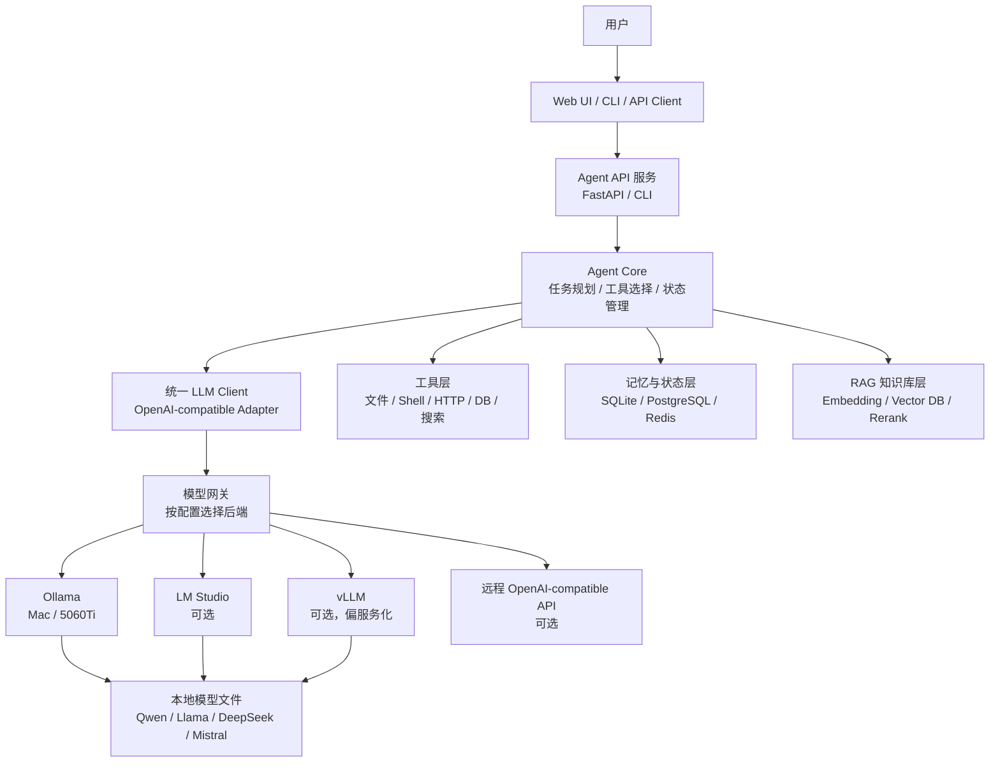
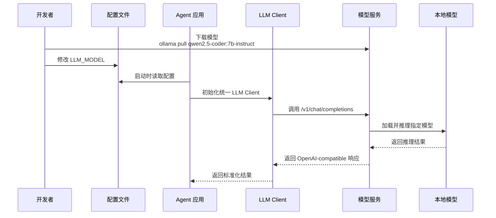
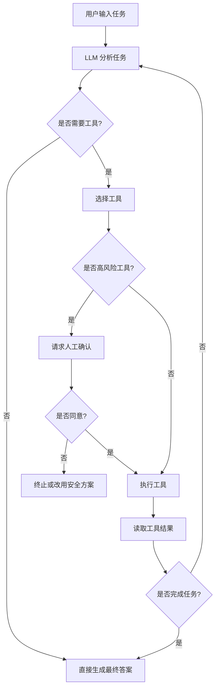
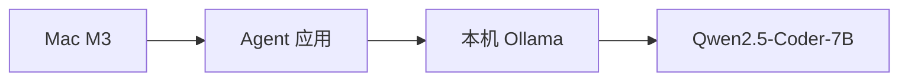
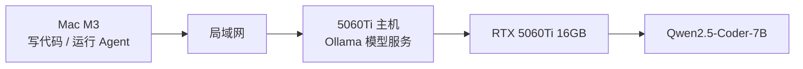
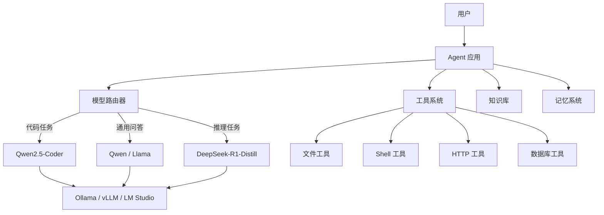

# 本地 Agent 应用开发设计文档

## 1. 文档目标

本文档用于设计一套可在以下两类设备上运行的本地 Agent 应用开发环境：

- Mac M3，16GB 统一内存
- NVIDIA 5060Ti，16GB 显存，32GB 系统内存

核心目标：

> 支持随意更换本地大模型。只要模型已经下载到本地，尽量不修改业务代码，通过配置即可完成模型切换。

初始模型选择：

```text
Qwen2.5-Coder-7B-Instruct
```

后续需要支持切换到：

```text
Qwen2.5-Coder-14B
Qwen2.5-7B-Instruct
DeepSeek-R1-Distill-Qwen-7B
Llama-3.1-8B
Mistral-7B
其他兼容 OpenAI API 的本地模型
```

---

## 2. 设计原则

### 2.1 模型与业务解耦

Agent 业务代码不直接绑定具体模型名称，也不直接依赖某一个推理框架。

业务代码只依赖统一的 LLM Client 接口，例如：

```python
llm.chat(messages, tools=None, temperature=0.2)
```

底层实际调用：

```text
Ollama / LM Studio / vLLM / llama.cpp / OpenAI-compatible Server
```

由配置决定。

---

### 2.2 统一使用 OpenAI-compatible API

不管底层使用哪种本地推理框架，对 Agent 应用统一暴露成 OpenAI-compatible API。

例如：

```text
http://localhost:11434/v1/chat/completions
http://192.168.1.20:11434/v1/chat/completions
```

这样 Agent 应用层只需要使用 OpenAI SDK 或 LangChain / LangGraph 中的 OpenAI-compatible 调用方式。

---

### 2.3 通过配置切换模型

模型切换只改 `.env` 或 `config.yaml`，不改 Agent 业务代码。

示例：

```env
LLM_PROVIDER=ollama
LLM_BASE_URL=http://localhost:11434/v1
LLM_MODEL=qwen2.5-coder:7b-instruct
LLM_API_KEY=ollama
LLM_TEMPERATURE=0.2
LLM_CONTEXT_SIZE=8192
```

切换模型时，只需要改：

```env
LLM_MODEL=qwen2.5-coder:14b-instruct
```

或者：

```env
LLM_MODEL=deepseek-r1:7b
```

---

### 2.4 推理服务与 Agent 服务分离

推理服务只负责模型加载与推理。

Agent 服务负责：

- 任务理解
- 工具调用
- 状态管理
- RAG 检索
- 业务流程编排
- 人工确认
- 结果汇总

两者通过 HTTP API 通信。

---

## 3. 总体架构



---

## 4. 分层设计

```mermaid
flowchart LR
    subgraph L1[表现层]
        UI1[CLI]
        UI2[Web UI]
        UI3[HTTP API]
    end

    subgraph L2[Agent 应用层]
        Planner[任务规划器]
        Executor[执行器]
        ToolRouter[工具路由]
        Guardrail[安全控制]
    end

    subgraph L3[能力层]
        LLM[LLM Client]
        Tools[工具集合]
        RAG[RAG 检索]
        Memory[记忆 / 状态]
    end

    subgraph L4[基础设施层]
        ModelServer[模型服务<br/>Ollama / vLLM / LM Studio]
        VectorDB[向量数据库<br/>Chroma / Qdrant]
        DB[数据库<br/>SQLite / PostgreSQL]
        FS[文件系统]
    end

    L1 --> L2
    L2 --> L3
    L3 --> L4
```



### 4.1 表现层

负责和用户交互。

可选形式：

- CLI 命令行
- Web 页面
- HTTP API
- VS Code / Cursor 插件形式

初期建议先实现 CLI，再扩展 FastAPI。

---

### 4.2 Agent 应用层

负责 Agent 的核心逻辑。

主要模块：

| 模块 | 功能 |
|---|---|
| Planner | 分析用户目标，拆解任务 |
| Executor | 执行每一步任务 |
| ToolRouter | 根据模型输出选择工具 |
| Guardrail | 限制危险操作，例如删除文件、执行高危命令 |
| Human Approval | 对高风险动作要求人工确认 |

---

### 4.3 能力层

负责封装底层能力，给 Agent 应用层使用。

| 能力 | 说明 |
|---|---|
| LLM Client | 统一模型调用接口 |
| Tool Registry | 注册可用工具 |
| RAG Retriever | 检索知识库内容 |
| Memory Store | 保存会话、任务状态、用户偏好 |

---

### 4.4 基础设施层

负责运行环境和存储。

| 组件 | 推荐选择 |
|---|---|
| 模型服务 | Ollama |
| 向量数据库 | Chroma 入门，Qdrant 进阶 |
| 状态数据库 | SQLite 入门，PostgreSQL 进阶 |
| 文件存储 | 本地文件系统 |
| 服务框架 | FastAPI |

---

## 5. 模型可替换设计

### 5.1 模型切换流程



---

### 5.2 配置文件设计

推荐使用 `.env` 作为入门配置。

`.env` 示例：

```env
# provider: ollama / lmstudio / vllm / remote_openai_compatible
LLM_PROVIDER=ollama

# Mac 本机调用
LLM_BASE_URL=http://localhost:11434/v1

# 如果 Mac 调用 5060Ti 机器，可改为：
# LLM_BASE_URL=http://192.168.1.20:11434/v1

LLM_MODEL=qwen2.5-coder:7b-instruct
LLM_API_KEY=ollama

LLM_TEMPERATURE=0.2
LLM_TOP_P=0.9
LLM_CONTEXT_SIZE=8192
LLM_TIMEOUT_SECONDS=120

# 是否开启流式输出
LLM_STREAM=true
```

后续也可以升级为 `config.yaml`：

```yaml
llm:
  provider: ollama
  base_url: http://localhost:11434/v1
  model: qwen2.5-coder:7b-instruct
  api_key: ollama
  temperature: 0.2
  top_p: 0.9
  context_size: 8192
  timeout_seconds: 120
  stream: true

agent:
  max_steps: 8
  require_approval_for_dangerous_tools: true
  enable_memory: true
  enable_rag: false
```

---

### 5.3 模型注册表设计

为了让不同模型具备不同默认参数，可以设计一个模型注册表。

`models.yaml`：

```yaml
models:
  qwen2.5-coder:7b-instruct:
    display_name: Qwen2.5 Coder 7B Instruct
    provider: ollama
    context_size: 8192
    good_for:
      - code
      - agent
      - tool_calling
    default_temperature: 0.2

  qwen2.5-coder:14b-instruct:
    display_name: Qwen2.5 Coder 14B Instruct
    provider: ollama
    context_size: 8192
    good_for:
      - code
      - agent
    default_temperature: 0.2

  llama3.1:8b:
    display_name: Llama 3.1 8B
    provider: ollama
    context_size: 8192
    good_for:
      - general
      - english
    default_temperature: 0.3
```

Agent 启动时：

1. 从 `.env` 读取 `LLM_MODEL`
2. 从 `models.yaml` 查找默认参数
3. 初始化 LLM Client
4. 如果 `.env` 中显式配置了参数，则覆盖模型默认参数

---

## 6. LLM Client 设计

### 6.1 统一接口

建议定义一个统一的 LLM Client。

```python
from typing import Any, Optional

class LLMClient:
    def chat(
        self,
        messages: list[dict[str, str]],
        tools: Optional[list[dict[str, Any]]] = None,
        temperature: Optional[float] = None,
        stream: bool = False,
    ) -> str:
        raise NotImplementedError
```

业务代码只依赖这个接口。

---

### 6.2 OpenAI-compatible 实现

```python
import os
from openai import OpenAI

class OpenAICompatibleLLMClient:
    def __init__(self):
        self.base_url = os.getenv("LLM_BASE_URL", "http://localhost:11434/v1")
        self.api_key = os.getenv("LLM_API_KEY", "ollama")
        self.model = os.getenv("LLM_MODEL", "qwen2.5-coder:7b-instruct")
        self.temperature = float(os.getenv("LLM_TEMPERATURE", "0.2"))

        self.client = OpenAI(
            base_url=self.base_url,
            api_key=self.api_key,
        )

    def chat(self, messages, tools=None, temperature=None, stream=False):
        response = self.client.chat.completions.create(
            model=self.model,
            messages=messages,
            tools=tools,
            temperature=self.temperature if temperature is None else temperature,
            stream=stream,
        )

        if stream:
            return response

        return response.choices[0].message.content
```

这样后续更换模型时，Agent 代码无需修改。

---

## 7. Agent 模块设计

### 7.1 Agent 执行流程



---

### 7.2 工具层设计

工具统一注册到 Tool Registry。

初期建议实现以下工具：

| 工具 | 功能 | 风险等级 |
|---|---|---|
| read_file | 读取文件 | 低 |
| write_file | 写入文件 | 中 |
| list_dir | 查看目录 | 低 |
| run_python | 执行 Python 片段 | 中 |
| http_get | 请求 HTTP API | 低 |
| shell_command | 执行 Shell 命令 | 高 |

高风险工具必须人工确认。

---

### 7.3 工具定义示例

```python
from langchain_core.tools import tool

@tool
def read_file(path: str) -> str:
    """Read a local text file."""
    with open(path, "r", encoding="utf-8") as f:
        return f.read()[:8000]

@tool
def write_file(path: str, content: str) -> str:
    """Write content to a local text file."""
    with open(path, "w", encoding="utf-8") as f:
        f.write(content)
    return f"written to {path}"
```

---

## 8. 双设备部署设计

### 8.1 Mac M3 本地模式



适用场景：

- 离线开发
- 轻量测试
- CLI Agent 学习
- 小规模 RAG 测试

`.env`：

```env
LLM_BASE_URL=http://localhost:11434/v1
LLM_MODEL=qwen2.5-coder:7b-instruct
```

---

### 8.2 Mac 开发 + 5060Ti 推理模式



适用场景：

- 更快推理
- 长上下文
- 后续尝试 14B 模型
- 同一局域网多客户端调用

Mac 上 `.env`：

```env
LLM_BASE_URL=http://192.168.1.20:11434/v1
LLM_MODEL=qwen2.5-coder:7b-instruct
```

5060Ti 主机启动 Ollama：

```bash
OLLAMA_HOST=0.0.0.0:11434 ollama serve
```

> 注意：不要把 Ollama 服务直接暴露到公网。建议只允许局域网访问。

---

## 9. 模型下载与切换规范

### 9.1 下载模型

以 Ollama 为例：

```bash
ollama pull qwen2.5-coder:7b-instruct
```

查看本地模型：

```bash
ollama list
```

测试模型：

```bash
ollama run qwen2.5-coder:7b-instruct
```

---

### 9.2 切换模型

步骤：

1. 下载新模型
2. 修改 `.env` 的 `LLM_MODEL`
3. 重启 Agent 服务
4. 运行模型连通性测试

示例：

```bash
ollama pull llama3.1:8b
```

修改 `.env`：

```env
LLM_MODEL=llama3.1:8b
```

运行测试：

```bash
python examples/test_llm.py
```

---

## 10. 推荐项目目录结构

```text
local-agent-lab/
  README.md
  .env
  config.yaml
  models.yaml
  requirements.txt

  app/
    __init__.py
    main.py

    config.py
    llm_client.py
    model_registry.py

    agent/
      __init__.py
      graph.py
      planner.py
      executor.py
      prompts.py
      state.py

    tools/
      __init__.py
      file_tools.py
      shell_tools.py
      python_tools.py
      http_tools.py
      registry.py

    rag/
      __init__.py
      loader.py
      splitter.py
      embeddings.py
      retriever.py

    memory/
      __init__.py
      sqlite_store.py
      session_store.py

  examples/
    test_llm.py
    simple_agent.py
    switch_model.py

  data/
    docs/
    vector_store/

  scripts/
    start_ollama.sh
    check_model.sh
```

---

## 11. 最小可运行调用示例

### 11.1 安装依赖

```bash
pip install openai python-dotenv
```

### 11.2 `.env`

```env
LLM_BASE_URL=http://localhost:11434/v1
LLM_MODEL=qwen2.5-coder:7b-instruct
LLM_API_KEY=ollama
LLM_TEMPERATURE=0.2
```

### 11.3 `examples/test_llm.py`

```python
import os
from dotenv import load_dotenv
from openai import OpenAI

load_dotenv()

client = OpenAI(
    base_url=os.getenv("LLM_BASE_URL"),
    api_key=os.getenv("LLM_API_KEY", "ollama"),
)

response = client.chat.completions.create(
    model=os.getenv("LLM_MODEL"),
    messages=[
        {"role": "system", "content": "你是一个严谨的代码助手。"},
        {"role": "user", "content": "用 Python 写一个二分查找函数。"},
    ],
    temperature=float(os.getenv("LLM_TEMPERATURE", "0.2")),
)

print(response.choices[0].message.content)
```

---

## 12. 模型切换验证脚本

`examples/switch_model.py`：

```python
import os
from dotenv import load_dotenv
from openai import OpenAI

load_dotenv()

base_url = os.getenv("LLM_BASE_URL", "http://localhost:11434/v1")
api_key = os.getenv("LLM_API_KEY", "ollama")
model = os.getenv("LLM_MODEL", "qwen2.5-coder:7b-instruct")

client = OpenAI(base_url=base_url, api_key=api_key)

print(f"Current model: {model}")
print(f"Base URL: {base_url}")

response = client.chat.completions.create(
    model=model,
    messages=[
        {"role": "user", "content": "请回答：你当前适合做什么类型的任务？"}
    ],
    temperature=0.2,
)

print(response.choices[0].message.content)
```

运行：

```bash
python examples/switch_model.py
```

---

## 13. 安全设计

Agent 应用具备执行工具的能力，因此必须限制危险行为。

### 13.1 高风险操作

以下操作默认需要人工确认：

- 删除文件
- 覆盖已有文件
- 执行 Shell 命令
- 访问外部网络
- 修改数据库
- 发送邮件
- 调用支付、订单、发布等业务接口

---

### 13.2 建议策略

| 风险等级 | 策略 |
|---|---|
| 低 | 直接执行 |
| 中 | 记录日志，可选确认 |
| 高 | 必须人工确认 |
| 极高 | 默认禁止 |

---

## 14. 后续扩展路线

### 阶段 1：打通本地模型调用

目标：

- Mac 和 5060Ti 都能运行 Ollama
- 能通过 OpenAI-compatible API 调用模型
- 能通过 `.env` 切换模型

---

### 阶段 2：实现最小 Agent

目标：

- 支持工具调用
- 支持文件读取
- 支持 Python 代码执行
- 支持多轮任务状态

---

### 阶段 3：加入 RAG

目标：

- 导入本地文档
- 向量化存储
- 检索相关内容
- 让 Agent 基于本地资料回答

---

### 阶段 4：服务化

目标：

- 使用 FastAPI 提供 Agent API
- 前端或其他程序可以调用
- 支持多会话
- 支持任务日志

---

### 阶段 5：模型网关增强

目标：

- 支持多个模型后端
- 支持自动选择模型
- 支持失败降级
- 支持模型能力标签

例如：

```text
代码任务 -> Qwen2.5-Coder
中文总结 -> Qwen2.5-Instruct
推理任务 -> DeepSeek-R1-Distill
英文任务 -> Llama / Mistral
```

---

## 15. 最终目标架构



---

## 16. 总结

本方案的关键点是：

1. Agent 应用不直接绑定具体模型。
2. 所有模型服务统一封装成 OpenAI-compatible API。
3. 通过 `.env` 或 `config.yaml` 控制模型名称、地址、参数。
4. 业务代码只调用统一的 LLM Client。
5. Mac M3 和 5060Ti 使用同一套项目代码。
6. 需要切换模型时，只需要下载模型并修改配置。

最终效果：

```text
下载模型 -> 修改 LLM_MODEL -> 重启服务 -> 完成切换
```

不需要大改 Agent 业务逻辑。
