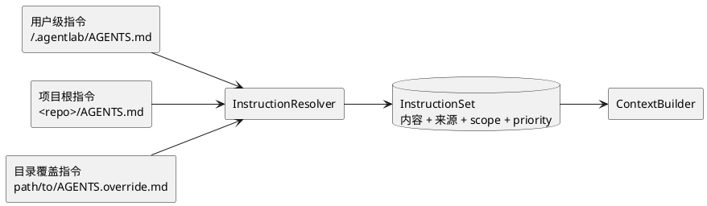
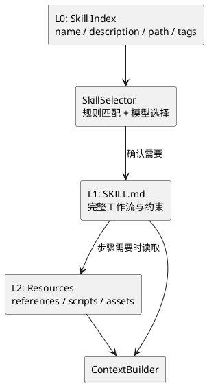
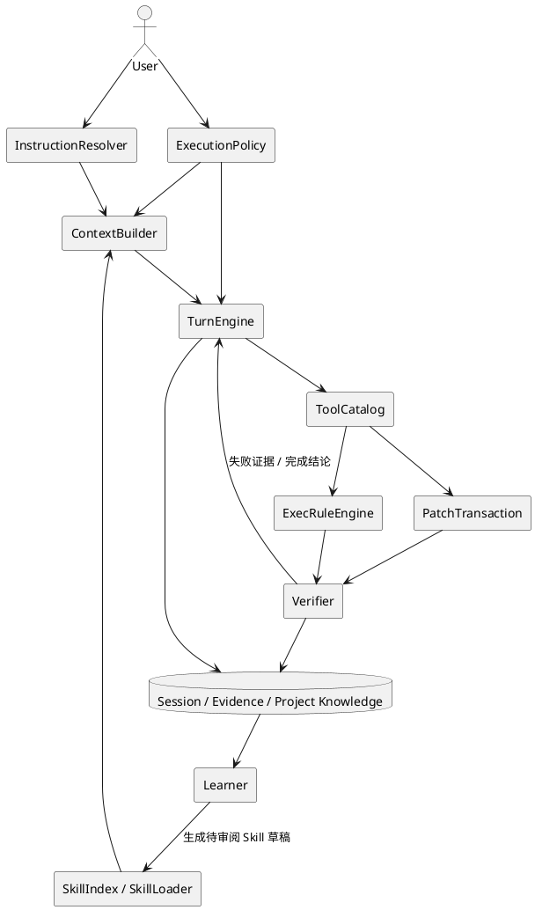

# AgentLab 从 Codex 借鉴的能力设计

| 项目 | 内容 |
|---|---|
| 文档定位 | AgentLab 面向个人本地 Agent 的 Codex 能力学习与落地指南 |
| 核心目标 | 提高任务完成率、上下文质量、工具使用准确率、验证可靠性和交互效率 |
| 参考范围 | Codex 的公开产品机制与架构思想，不复制其具体实现或绑定 OpenAI 专属服务 |
| 产品约束 | Python 3.11、本地优先、macOS / Linux / Windows、支持本地模型与云端模型 |
| 优先级原则 | 智能与效率优先；服务化、多前端、云调度和重型基础设施靠后 |

## 1. 结论

AgentLab 已经具备多模型、工具调用、MCP、Skill、任务编排、Session、长期记忆、上下文压缩、审批、浏览器控制和 Loop Engineering 基础，不需要照着 Codex 再造一套庞大的 Runtime。

下一阶段最值得借鉴 Codex 的不是界面或服务端，而是以下五件事：

1. **分层项目指令**：自动发现用户级、项目级和子目录级指令，并记录每条指令的来源和优先级。
2. **渐进式上下文与工具加载**：先给模型目录，确定需要后再加载 Skill 正文、参考文件和低频工具 Schema。
3. **可审查的 Patch 编辑事务**：用带前置条件的多文件 Patch 替代大段覆盖写入，失败时不产生半成品。
4. **低打扰但可解释的执行策略**：将命令规则、审批原因、权限边界和会话授权统一起来。
5. **按任务调节模型、推理和验证成本**：简单任务快速完成，复杂任务再升级 Planner、推理强度和验证范围。

这些能力直接影响个人 Agent 每一轮工作的质量，应该优先于 FastAPI Server、完整 TUI/Web UI、远程调度中心、插件市场和重型跨平台沙箱。

## 2. 取舍标准

任何准备从 Codex 借鉴的能力，都应先通过下面的判断：

```text
是否明显提高个人 Agent 的任务完成率？
  ├─ 否 → 暂缓
  └─ 是
      ↓
是否能降低重复读取、错误工具调用、无效推理或频繁审批？
  ├─ 是 → P0
  └─ 否
      ↓
是否能让工作流复用、恢复或自动验证更可靠？
  ├─ 是 → P1
  └─ 否 → P2
```

评估时优先观察：

- 首次有效行动耗时；
- 每轮输入 token 和 Tool Schema token；
- 一次完成率与用户纠正次数；
- 重复读取、重复搜索和重复工具调用次数；
- 每项任务的审批次数；
- 修改后发现回归所需的轮数；
- 中断恢复后重复工作的比例。

## 3. 能力优先级

| 优先级 | 能力 | AgentLab 基础 | 主要缺口 | 建议 |
|---|---|---|---|---|
| P0 | 分层指令解析 | AgentProfile、system prompt、Skill 注入 | 没有目录级指令发现、覆盖关系和来源审计 | 立即实现 |
| P0 | ~~Skill 渐进披露~~（已完成） | Skill Loader/Catalog 已可匹配并注入正文 | ~~被选 Skill 正文一次性进入 prompt，缺少目录预算和按需读取~~ | ~~立即改造~~ |
| P0 | Patch 编辑事务 | `edit_file` 支持唯一字符串替换，CLI 可展示 diff | 缺少多文件原子 Patch、前置条件、冲突诊断和统一变更结果 | 立即实现 |
| P0 | 工具渐进加载 | 已按任务类型筛选工具 | 缺少低频工具目录、按需激活、Schema token 统计和选择质量反馈 | 继续完善 |
| P0 | 自适应执行策略 | Direct/Task/Loop 路由、可配置 reasoning | 模式、模型、推理、工具范围和验证强度尚未由统一策略决定 | 立即实现 |
| P0 | 可测试命令规则 | 已有 Session 命令前缀授权和风险审批 | 缺少用户/项目持久规则、`allow/prompt/forbidden` 合并和规则样例测试 | 继续完善 |
| P1 | 验证策略 | Verifier、测试执行和 Loop 证据已存在 | 缺少改动影响分析、最小验证选择和失败证据驱动修复 | 紧随 P0 |
| P1 | 轻量生命周期 Hook | 已有 Runtime/Tool/Compaction 事件 | 缺少用户可配置的少量稳定扩展点 | 做最小版本 |
| P1 | 结构化非交互执行 | `-p`、Protocol v1、事件重放已存在 | 缺少稳定 JSONL CLI、输出 Schema、明确退出码和命令级 resume | 可独立实现 |
| P1 | 工作流录制为 Skill | 有工具审计、事件和 Skill 格式 | 缺少从成功轨迹提炼 Skill 草稿的 Learner | 先做半自动版本 |
| P1 | 项目知识缓存 | 有长期记忆与上下文摘要 | 缺少来源、置信度、文件版本和失效机制 | 与 Learner 合并设计 |
| P2 | 子 Agent 并行 | 有 subagent 数据模型和 worktree 基础 | 缺少真实委托调度和冲突治理 | 单 Agent 稳定后再做 |
| P2 | 完整 App Server / 多前端 | Runtime Protocol 已有基础 | FastAPI、SSE、TUI、Web UI 尚未完成 | 非当前效率瓶颈 |
| P2 | 重型系统沙箱 | 有 workspace 边界、审批和审计 | 缺少三平台 OS 级隔离 | 执行不可信代码前再提升 |
| P2 | 云端任务/远程调度平台 | 有交互终端和远程执行基础 | 缺少设备注册、任务路由和云控制面 | 保留接口，不先建设 |

## 4. P0 详细设计

### 4.1 分层项目指令解析

Codex 会从用户目录、项目根目录一路向当前工作目录发现 `AGENTS.md`，按“全局到局部”合并，离当前目录更近的内容拥有更高优先级，并限制总字节数。AgentLab 应借鉴的是**确定的发现顺序和来源可见性**，而不是只支持某个固定文件名。[Codex AGENTS.md 说明](https://learn.chatgpt.com/docs/agent-configuration/agents-md)

建议新增 `InstructionResolver`：



规则：

- 从 workspace/Git 根目录走到任务目标文件所在目录，不依赖启动终端所在目录；
- 每层最多选择一个指令文件，`AGENTS.override.md` 优先于 `AGENTS.md`；
- 合并顺序为用户级 → 项目根 → 子目录，局部规则覆盖宽泛规则；
- 指令带 `source_path / scope_path / priority / content_hash`；
- 限制总字节和 token，超限时保留来源清单并明确告警，不能静默丢失；
- `/instructions` 显示当前实际生效的来源、顺序和截断情况；
- 外部 Skill、网页、工具输出和代码注释只能作为数据，不能进入同一指令优先级链。

最小验收：

- 从项目子目录运行时能加载根规则和子目录覆盖；
- 同名规则冲突时局部规则稳定生效；
- 模型和用户能看到规则来自哪个文件；
- 修改指令文件后，新 Turn 或显式 reload 能更新上下文。

### ~~4.2 Skill 渐进披露（已完成）~~

Codex 的 Skill 先只暴露 `name + description + path`，实际选择后再读取完整 `SKILL.md`；初始 Skill 目录还有独立上下文预算。AgentLab 当前会把命中的 Skill 正文直接拼入 system prompt，Skill 变多后会挤占代码和任务上下文。[Codex Skill 渐进披露](https://learn.chatgpt.com/docs/build-skills)

建议拆成三层：



~~实现要求：~~ **~~已完成：~~**

- ~~启动时只构建轻量 `SkillIndex`，不把所有正文注入 prompt；~~
- ~~规则明确命中时直接激活，语义不确定时允许模型调用 `load_skill(skill_id)`；~~
- ~~reference 和 script 不自动读取，由 Skill 步骤按需加载；~~
- ~~Skill 目录设置独立 token/字符预算，描述过长先压缩描述而不是挤掉任务上下文；~~
- ~~每轮记录候选 Skill、最终激活 Skill、加载成本和是否真正使用；~~
- ~~Skill 只能建议能力，不能扩大工具权限或绕过审批。~~

### 4.3 工具渐进加载与稳定命名空间

AgentLab 已能按任务类型筛选工具，下一步应从静态过滤升级为两级工具目录：

1. 核心工具直接提供：`read_file / code_search / edit_file / shell`；
2. 低频能力只提供目录项：浏览器、远程终端、数据库、大型 MCP Server；
3. 模型确认需要后调用 `activate_tool_group(name)`；
4. Runtime 校验 AgentProfile、风险和 MCP 配置后，下一轮才提供完整 Schema。

不要在单轮中反复增删同一组工具，避免 prompt cache 失效和模型行为漂移。工具列表应使用稳定顺序，并记录：

- 激活前后 Schema token；
- 工具组被激活后是否实际调用；
- 未找到工具、错选工具和重复调用比例；
- MCP 启动失败是否影响核心任务。

OpenAI 的模型指南也建议大工具目录使用 tool search/延迟加载，并强调压缩时保留已完成动作、活跃假设、工具结果、阻塞和下一目标。[模型与工具调用指南](https://developers.openai.com/api/docs/guides/latest-model)

### 4.4 Patch 编辑事务

`edit_file(old_str, new_str)` 适合单点修改，但复杂任务需要一个更接近 Codex `apply_patch` 的结构化编辑入口。它不是简单地新增另一种写文件工具，而是建立**变更事务**：

```text
PatchRequest
  ├─ base_revision / 文件哈希
  ├─ files[]
  │   ├─ create / update / delete / move
  │   └─ hunks[] + before_context + after_context
  ├─ expected_paths
  └─ dry_run

PatchResult
  ├─ applied / conflict / no_change
  ├─ changed_files
  ├─ rejected_hunks
  ├─ unified_diff
  └─ rollback_status
```

要求：

- 先 dry-run 校验所有 hunk，再一次性提交；任一前置条件失败时不写任何文件；
- 每个更新绑定文件哈希或上下文，防止覆盖用户同时产生的修改；
- 原子写入使用同目录临时文件 + replace，并保持编码和换行风格；
- 审批展示完整 diff，而不是原始 JSON 参数；
- PatchResult 直接进入验证器和上下文，不让模型重新读取整个文件确认是否成功；
- 保留 `edit_file` 处理简单单点修改，Planner 根据改动范围选择工具。

最小验收：多文件修改要么全部成功，要么一个都不写；用户在 dry-run 后改动文件时返回 conflict；Windows CRLF 文件不会被无关地全文件改写。

### 4.5 可测试的执行规则

Codex 的命令规则把命令视为 argv 前缀，支持 `allow / prompt / forbidden`，多条命中时采用最严格决策，并允许为规则配置正反例。AgentLab 已有 Session 前缀授权，应继续演进为轻量规则引擎，而不是先建设完整 OS 沙箱。[Codex Rules 说明](https://learn.chatgpt.com/docs/agent-configuration/rules)

建议规则层级：

```text
内置禁止规则
  > 用户级规则 ~/.agentlab/rules/
  > 项目级规则 <workspace>/.agentlab/rules/
  > Session 临时授权
```

合并原则：

- `forbidden > prompt > allow`；
- 规则匹配解析后的命令段和 argv，不匹配未经解析的整段字符串；
- shell wrapper、管道、重定向、命令替换和复合命令逐段检查；
- 每条持久规则必须有 `justification`；
- 可选 `match/not_match` 样例在加载时离线验证；
- 审批框展示完整命令、命中的规则、申请的权限和可复用范围；
- “允许一次”“本会话允许此前缀”“写入项目规则”是三个不同动作，不能混为一体。

### 4.6 自适应模型、推理与验证策略

当前 Direct/Task/Loop 主要决定编排路径，还应增加统一 `ExecutionPolicy`，共同决定：

```text
task_features
  → mode: direct / task / loop
  → model_profile
  → reasoning_effort
  → tool_groups
  → context_budget
  → verification_level
  → max_steps / timeout
```

建议初始规则：

| 任务 | 模式 | 推理 | 工具 | 验证 |
|---|---|---|---|---|
| 查询、解释、单文件小改 | Direct | minimal/low | 核心只读或编辑 | 语法/相关测试 |
| 多文件功能、明确依赖 | Task | medium | 核心 + 按需工具 | 相关测试 + diff 检查 |
| 模糊目标、跨模块迁移 | Task/Loop | high | Planner + 按需工具 | 分阶段验证 |
| 长期目标、失败后需迭代 | Loop | high/xhigh | 全证据链 | GoalSpec Verifier |

升级策略必须可解释：只有复杂度、失败证据或风险上升时才增加模型成本。不要因为一次工具超时就自动切换更贵模型；先判断是代码、环境、权限、网络还是 Provider 错误。

验证遵循“影响范围驱动”：

- 先做 diff 静态检查和直接相关测试；
- 共享模块、协议、存储迁移或公共工具发生变化时扩大测试；
- 只有存在新增风险或前一步失败，才重复或运行完整测试；
- Verifier 输出结构化失败证据，Replanner 必须引用证据生成修复任务；
- 同一失败签名连续出现时停止盲目重试。

Codex 的长任务也强调目标应包含 outcome、constraints 和 verification，并支持在运行中继续补充约束；AgentLab 的 GoalSpec 和 Loop 应保持这一方向。[Codex Long-running work](https://learn.chatgpt.com/docs/long-running-work)

## 5. P1 能力

### 5.1 轻量生命周期 Hook

Codex 提供 Session、Tool、Permission、Compaction、Interrupt 和 Stop 等生命周期 Hook。AgentLab 已有对应事件基础，但不应一次实现完整 Hook 平台。[Codex Hooks](https://learn.chatgpt.com/docs/hooks)

第一版只提供五个稳定扩展点：

- `session_start`：加载项目环境提示或生成只读上下文；
- `pre_tool_use`：补充项目策略，允许阻止但不能静默扩大权限；
- `post_tool_use`：收集格式化、扫描和测试证据；
- `pre_compact/post_compact`：保护必须保留的信息并验证摘要；
- `turn_stop`：生成简短交接和未完成事项。

Hook 默认关闭，项目显式信任后才加载；支持超时、输出上限、错误隔离和审计。后台 Hook 只能补充观察结果，不能审批、改写或阻止当前操作。

### 5.2 结构化非交互执行

Codex 的非交互模式支持 JSONL 事件、最终输出 JSON Schema 和按 Session 恢复。AgentLab 已有 Protocol v1，因此实现成本不高，但优先级低于 Agent 本身的任务质量。[Codex non-interactive mode](https://learn.chatgpt.com/docs/non-interactive-mode)

建议接口：

```text
agentlab exec "任务" --json
agentlab exec "任务" --output-schema schema.json
agentlab exec resume --last "继续处理失败项"
agentlab exec resume <session_id> "补充要求"
```

要求：stdout 只输出 JSONL，日志和进度走 stderr；事件至少覆盖 thread/turn/item/tool/approval/error/completed；退出码区分成功、验证失败、需审批、取消、配置错误和 Runtime 错误。

### 5.3 从成功轨迹生成 Skill

Codex 的 Record & Replay 会把一次演示提炼成包含触发条件、输入、步骤和验证方式的 Skill。AgentLab 不需要先做桌面录屏，可以先利用已有的工具审计和 Loop 证据生成 Skill 草稿。[Codex Record & Replay](https://learn.chatgpt.com/docs/extend/record-and-replay)

半自动流程：

1. 用户选择一个成功的 Session 或 Loop Run；
2. Learner 去除闲聊、失败试探、绝对路径和敏感信息；
3. 抽取触发条件、必要输入、稳定步骤、使用工具和验证证据；
4. 生成 `SKILL.md` 草稿和可选 references；
5. 用户审阅后安装，绝不自动启用或自动授予工具权限；
6. 用一次 replay dry-run 检查 Skill 是否依赖已经不存在的上下文。

### 5.4 带失效机制的项目知识

长期记忆不应只是文本相似度检索。项目知识至少包含：

- `fact`：构建命令、测试命令、入口、框架、目录职责；
- `source`：文件路径、工具结果或用户明确说明；
- `source_hash/revision`：来源版本；
- `confidence`：用户确认、验证推断或模型猜测；
- `scope`：用户、项目、目录或 Agent；
- `expires/invalidated_by`：失效条件。

模型猜测不能直接成为长期事实。文件哈希变化后，相关知识先标记 stale，使用前重新验证。Learner 只在成功验证的稳定点提取知识，避免把失败过程固化。

### 5.5 受控并行

先实现同一 Agent 内的只读并行，而不是立即开发多个自治子 Agent：

- 并行读取互不相关文件；
- 并行执行多个代码搜索；
- 并行运行不会修改相同输出的检查；
- 任何编辑、Git 操作、共享终端 Session 和审批仍串行；
- 并行结果按调用 ID 稳定排序后进入上下文；
- 设置总并发、总输出和取消传播。

真实子 Agent 只在单 Agent 的上下文、工具和验证策略稳定后引入，并要求独立 worktree 或明确的只读角色。

## 6. P2：暂不优先照搬

以下能力不是当前个人本地 Agent 的主要瓶颈：

- 完整 Codex App Server 协议兼容；
- FastAPI + SSE + Web UI + TUI 同时开发；
- 云端任务队列、多人协作和企业策略下发；
- 插件市场、签名、版本分发和组织级治理；
- 大规模子 Agent 调度和跨设备 worktree 编排；
- 自动审批 Reviewer Agent；
- macOS Seatbelt、Linux bubblewrap/seccomp、Windows Restricted Token 的完整同构实现；
- 桌面视频录制和视觉工作流自动泛化。

这些能力可以保留接口，但只有在出现明确需求时再实现。例如：开始执行来源不可信的代码时，系统沙箱才从 P2 升到 P0；需要手机控制长任务时，远程控制面才升级。

## 7. 推荐实施顺序

### 阶段 A：让模型先拿到正确上下文

- 实现 `InstructionResolver` 和 `/instructions`；
- ~~把 Skill 改为 L0 目录 + L1/L2 按需加载；~~
- 补 Tool Schema token 和 Skill token 统计。

### 阶段 B：让修改更可靠

- 实现原子 `apply_patch` 工具；
- PatchResult 接入 diff、审批、审计和 Verifier；
- 增加 CRLF、并发修改和多文件回滚测试。

### 阶段 C：让成本与任务匹配

- 新增统一 `ExecutionPolicy`；
- 将 mode、model、reasoning、tools、budget、verification 一次决策；
- 用代表性任务集比较完成率、耗时和 token，而不是凭感觉调规则。

### 阶段 D：减少重复审批和重复劳动

- 持久化 `allow/prompt/forbidden` 命令规则；
- 规则支持来源、解释和正反例自测；
- 实现项目知识失效机制和成功轨迹 Skill 草稿。

### 阶段 E：再开放自动化入口

- 实现最小 Hook；
- 实现 `agentlab exec --json`、输出 Schema 和 resume；
- 最后再评估子 Agent、Server 和多前端是否真的成为瓶颈。

## 8. 整体关系



## 9. 明确不做的事

- 不为了“像 Codex”而改写为 Rust；
- 不要求所有模型支持 OpenAI 专属字段；
- 不让 Skill、Hook、MCP 或项目文件绕过 ToolRegistry 和审批边界；
- 不把所有任务都送入 Planner 或 Loop；
- 不把所有测试都作为每次修改的固定收尾动作；
- 不在核心 Agent 行为稳定前同时开发多个前端；
- 不将模型生成的项目知识直接视为事实。

AgentLab 应学习 Codex 的核心方法：给模型正确且精简的上下文，提供清晰可审计的动作，让执行结果形成证据，再根据任务难度决定是否投入更多推理和基础设施。
