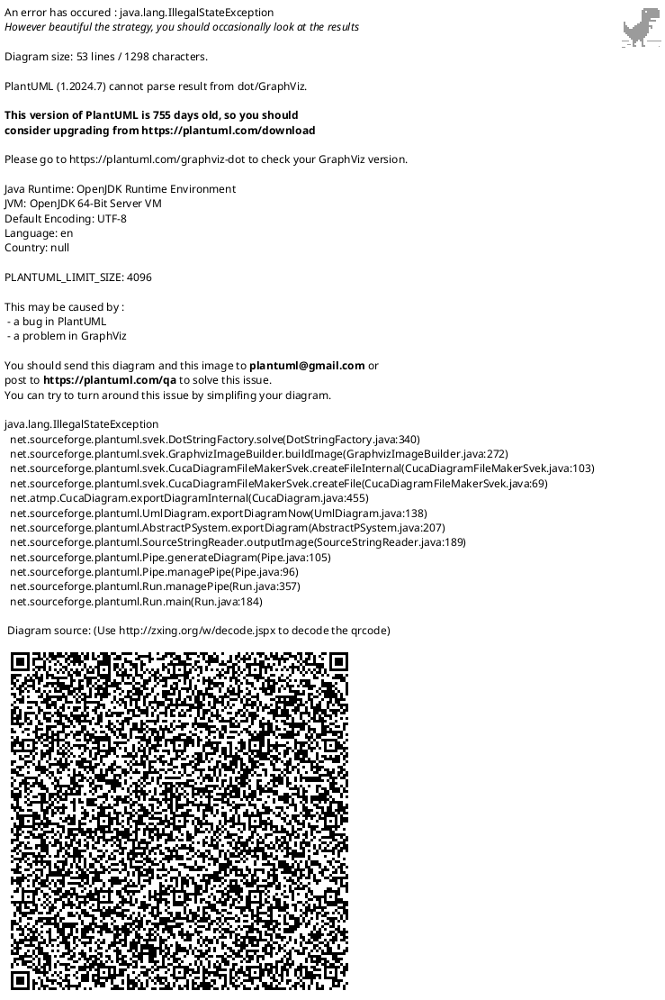
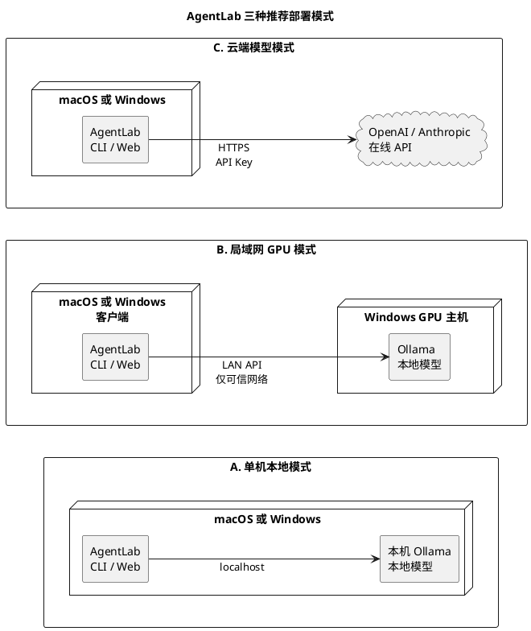
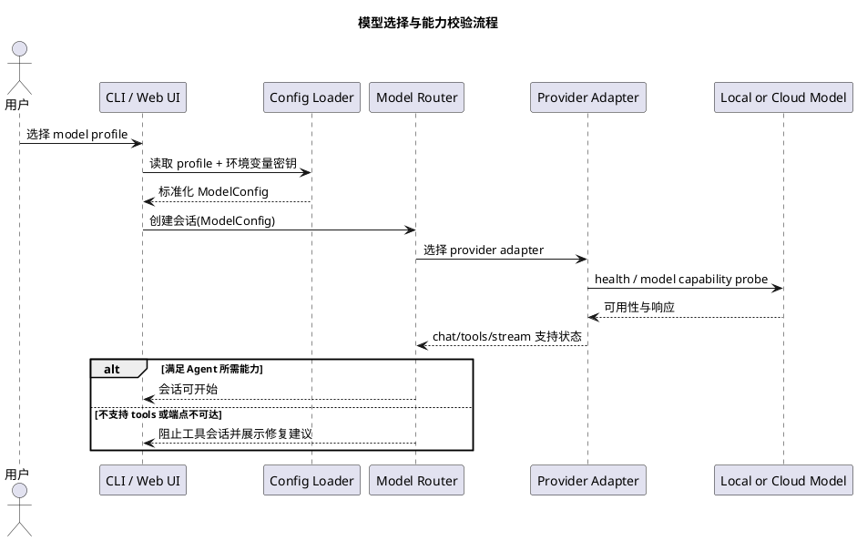
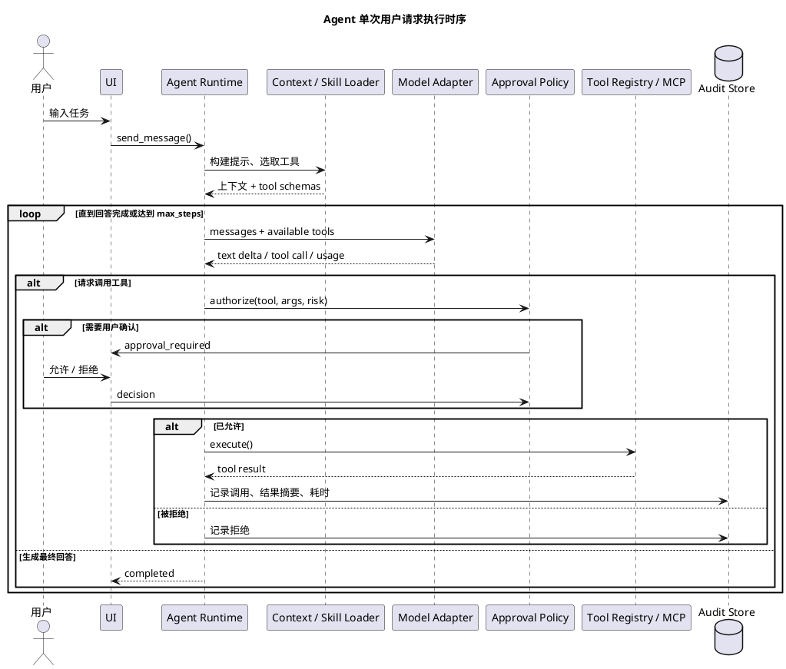
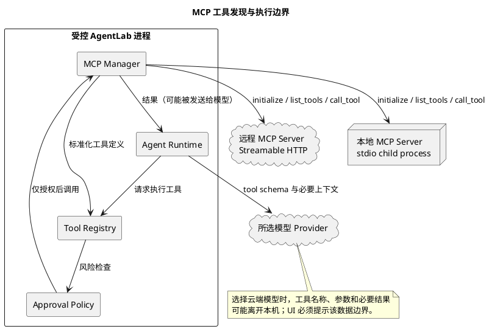

# AgentLab 总体技术方案

| 项目 | 内容 |
|---|---|
| 文档定位 | 跨 macOS / Windows 的本地 Agent 产品总体技术方案 |
| 文档版本 | v1.0 |
| 更新时间 | 2026-05-27 |
| 目标产品形态 | 可切换本地/云端模型、可配置 Skill 与 MCP、同时提供 CLI 和本地 Web UI 的个人 Agent |

---

## 1. 目标与边界

### 1.1 产品目标

AgentLab 是运行在个人电脑上的 Agent 应用。用户可以在 macOS 或 Windows 上启动它，对话、读写授权范围内的文件、调用工具或 MCP Server，并按任务选择本地模型或云端模型。

必须达成的目标：

1. 同一套 Python 代码可运行在 macOS 和 Windows。
2. 本地模型下载完成后，只修改配置即可切换模型，不修改 Agent 业务逻辑。
3. 能配置并调用在线模型，例如 OpenAI GPT 与 Anthropic Claude。
4. 能加载本地 Skill，并能连接可配置的 MCP Server。
5. 同时支持终端交互和浏览器 UI；两者复用同一个 Agent Core。
6. 文件写入、命令执行、联网请求和外部 MCP 调用都可经过权限控制与审计。

### 1.2 非首版目标

以下能力保留架构位置，但不应阻塞第一版可用产品：

- 多用户服务、账号体系、团队权限管理。
- 移动端客户端或原生桌面安装包。
- 分布式队列、多 Agent 集群调度。
- 大规模知识库和远程向量数据库。
- 自动执行任意高风险系统操作。

### 1.3 关键判断

本项目不应把“模型”当作 Agent 本身。模型只负责推理和产生工具请求；Agent Runtime 持有会话、工具、审批、MCP、Skill、状态和事件流。这样本地模型、云端 GPT、Claude 之间切换时，安全边界和用户体验仍由本地程序掌控。

---

## 2. 总体技术决策

| 领域 | 首选方案 | 原因 |
|---|---|---|
| 主语言 | Python 3.11+ | 当前代码一致；macOS/Windows 开发与分发成本低；MCP 与 AI SDK 生态完整 |
| Agent Runtime | 项目自有轻量循环，保留未来替换编排器的接口 | 当前已有基础；便于精确控制审批、事件、provider 差异 |
| API 服务 | FastAPI + Uvicorn | 本地服务、流式事件和 OpenAPI 方便；Python 单栈 |
| 初版 Web UI | FastAPI 静态页面 + Jinja2/HTMX 或轻量 TypeScript 页面 | 不要求用户先配置复杂桌面环境；可由 Python 一条命令启动 |
| 本地推理首选 | Ollama | macOS 与 Windows 均便于安装；提供 OpenAI-compatible 接口和工具调用能力 |
| 本地推理可选 | LM Studio；服务化阶段再评估 vLLM/llama.cpp | 通过 adapter 隔离，不成为首版硬依赖 |
| 云端模型 | OpenAI 原生 adapter、Anthropic 原生 adapter | 不丢失各厂商工具、流式和响应能力；不假设云端协议完全一致 |
| MCP | 官方 MCP Python SDK；stdio + Streamable HTTP | 与协议标准保持一致，适配本地进程与远程服务 |
| 持久化 | SQLite + 本地数据目录 | 跨平台、无需额外服务、适合单用户桌面应用 |
| 配置 | YAML 非密钥配置 + `.env`/系统 Keyring 密钥 | 易编辑、可版本化模板、避免密钥入库 |
| 测试 | pytest + provider fake + MCP 测试 server | Agent 循环和审批必须可离线回归 |

### 2.1 为什么不把所有模型都强塞进同一 HTTP 接口

Ollama、LM Studio 等本地推理服务适合通过 OpenAI-compatible adapter 接入。但在线模型应保留原生 adapter：

- OpenAI adapter 可以面向 Responses API 的工具与事件结构演进。
- Anthropic adapter 可以直接处理 Messages API 的内容块与 `tool_use` / `tool_result`。
- 本地 OpenAI-compatible adapter 可以处理不同服务只实现协议子集的情况。

Agent Core 依赖的是项目内部的 `ModelResponse` 与 `ToolCall`，而不是某一家外部 SDK 的返回对象。

---

## 3. 系统架构

### 3.1 逻辑组件图



图中仅绘制跨层主调用方向：纵向是对话与模型推理链路，右侧是 Skill、工具、MCP 和持久化能力链路；审批与事件分发属于 Runtime 内部控制，不再展开成多条交叉连接。

### 3.2 核心边界

| 边界 | 职责 |
|---|---|
| UI / API | 接收用户输入、展示流式事件与审批请求，不实现 Agent 决策 |
| Agent Runtime | 维护一次任务的循环、上下文、步数限制、取消与恢复 |
| Capability Layer | 对 Skill、内置 Tool、MCP Tool、记忆进行统一管理 |
| Model Layer | 把不同供应商响应翻译成统一内部事件 |
| Persistence | 保存会话、配置元数据、执行记录；不将 API Key 明文写入业务数据库 |

---

## 4. 跨平台运行与部署

### 4.1 部署拓扑



三种模式通过模型 profile 选择，不表示三条连接会同时启用。首版建议优先完成 A；需要复用 Windows 显卡时选 B；需要在线模型能力时显式选择 C。

### 4.2 推荐运行模式

| 模式 | Agent 运行位置 | 推理位置 | 用途 |
|---|---|---|---|
| 单机离线 | Mac 或 Windows | 本机 Ollama | 隐私数据、无网络环境、轻量任务 |
| GPU 主机服务 | Mac 或 Windows | Windows GPU 电脑的 Ollama | 在多台个人设备间复用较快的本地推理 |
| 云端增强 | Mac 或 Windows | OpenAI / Anthropic | 复杂编码、较强工具调用或长上下文任务 |
| 混合路由 | 本机 | 本地默认，手工切换云端 | 成本与能力折中，首版仅做显式切换 |

### 4.3 跨平台工程约束

1. 文件路径全部使用 `pathlib.Path`，不在业务逻辑拼接 `/` 或 `\`。
2. 内置工具使用 Python API 执行文件操作；Shell 工具区分 `powershell` 与 `zsh`/`bash` profile。
3. stdio MCP Server 的启动命令采用参数数组，不依赖 shell 展开与管道语法。
4. 用户数据目录使用平台规范目录，例如 macOS 的 Application Support 与 Windows 的 LocalAppData；开发模式可保留项目内 `.agentlab/`。
5. FastAPI 默认只监听 `127.0.0.1`，局域网开放必须由用户显式配置。
6. 本地模型文件由 Ollama/LM Studio 管理；AgentLab 只存模型 profile，不复制权重文件。

---

## 5. 代码分层与目标目录

现有 `app/` 可平滑演进为以下结构。第一阶段无需一次性创建所有目录。

```text
AgentLab/
  README.md
  pyproject.toml                    # 目标：逐步替换 requirements.txt
  .env.example
  config/
    app.example.yaml                # 非密钥配置模板
    models.yaml                     # 模型 profile 与能力声明
    mcp_servers.example.yaml        # MCP 配置模板
  skills/
    code-review/
      SKILL.md
  app/
    __main__.py
    cli.py                          # CLI 入口
    server.py                       # FastAPI 启动入口
    config/
      loader.py
      schemas.py
    agent/
      runtime.py                    # agent 循环
      session.py
      context.py
      approval.py
      events.py
    models/
      protocol.py                   # 内部 ModelResponse / ToolCall
      router.py
      openai_adapter.py
      anthropic_adapter.py
      compatible_adapter.py
    tools/
      registry.py
      builtin/
        files.py
        shell.py
    skills/
      loader.py
      catalog.py
    mcp/
      manager.py
      adapter.py
    storage/
      sqlite.py
      audit.py
    web/
      api.py
      static/
      templates/
  tests/
    unit/
    integration/
  data/                            # 开发期本地数据，gitignore
```

迁移原则：

- 当前 `app/main.py` 在重构前继续作为 CLI 可运行入口。
- 当前 `models.yaml` 可以先保持根目录路径，待配置 loader 支持新目录后迁移。
- 所有新增界面都调用同一个 `AgentSession` / Runtime 接口，不复制执行逻辑。

---

## 6. 模型层设计

### 6.1 内部统一协议

模型适配层向 Runtime 输出相同的数据结构：

```python
@dataclass
class ToolCall:
    id: str
    name: str
    arguments: dict[str, object]

@dataclass
class ModelResponse:
    text: str
    tool_calls: list[ToolCall]
    usage: dict[str, int]
    provider_payload: object
    finish_reason: str | None = None
```

Runtime 只处理 `ModelResponse`。adapter 负责：

- 将统一工具 schema 翻译成 provider 要求的格式。
- 将流式文本与工具参数增量翻译为内部事件。
- 将工具结果重新编码为该 provider 需要的下一轮输入。
- 发现模型不支持工具调用时，在会话启动前给出可理解的错误，而不是执行中途失控。

### 6.2 Provider 类型

| Provider ID | 目标对象 | 接口策略 | 首版优先级 |
|---|---|---|---|
| `ollama` / `openai_compatible` | Ollama、LM Studio 或兼容端点 | OpenAI-compatible Chat/Responses 能力按 profile 声明 | P0 |
| `anthropic` | Claude 官方 API 或明确兼容代理 | Anthropic Messages 原生适配 | 已有骨架，P0 完善 |
| `openai` | GPT 在线 API | OpenAI 原生 Responses adapter | P1 |

不建议在配置中把 `ollama` 和 `openai` 混为一个 provider。即使 SDK 调用形式类似，它们的模型能力、认证、错误恢复和工具兼容程度并不完全相同。

### 6.3 模型 profile

`.env` 适合放密钥和快速覆盖；可切换多组模型时应引入 YAML profile：

```yaml
# config/models.yaml
models:
  local_qwen:
    provider: ollama
    model: qwen2.5-coder:7b-instruct
    base_url: http://127.0.0.1:11434/v1
    capabilities: [chat, tools, streaming]
    params:
      temperature: 0.2
      context_size: 8192

  cloud_gpt:
    provider: openai
    model: ${OPENAI_MODEL}
    api_key_env: OPENAI_API_KEY
    capabilities: [chat, tools, streaming]

  cloud_claude:
    provider: anthropic
    model: ${ANTHROPIC_MODEL}
    api_key_env: ANTHROPIC_API_KEY
    capabilities: [chat, tools, streaming]
```

运行时选择：

```bash
python -m app --profile local_qwen
python -m app --profile cloud_claude
python -m app serve --profile cloud_gpt
```

首版可以继续接受现有 `LLM_MODEL` / `LLM_PROVIDER` 环境变量，并规定其优先级高于 YAML，以保持兼容。

### 6.4 模型切换流程



---

## 7. Agent Runtime 与工具调用

### 7.1 Runtime 职责

一次会话由 Runtime 管理，至少包含：

- 当前模型 profile 和能力。
- 消息历史与被注入的 Skill 上下文。
- 当前启用的内置工具与 MCP 工具快照。
- 审批策略、最大执行步数、取消信号和超时。
- 文本增量、工具开始/完成、审批请求、错误、token 用量等事件。

### 7.2 工具循环



### 7.3 工具风险分类

| 等级 | 示例 | 默认策略 |
|---|---|---|
| `read` | 读取当前 workspace 文件、列目录 | 可自动允许，并记录日志 |
| `network` | HTTP 请求、远程 MCP 查询 | 首次按 server/域名确认 |
| `write` | 写文件、修改配置、创建目录 | 每次确认或用户授予会话级权限 |
| `execute` | 运行命令、Python 代码、启动进程 | 每次确认，限制工作目录与超时 |
| `destructive` | 删除、覆盖大量文件、修改系统设置 | 默认阻止，明确二次确认后才执行 |

工具 registry 需要为内置工具和 MCP 工具使用同一套风险元数据。模型不能自行提升权限。

---

## 8. Skill 设计

### 8.1 定义

Skill 是本地可配置的“任务指导包”，用于告诉 Agent 某类任务应遵循的步骤、允许使用的工具、参考材料和输出约束。Skill 本身不是任意代码执行入口；需要执行动作时，仍必须通过注册过的工具或 MCP，并接受权限策略。

Skill、Tool 和 MCP 的区别：

| 概念 | 解决的问题 | 例子 |
|---|---|---|
| Skill | 如何完成一种任务 | “代码审查时先跑测试再输出分级 findings” |
| 内置 Tool | 应用进程内的原子能力 | 读文件、写文件 |
| MCP Server | 外部进程/服务暴露的工具或资源 | GitHub、数据库、浏览器、本地 IDE 服务 |

### 8.2 Skill 目录格式

```text
skills/
  code-review/
    SKILL.md
    references/
      checklist.md
    scripts/                         # 可选；只能经被批准的执行工具调用
```

建议的 `SKILL.md`：

```markdown
---
name: code-review
description: Review source changes for correctness and test gaps.
allowed_tools: [read_file, list_dir]
optional_mcp_servers: [git]
---

# Workflow

1. Read changed files and related tests.
2. Report correctness and security issues before summaries.
```

### 8.3 加载规则

1. 启动时扫描启用目录，校验 metadata，生成 Skill Catalog。
2. 用户可显式启用 Skill；后续可增加基于描述的自动推荐。
3. Runtime 只将当前任务需要的 Skill 内容加入上下文，避免提示过长。
4. Skill 声明的工具是需求或上限，不代表自动授权。
5. 来自未知来源的 Skill 默认禁用，启用前展示其所需工具和引用文件。

---

## 9. MCP 集成设计

### 9.1 接入方式

AgentLab 充当 MCP Client，连接用户配置的 MCP Server。目标支持两种 transport：

| Transport | 适用场景 | 示例 |
|---|---|---|
| `stdio` | 与 Agent 同机运行的受信本地 server | 文件增强、git、开发工具 |
| `streamable_http` | 远程或长期运行的 server | 内网服务、远程工具服务 |

### 9.2 MCP 配置

```yaml
# config/mcp_servers.yaml
servers:
  local_git:
    transport: stdio
    command: python
    args: ["-m", "my_git_mcp_server"]
    env_allowlist: ["PATH"]
    enabled: false
    risk: read

  internal_docs:
    transport: streamable_http
    url: http://127.0.0.1:9010/mcp
    token_env: INTERNAL_DOCS_MCP_TOKEN
    enabled: false
    risk: network
```

配置要求：

- 配置文件只保存环境变量名称，不保存真实 token。
- stdio 命令以数组方式保存并直接启动，禁止默认通过 shell 执行字符串。
- 任一新 MCP Server 第一次启用前，UI/CLI 展示 server 名称、transport 和可能暴露的数据。
- 从 MCP 发现的每一个工具都映射到统一 `ToolDescriptor`，并继承或提高 server 风险等级。

### 9.3 MCP 数据流和信任边界



---

## 10. 配置、密钥与数据存储

### 10.1 配置优先级

建议将当前环境变量机制扩展为：

```text
命令行参数 / UI 当前会话选择        最高优先级
环境变量与 .env                    密钥及开发覆盖
用户配置目录的 app.yaml            用户持久配置
项目 config/*.yaml                 项目模板与默认 profile
代码内安全默认值                    最低优先级
```

### 10.2 密钥管理

| 阶段 | 做法 |
|---|---|
| 开发期 | `.env`，加入 `.gitignore`，仅提供 `.env.example` |
| 可分发版本 | 使用系统 Keyring 保存 API Key；YAML 仅引用 key 名 |
| 日志与 UI | 端点可展示，密钥一律脱敏；异常中不得输出请求 header |

### 10.3 数据存储

建议的 SQLite 实体：

| 表 | 用途 |
|---|---|
| `sessions` | 会话名称、模型 profile、创建/更新时间 |
| `messages` | 用户与 assistant 消息、必要的结构化 content |
| `runs` | 每次请求状态、耗时、token 用量、错误 |
| `tool_executions` | 工具、参数脱敏摘要、审批决定、执行结果摘要 |
| `settings` | 非密钥用户设置与已启用能力 |

隐私规则：

- 默认不长期保存完整工具输出；提供“保存会话”选项后再持久化。
- 含凭据的环境变量、请求 header 和工具输出中的疑似密钥必须在日志中遮蔽。
- 切换到在线模型时，在会话头部明确展示“内容可能发送至云端”。

---

## 11. CLI 与本地 Web UI

### 11.1 交互接口统一

CLI 和 Web UI 都消费 Runtime 产生的事件：

| 事件 | 展示用途 |
|---|---|
| `message_delta` | 流式模型文本 |
| `tool_requested` | 显示模型想调用的工具 |
| `approval_required` | 弹出确认或终端询问 |
| `tool_completed` | 展示成功、失败和耗时 |
| `run_completed` | 最终回答及使用统计 |
| `run_failed` | 可理解的错误与重试入口 |

### 11.2 Web 服务接口

首版 Web UI 可以由 Python 进程直接提供静态资源与接口：

| 方法与路径 | 用途 |
|---|---|
| `GET /` | 本地聊天页面 |
| `GET /api/models` | 可选模型与连通状态 |
| `GET /api/skills` | Skill 列表与启用状态 |
| `GET /api/mcp/servers` | MCP Server 状态 |
| `POST /api/sessions` | 创建会话 |
| `POST /api/sessions/{id}/messages` | 发送用户消息 |
| `GET /api/runs/{id}/events` | SSE 事件流 |
| `POST /api/approvals/{id}` | 允许或拒绝工具调用 |

开发启动体验目标：

```bash
# 终端模式
python -m app chat --profile local_qwen

# 本地 Web 模式，仅监听本机
python -m app serve --host 127.0.0.1 --port 8765
```

### 11.3 是否做桌面客户端

首版不建议立即引入 Electron/Tauri 打包。浏览器 UI + Python 本地服务已经满足 macOS 与 Windows 双平台；待 Runtime、权限和更新机制稳定后，再评估桌面壳与安装包。

---

## 12. 安全设计

### 12.1 威胁与防护

| 风险 | 防护措施 |
|---|---|
| 模型调用危险工具 | 工具风险等级、明确审批、最大步骤、超时和可取消 |
| Prompt injection 诱导读写敏感文件 | workspace 根目录约束；访问目录外内容额外审批 |
| MCP Server 不可信 | 默认禁用；启用提示；工具统一过审批；限制传递的环境变量 |
| 云端模型泄露本地内容 | 会话明确标记 provider；调用云端前提示数据边界；日志脱敏 |
| 局域网模型服务暴露 | 默认 loopback；不要直接暴露公网；必要时放在受信网络并增加鉴权代理 |
| 密钥泄露 | `.env` 不入库，目标版本用系统 Keyring，日志过滤 |
| 无限工具循环与费用失控 | `max_steps`、请求 timeout、token/费用预算、取消操作 |

### 12.2 默认安全策略

首版默认值应保守：

- Web 服务监听 `127.0.0.1`。
- 仅允许访问用户选择的 workspace；越界读取也提示确认。
- 文件写操作每次询问；执行命令与网络 MCP 默认禁用，启用后仍需确认。
- 在线模型 profile 在界面中始终可辨识，不能静默从本地降级至云端。
- 模型连接故障时允许用户手工切换，不自动将敏感请求转发给其他 provider。

---

## 13. 可观测性与测试

### 13.1 可观测性

每次 run 记录：

- provider、模型 profile、开始结束时间、最终状态。
- 输入/输出 token（provider 返回时）、耗时和工具步数。
- 工具调用名称、风险等级、审批结果和脱敏后的错误。
- MCP server 连接状态与调用耗时。

日志采用结构化 JSON 或标准 logging 字段；默认在本机保留，并允许用户清除。

### 13.2 测试矩阵

| 测试层级 | 覆盖内容 |
|---|---|
| 单元测试 | 配置优先级、profile 解析、审批策略、路径隔离、adapter 响应转换 |
| Agent 离线测试 | fake model 触发工具调用、拒绝、超步数和取消 |
| MCP 集成测试 | 测试 server 的 `list_tools` / `call_tool`、连接错误、审批 |
| Provider 烟测 | Ollama 本地聊天与 tool call；OpenAI/Anthropic 以显式凭据可选运行 |
| UI 测试 | 创建会话、流式输出、审批交互、provider 显示 |
| 跨平台验收 | macOS 和 Windows 分别完成安装、CLI、Web、本地模型切换 |

不能只以“能聊天”作为本地模型可用标准；Agent 模式必须验证该 profile 的结构化工具调用是否可靠。

## 14. 官方技术参考

以下链接用于约束实现选择；实施时应依据所安装 SDK 版本锁定并编写适配测试。

- [Ollama OpenAI compatibility](https://docs.ollama.com/api/openai-compatibility)：本地端点兼容的 API 与工具调用示例。
- [Ollama tool calling](https://docs.ollama.com/capabilities/tool-calling)：本地模型工具调用和 agent loop 示例。
- [Ollama macOS](https://docs.ollama.com/macos) 与 [Ollama Windows](https://docs.ollama.com/windows)：双平台安装与运行边界。
- [Model Context Protocol Python SDK](https://github.com/modelcontextprotocol/python-sdk)：MCP client/server 与 stdio、Streamable HTTP transport。
- [OpenAI Responses API migration guide](https://developers.openai.com/api/docs/guides/migrate-to-responses)：OpenAI 原生 adapter 的推荐 API 方向。
- [Anthropic tool use](https://platform.claude.com/docs/en/agents-and-tools/tool-use/overview)：Claude 工具调用内容块与结果回传约束。
