# AgentLab 总体技术方案

| 项目 | 内容 |
|---|---|
| 文档定位 | 跨 macOS / Windows 的本地 Agent 产品总体技术方案 |
| 文档版本 | v1.0 |
| 目标产品形态 | 可切换本地/云端模型、可配置 Skill 与 MCP、同时提供 CLI 和本地 Web UI 的个人 Agent |

---

## 1. 目标与边界

### 1.1 产品目标

AgentLab 是运行在个人电脑上的 Agent 应用。用户可以在 macOS 或 Windows 上启动它，对话、读写授权范围内的文件、调用工具或 MCP Server，并按任务选择本地模型或云端模型。目标形态不是单纯聊天机器人，而是一个经用户授权后能观察和操作计算机环境的个人 Agent。

必须达成的目标：

1. 同一套 Python 代码可运行在 macOS 和 Windows。
2. 本地模型下载完成后，只修改配置即可切换模型，不修改 Agent 业务逻辑。
3. 能配置并调用在线模型，例如 OpenAI GPT 与 Anthropic Claude。
4. 能加载本地 Skill，并能连接可配置的 MCP Server。
5. 同时支持行式 CLI、全屏终端 TUI 和浏览器 Web UI 三种交互方式；三者复用同一个 Agent Core。
6. 能创建多个不同职责的 Agent，例如 Coding Agent、Research Agent、Browser Agent、Ops Agent。
7. 能通过 `/session` 创建、列出、切换不同 Agent 的会话；每个会话拥有独立上下文、任务状态和运行记录。
8. 能具备长期记忆能力，保存用户偏好、Agent 经验、项目事实和会话摘要，并在后续会话中按权限检索使用。
9. 能在长对话和复杂任务中自动压缩上下文，在模型上下文窗口接近上限时保留关键目标、约束、决策、证据、任务状态和最近消息。
10. 能提供 Loop Engineering 模式：用户定义目标、验收标准、约束和预算后，Agent 在受控范围内持续执行、验证、修复、再验证，并沉淀经验。
11. 能在代码任务中使用隔离 worktree 或远程 workspace 执行循环，避免未验证改动直接污染主工作区。
12. 能打开网页、观察页面、点击、输入、提交表单，并将网页操作过程展示给用户。
13. 能在用户授权下执行桌面级操作，例如截图、点击、键盘输入和启动应用，但默认关闭。
14. 能远程登录受信设备，在远程 workspace 内执行命令、传输文件或启动远程浏览器/Agent Worker。
15. 文件写入、命令执行、联网请求、网页提交、桌面控制、远程执行和外部 MCP 调用都必须经过权限控制与审计。

### 1.2 非目标

以下能力不属于本产品的核心目标：

- 多用户服务、账号体系、团队权限管理。
- 移动端客户端或原生桌面安装包。
- 分布式队列、多 Agent 集群调度。
- 大规模知识库和远程向量数据库。
- 无人值守地自动执行任意高风险系统操作。
- 绕过操作系统、浏览器、远程设备或第三方网站本身的权限控制。

### 1.3 关键判断

本项目不应把“模型”当作 Agent 本身。模型只负责推理和产生工具请求；Agent Runtime 持有会话、工具、审批、MCP、Skill、状态和事件流。这样本地模型、云端 GPT、Claude 之间切换时，安全边界和用户体验仍由本地程序掌控。

---

## 2. 总体技术决策

| 领域 | 首选方案 | 原因 |
|---|---|---|
| 主语言 | Python 3.11+ | macOS/Windows 开发与分发成本低；MCP 与 AI SDK 生态完整 |
| Agent Runtime | 项目自有轻量循环，保留替换编排器的接口 | 便于精确控制审批、事件、provider 差异 |
| Loop Engineering | GoalSpec + LoopRunner + Verifier + Replanner + Learner | 从“给一次 Prompt”升级为“定义目标后循环执行、验证、修复、学习”，但仍受预算、权限和停止条件约束 |
| 多 Agent / Session | AgentProfile + Session 绑定 + `/session` 命令 | 一个应用内运行多个不同职责 Agent，切换时不混淆上下文和权限 |
| API 服务 | FastAPI + Uvicorn | 本地服务、流式事件和 OpenAPI 方便；Python 单栈 |
| 终端 TUI | Textual / Rich 全屏终端界面，复用同一 Runtime 事件 | 在不离开终端的前提下提供分区布局、欢迎栏、会话/任务/审批面板，比纯行式 REPL 更直观 |
| Web UI | FastAPI 静态页面 + Jinja2/HTMX 或轻量 TypeScript 页面 | 不要求用户先配置复杂桌面环境；可由 Python 一条命令启动 |
| 本地推理首选 | Ollama | macOS 与 Windows 均便于安装；提供 OpenAI-compatible 接口和工具调用能力 |
| 本地推理可选 | LM Studio、vLLM、llama.cpp server | 通过 adapter 隔离，不成为核心硬依赖 |
| 云端模型 | OpenAI 原生 adapter、Anthropic 原生 adapter | 不丢失各厂商工具、流式和响应能力；不假设云端协议完全一致 |
| MCP | 官方 MCP Python SDK；stdio + Streamable HTTP | 与协议标准保持一致，适配本地进程与远程服务 |
| 浏览器控制 | Playwright Python 作为首选 Browser Adapter | 跨 macOS/Windows/Linux，支持 Chromium/WebKit/Firefox，适合结构化网页自动化 |
| 桌面控制 | PyAutoGUI/系统无障碍能力作为可选 Desktop Adapter | 覆盖非网页应用，但风险高、稳定性低，默认禁用并要求强审批 |
| 远程设备控制 | SSH Runner + 可选远程 Agent Worker/MCP Server | SSH 适合命令执行和文件传输；复杂远程交互通过远程 Worker 暴露结构化工具 |
| 工作区隔离 | Git worktree + 临时数据目录 + 可选远程 workspace | 长循环和代码修改默认在隔离环境内完成，验证通过后再由用户决定合并 |
| 验证器 | 命令/测试/文件断言/浏览器检查/API 检查/人工确认 | Agent 不能只靠自述“完成”，必须用真实证据判断目标是否达成 |
| 长期记忆 | SQLite 结构化记忆 + 可选向量检索 | 支持用户偏好、项目事实、Agent 经验和会话摘要的长期复用 |
| 上下文压缩 | ContextBudget + ContextCompressor + 结构化摘要 | 长任务不会因 token 超限中断；压缩摘要可审计、可恢复、与长期记忆边界清晰 |
| 持久化 | SQLite + 本地数据目录 | 跨平台、无需额外服务、适合单用户桌面应用 |
| 配置 | YAML 非密钥配置 + `.env`/系统 Keyring 密钥 | 易编辑、可版本化模板、避免密钥入库 |
| 测试 | pytest + provider fake + MCP 测试 server | Agent 循环和审批必须可离线回归 |

### 2.1 为什么不把所有模型都强塞进同一 HTTP 接口

Ollama、LM Studio 等本地推理服务适合通过 OpenAI-compatible adapter 接入。但在线模型应保留原生 adapter：

- OpenAI adapter 可以面向 Responses API 的工具与事件结构演进。
- Anthropic adapter 可以直接处理 Messages API 的内容块与 `tool_use` / `tool_result`。
- 本地 OpenAI-compatible adapter 可以处理不同服务只实现协议子集的情况。

Agent Core 依赖的是项目内部的 `ModelResponse` 与 `ToolCall`，而不是某一家外部 SDK 的返回对象。

---

## 3. 系统架构

### 3.1 整体分层图

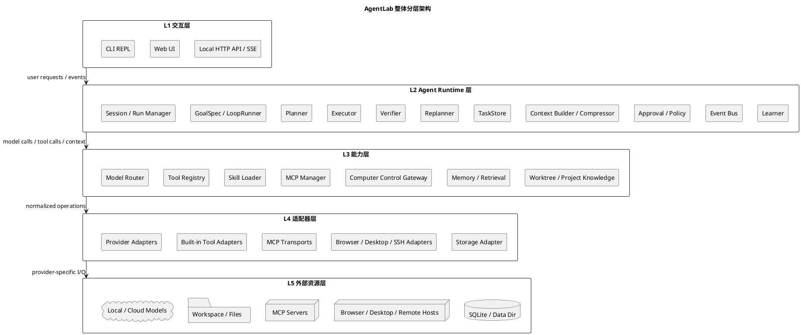
```plantuml
@startuml
title AgentLab 整体分层架构
skinparam componentStyle rectangle
skinparam linetype ortho
skinparam shadowing false
top to bottom direction

rectangle "L1 交互层" as L1 {
  [CLI REPL] as L1Cli
  [Web UI] as L1Web
  [Local HTTP API / SSE] as L1Api
  L1Cli -[hidden]right- L1Web
  L1Web -[hidden]right- L1Api
}

rectangle "L2 Agent Runtime 层" as L2 {
  [Session / Run Manager] as L2Session
  [GoalSpec / LoopRunner] as L2Loop
  [Planner] as L2Planner
  [Executor] as L2Executor
  [Verifier] as L2Verifier
  [Replanner] as L2Replanner
  [Learner] as L2Learner
  [TaskStore] as L2Tasks
  [Context Builder / Compressor] as L2Context
  [Approval / Policy] as L2Policy
  [Event Bus] as L2Events
  L2Session -[hidden]right- L2Loop
  L2Loop -[hidden]right- L2Planner
  L2Planner -[hidden]right- L2Executor
  L2Executor -[hidden]right- L2Verifier
  L2Verifier -[hidden]right- L2Replanner
  L2Replanner -[hidden]right- L2Learner
  L2Replanner -[hidden]right- L2Tasks
  L2Tasks -[hidden]right- L2Context
  L2Context -[hidden]right- L2Policy
  L2Policy -[hidden]right- L2Events
}

rectangle "L3 能力层" as L3 {
  [Model Router] as L3Model
  [Tool Registry] as L3Tools
  [Skill Loader] as L3Skills
  [MCP Manager] as L3Mcp
  [Computer Control Gateway] as L3Control
  [Memory / Retrieval] as L3Memory
  [Worktree / Project Knowledge] as L3Workspace
  L3Model -[hidden]right- L3Tools
  L3Tools -[hidden]right- L3Skills
  L3Skills -[hidden]right- L3Mcp
  L3Mcp -[hidden]right- L3Control
  L3Control -[hidden]right- L3Memory
  L3Memory -[hidden]right- L3Workspace
}

rectangle "L4 适配器层" as L4 {
  [Provider Adapters] as L4Provider
  [Built-in Tool Adapters] as L4Tool
  [MCP Transports] as L4Mcp
  [Browser / Desktop / SSH Adapters] as L4Control
  [Storage Adapter] as L4Storage
  L4Provider -[hidden]right- L4Tool
  L4Tool -[hidden]right- L4Mcp
  L4Mcp -[hidden]right- L4Control
  L4Control -[hidden]right- L4Storage
}

rectangle "L5 外部资源层" as L5 {
  cloud "Local / Cloud Models" as L5Models
  folder "Workspace / Files" as L5Files
  node "MCP Servers" as L5Mcp
  node "Browser / Desktop / Remote Hosts" as L5Control
  database "SQLite / Data Dir" as L5Db
  L5Models -[hidden]right- L5Files
  L5Files -[hidden]right- L5Mcp
  L5Mcp -[hidden]right- L5Control
  L5Control -[hidden]right- L5Db
}

L1 -down-> L2 : user requests / events
L2 -down-> L3 : model calls / tool calls / context
L3 -down-> L4 : normalized operations
L4 -down-> L5 : provider-specific I/O
@enduml
```

这张图只表达分层责任：上层只依赖下一层的抽象接口，不能越过 Runtime 直接调用模型、工具或电脑控制目标。

### 3.2 逻辑组件图

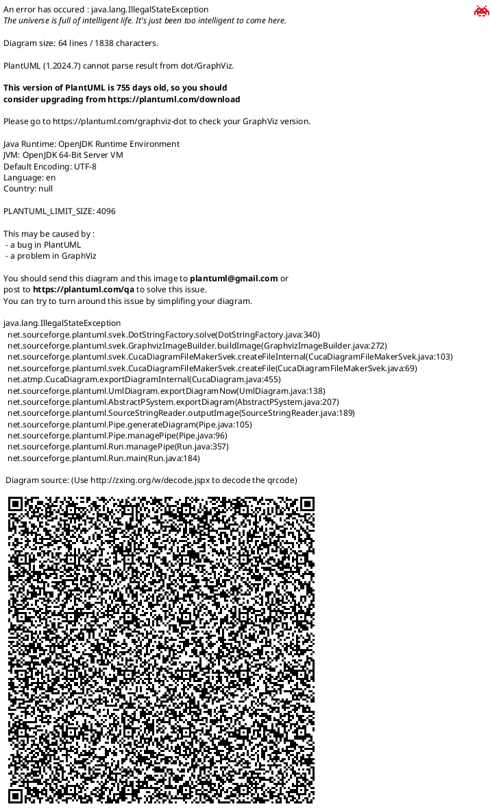
```plantuml
@startuml
title AgentLab 目标逻辑架构
skinparam componentStyle rectangle
skinparam linetype ortho
skinparam shadowing false
top to bottom direction

actor "用户" as User

rectangle "交互层" as UI {
  [CLI REPL] as CLI
  [Web UI + FastAPI / SSE] as Web
  CLI -[hidden]right- Web
}

rectangle "Agent Runtime" as Runtime {
  [Session / Run Manager] as Core
  [GoalSpec / LoopRunner] as GoalLoop
  [Planner / Executor / Verifier / Replanner / Learner] as TaskLoop
  [TaskStore / Context / Compression / Approval / Event Bus] as Control
  Core -[hidden]right- TaskLoop
  Core -[hidden]right- GoalLoop
  GoalLoop -[hidden]right- TaskLoop
  TaskLoop -[hidden]right- Control
}

rectangle "模型接入层" as ModelLayer {
  [Model Router / Provider Adapters] as Router
}

rectangle "模型服务" as Models {
  [本地模型\nOllama / LM Studio] as LocalLLM
  [在线模型\nOpenAI / Anthropic] as CloudLLM
  LocalLLM -[hidden]right- CloudLLM
}

rectangle "能力层" as Capabilities {
  [Skill Loader / Memory] as ContextCapability
  [Tool Registry / MCP Manager] as ToolCapability
  [Computer Control Gateway] as ControlGateway
  [Worktree / Project Knowledge] as WorkspaceCapability
  ContextCapability -[hidden]right- ToolCapability
  ToolCapability -[hidden]right- ControlGateway
  ControlGateway -[hidden]right- WorkspaceCapability
}

rectangle "受控资源" as Resources {
  folder "Workspace / Data Dir" as FS
  node "Browser / Desktop" as LocalComputer
  node "Remote Hosts / MCP Servers" as RemoteTargets
  database "SQLite\n会话 / 审计 / 设置" as DB
  FS -[hidden]right- LocalComputer
  LocalComputer -[hidden]right- RemoteTargets
  RemoteTargets -[hidden]right- DB
}

User -down-> UI : 操作
UI -down-> Runtime : 请求 / 事件流
Runtime -down-> ModelLayer : 推理请求
ModelLayer -down-> Models : 按 profile 调用

Runtime -right-> Capabilities : 加载上下文 / 调用工具 / 控制电脑
Capabilities -down-> Resources : 经过权限策略后访问
@enduml
```

图中仅绘制跨层主调用方向：纵向是对话与模型推理链路，右侧是 Skill、工具、MCP、电脑控制和持久化能力链路；审批与事件分发属于 Runtime 内部控制，不再展开成多条交叉连接。

### 3.3 核心边界

| 边界 | 职责 |
|---|---|
| UI / API | 接收用户输入、展示流式事件与审批请求，不实现 Agent 决策 |
| Agent Runtime | 维护一次任务的规划、执行、重规划、上下文、步数限制、取消与恢复 |
| Capability Layer | 对 Skill、内置 Tool、MCP Tool、记忆进行统一管理 |
| Computer Control | 把浏览器、桌面、远程主机抽象为受控目标，统一做观察、动作、审批、审计和取消 |
| Model Layer | 把不同供应商响应翻译成统一内部事件 |
| Persistence | 保存会话、配置元数据、执行记录；不将 API Key 明文写入业务数据库 |

---

## 4. 跨平台运行与部署

### 4.1 部署拓扑

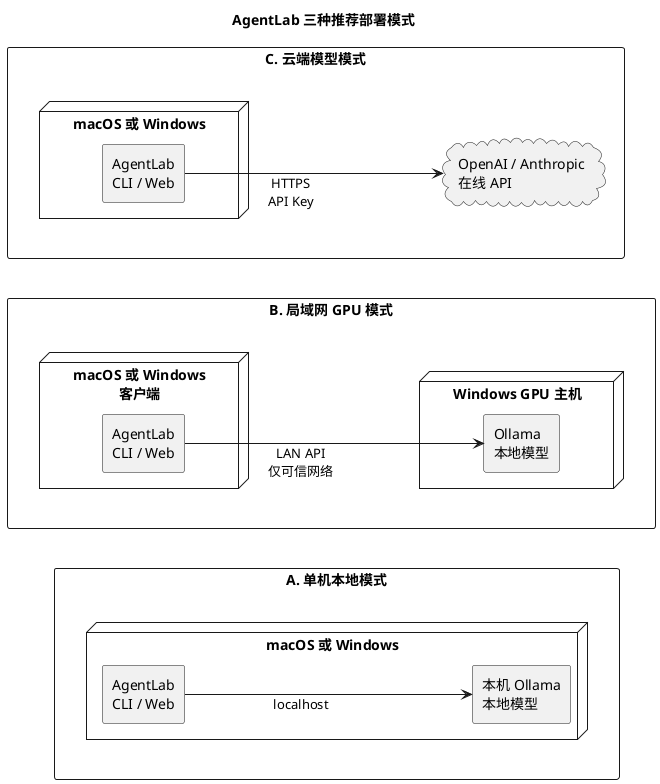
```plantuml
@startuml
title AgentLab 三种推荐部署模式
skinparam componentStyle rectangle
skinparam linetype ortho
skinparam shadowing false
left to right direction

rectangle "A. 单机本地模式" as LocalMode {
  node "macOS 或 Windows" as SingleHost {
    [AgentLab\nCLI / Web] as LocalAgent
    [本机 Ollama\n本地模型] as LocalModel
  }
  LocalAgent -down-> LocalModel : localhost
}

rectangle "B. 局域网 GPU 模式" as LanMode {
  node "macOS 或 Windows\n客户端" as ClientHost {
    [AgentLab\nCLI / Web] as LanAgent
  }
  node "Windows GPU 主机" as GpuHost {
    [Ollama\n本地模型] as GpuModel
  }
  LanAgent -down-> GpuModel : LAN API\n仅可信网络
}

rectangle "C. 云端模型模式" as CloudMode {
  node "macOS 或 Windows" as CloudHost {
    [AgentLab\nCLI / Web] as CloudAgent
  }
  cloud "OpenAI / Anthropic\n在线 API" as CloudModel
  CloudAgent -down-> CloudModel : HTTPS\nAPI Key
}

LocalMode -[hidden]right- LanMode
LanMode -[hidden]right- CloudMode
@enduml
```

三种模式通过模型 profile 选择，不表示三条连接会同时启用。需要离线与隐私时选 A；需要复用 Windows 显卡时选 B；需要在线模型能力时显式选择 C。

### 4.2 推荐运行模式

| 模式 | Agent 运行位置 | 推理位置 | 用途 |
|---|---|---|---|
| 单机离线 | Mac 或 Windows | 本机 Ollama | 隐私数据、无网络环境、轻量任务 |
| GPU 主机服务 | Mac 或 Windows | Windows GPU 电脑的 Ollama | 在多台个人设备间复用较快的本地推理 |
| 云端增强 | Mac 或 Windows | OpenAI / Anthropic | 复杂编码、较强工具调用或长上下文任务 |
| 混合路由 | 本机 | 本地默认，手工切换云端 | 成本与能力折中，默认采用显式切换 |

### 4.3 跨平台工程约束

1. 文件路径全部使用 `pathlib.Path`，不在业务逻辑拼接 `/` 或 `\`。
2. 内置工具使用 Python API 执行文件操作；Shell 工具区分 `powershell` 与 `zsh`/`bash` profile。
3. stdio MCP Server 的启动命令采用参数数组，不依赖 shell 展开与管道语法。
   Windows 下启动器必须解析 `npx.cmd` / `.exe` / `.bat`，不得要求用户维护
   单独的 Windows MCP 配置。
4. 用户数据目录使用平台规范目录，例如 macOS 的 Application Support 与 Windows 的 LocalAppData；开发模式可保留项目内 `.agentlab/`。
5. FastAPI 默认只监听 `127.0.0.1`，局域网开放必须由用户显式配置。
6. 本地模型文件由 Ollama/LM Studio 管理；AgentLab 只存模型 profile，不复制权重文件。
7. 浏览器自动化优先使用隔离浏览器上下文，不默认接管用户正在使用的主浏览器 profile。
8. 桌面控制依赖系统权限：macOS 需要 Accessibility/Screen Recording，Windows 需要相应 UI 自动化权限；未授权时能力不可用。
9. 远程设备控制必须显式配置 host、workspace、认证方式和风险等级，不从模型输出中临时拼接未知远程目标。

---

## 5. 模块分层与目标目录

目标目录结构如下，用于约束模块边界和未来扩展方向。

```text
AgentLab/
  README.md                         # 面向使用者的快速开始、配置入口和常用命令
  pyproject.toml                    # Python 项目元数据、依赖声明、测试/格式化工具配置
  .env.example                      # 环境变量模板；只写变量名和示例，不保存真实密钥

  config/                           # 可版本化的非密钥配置模板
    app.example.yaml                # 应用级配置模板：workspace、日志、默认 profile、安全默认值
    agents.example.yaml             # AgentProfile 模板：角色、模型、工具、Skill、MCP、记忆策略
    models.yaml                     # 模型 profile：provider、model、base_url、能力标签、默认参数
    mcp_servers.example.yaml        # MCP Server 模板：transport、启动命令/URL、风险等级、启用状态
    control.example.yaml            # 电脑控制模板：浏览器、桌面控制、远程主机和下载目录配置
    loop.example.yaml               # Loop Engineering 模板：默认预算、验证器、worktree、学习策略

  skills/                           # 用户可安装/启用的本地 Skill 根目录
    code-review/                    # 单个 Skill 包；目录名是稳定 skill id
      SKILL.md                      # Skill 元数据、触发说明、工作流、工具/MCP 需求声明
      references/                   # Skill 附带的参考资料；按需注入上下文
      scripts/                      # Skill 附带脚本；只能经受控工具和审批执行

  app/                              # AgentLab 应用主包；所有运行时代码都在这里
    __main__.py                     # `python -m app` 入口，只负责分发到 CLI/TUI/server
    cli.py                          # CLI REPL：输入、流式渲染、审批交互、状态展示
    server.py                       # FastAPI 启动入口：HTTP API、SSE、静态 Web UI 托管

    tui/                            # 全屏终端 TUI；复用 Runtime 事件，不实现 Agent 决策
      app.py                        # TUI 应用入口与布局：欢迎栏、会话/任务/审批/对话面板
      banner.py                     # 大号欢迎栏：ASCII art 渲染 "Amaz1ng" 标题
      widgets.py                    # 会话列表、任务面板、审批对话框、控制观察等组件
      events.py                     # 订阅 Runtime Event Bus，把事件映射到 TUI 组件刷新

    config/                         # 配置加载与 schema
      loader.py                     # 合并 CLI/UI/env/YAML/默认值，输出运行时配置对象
      schemas.py                    # ModelConfig、RuntimePolicy、ControlTarget 等配置数据结构

    agent/                          # Agent Runtime 核心，不依赖具体 UI
      runtime.py                    # Runtime 编排入口：串联规划、执行、重规划、事件和审计
      session.py                    # 会话与 run 生命周期：历史、当前 profile、取消、恢复
      goals.py                      # GoalSpec：目标、验收标准、约束、预算、停止条件和验证计划
      loop_runner.py                # LoopRunner：执行→验证→诊断→修复→学习的循环状态机
      verifier.py                   # Verifier：命令、测试、文件断言、浏览器检查、API 检查、人工确认
      learner.py                    # Learner：从成功/失败循环中提取项目规则、Skill 改进和记忆候选
      subagents.py                  # 子 Agent 编排：执行 Agent、验证 Agent、审查 Agent 的隔离运行和结果汇总
      context.py                    # 上下文构建：system prompt、Skill、Memory、工具快照、压缩摘要、最近消息
      context_budget.py             # 上下文预算：模型窗口、预留输出、工具 schema、压缩触发阈值
      context_compaction.py         # 上下文压缩：历史分段、摘要生成、摘要校验、压缩事件
      profiles.py                   # AgentProfile：不同 Agent 的角色、默认模型、工具和记忆策略
      session_router.py             # `/session` 切换、创建、列出、归档和当前会话解析
      planner.py                    # Planner：把用户目标拆成可执行任务清单，写入 TaskStore
      executor.py                   # Executor：按 TaskStore 取下一步任务，驱动模型和工具完成动作
      replanner.py                  # Replanner：根据工具结果、错误、用户反馈调整任务清单
      approval.py                   # 审批策略：分级风险、会话授权、拒绝/取消处理
      events.py                     # Runtime 事件协议：message_delta、tool_requested、approval_required 等
      tasks.py                      # TaskStore：任务 id、状态、依赖、证据、失败原因和展示快照

    workspace/                      # 工作区隔离与项目知识
      worktree.py                   # Git worktree 生命周期：创建、清理、diff、验证通过后合并建议
      knowledge.py                  # 项目知识索引：README、AGENTS/CLAUDE、SKILL、测试命令、架构约定
      scheduler.py                  # 本地定时/后台 loop：cron/GitHub Actions/手动触发的统一描述

    models/                         # 模型接入层；Runtime 只依赖这里的内部协议
      protocol.py                   # ModelResponse、ToolCall、ToolResult、流式回调等内部协议
      router.py                     # 根据 profile 选择 provider adapter，并做能力门控
      openai_adapter.py             # OpenAI 原生 Responses API 适配器
      anthropic_adapter.py          # Anthropic Messages API 适配器
      compatible_adapter.py         # Ollama/LM Studio/vLLM 等 OpenAI-compatible 适配器
      action_parser.py              # 非原生 tools 模型的 JSON action parser；实验性能力门控

    tools/                          # 工具系统；文件、shell、MCP、控制动作都统一成 ToolDescriptor
      registry.py                   # ToolRegistry 与 ToolDescriptor：名称、schema、risk、scope、target
      builtin/                      # 应用内置工具
        files.py                    # 文件工具：read/write/list，受 workspace 约束
        code_search.py              # 代码搜索工具：按文本/正则/文件名快速定位代码位置，只读
        shell.py                    # 本机 shell 工具：cwd、timeout、输出截断、强审批
        todo.py                     # 会话任务清单工具；无外部副作用

    control/                        # Computer Control Gateway 与具体控制 adapter
      gateway.py                    # 统一入口：解析 target、校验 capability/risk、走审批和审计
      sessions.py                   # ControlSession、Observation、截图引用、取消和生命周期管理
      browser.py                    # Playwright 浏览器控制：open、snapshot、click、type、press、download
      desktop.py                    # 桌面观察与操作：截图、坐标点击、键盘输入；默认禁用
      remote.py                     # SSH/远程 Worker：远程命令、文件传输、远程浏览器桥接

    skills/                         # Skill 运行时支持
      loader.py                     # 扫描 Skill 目录，解析 SKILL.md，校验 metadata
      catalog.py                    # Skill Catalog：启用状态、匹配规则、工具/MCP 需求

    mcp/                            # MCP Client 管理
      manager.py                    # MCP Server 生命周期、工具发现、启用/禁用、健康状态
      adapter.py                    # MCP 工具到 ToolDescriptor 的适配、参数/结果转换
      transports.py                 # stdio 与 Streamable HTTP transport 封装

    storage/                        # 本地持久化与审计
      sqlite.py                     # SQLite 连接、schema、migration、session/run/message 存储
      audit.py                      # 工具、控制动作、审批、错误的脱敏审计记录
      blobs.py                      # 大文本、截图、下载文件等内容引用与本地数据目录管理
      loop_store.py                 # GoalSpec、LoopRun、Iteration、VerificationResult、Worktree 元数据存储

    memory/                         # 长期记忆与检索，可独立于核心对话路径启用
      store.py                      # 用户偏好、Agent 经验、项目事实、会话摘要等长期记忆存储
      retrieval.py                  # 本地知识检索接口：embedding/vector/rerank 的抽象边界
      policy.py                     # 记忆写入/读取策略：作用域、敏感信息过滤、用户确认

    web/                            # 本地 Web UI 资源与 API 组织
      api.py                        # FastAPI route 定义：sessions、runs、approvals、control、settings
      events.py                     # SSE/WebSocket 事件推送适配 Runtime Event Bus
      static/                       # 前端静态资源：CSS、JS、图标、构建产物
      templates/                    # 服务端模板；轻量 UI 可用 Jinja2/HTMX

    util/                           # 跨模块通用工具
      redact.py                     # 密钥、token、header、工具输出的脱敏
      paths.py                      # 跨平台路径、用户数据目录、workspace resolve
      logging.py                    # 结构化日志与本地日志文件配置

  tests/                            # 自动化测试
    unit/                           # 纯离线单元测试：配置、adapter、runtime、审批、工具
    integration/                    # 集成测试：本地浏览器、MCP 测试 server、可选 provider 烟测
    fixtures/                       # 测试页面、fake model、fake MCP server、fake SSH target

  data/                             # 本地运行数据目录；gitignore
    sqlite/                         # SQLite 数据库文件
    blobs/                          # 截图、大文本、下载文件、工具输出引用
    browser-profiles/               # 受控浏览器 profile；隔离/命名 profile 分开
    logs/                           # 本地日志和脱敏审计导出
```

---

## 6. 模型层设计

### 6.1 内部统一协议

模型适配层向 Runtime 输出相同的数据结构：

```python
@dataclass
class ToolCall:
    id: str
    name: str
    arguments: dict[str, object]

@dataclass
class ModelResponse:
    text: str
    tool_calls: list[ToolCall]
    usage: dict[str, int]
    provider_payload: object
    finish_reason: str | None = None
```

Runtime 只处理 `ModelResponse`。adapter 负责：

- 将统一工具 schema 翻译成 provider 要求的格式。
- 将流式文本与工具参数增量翻译为内部事件。
- 将工具结果重新编码为该 provider 需要的下一轮输入。
- 发现模型不支持工具调用时，在会话启动前给出可理解的错误，而不是执行中途失控。

### 6.2 模型层详细图

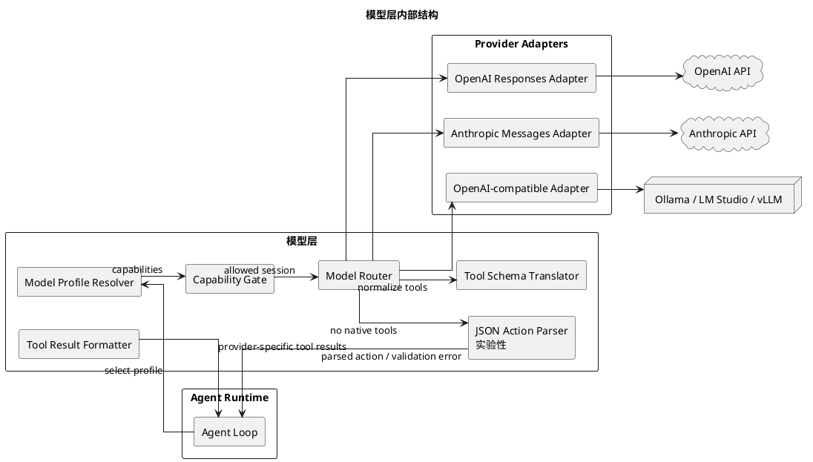
```plantuml
@startuml
title 模型层内部结构
skinparam componentStyle rectangle
skinparam linetype ortho
skinparam shadowing false
left to right direction

rectangle "Agent Runtime" as Runtime {
  [Agent Loop] as Loop
}

rectangle "模型层" as ModelLayer {
  [Model Profile Resolver] as Profile
  [Capability Gate] as Gate
  [Model Router] as Router
  [Tool Schema Translator] as Schema
  [Tool Result Formatter] as Formatter
  [JSON Action Parser\n实验性] as JsonParser
}

rectangle "Provider Adapters" as Adapters {
  [OpenAI Responses Adapter] as OpenAI
  [Anthropic Messages Adapter] as Anthropic
  [OpenAI-compatible Adapter] as Compatible
}

cloud "OpenAI API" as OpenAICloud
cloud "Anthropic API" as AnthropicCloud
node "Ollama / LM Studio / vLLM" as LocalServer

Loop --> Profile : select profile
Profile --> Gate : capabilities
Gate --> Router : allowed session
Router --> Schema : normalize tools
Router --> OpenAI
Router --> Anthropic
Router --> Compatible
Router --> JsonParser : no native tools
Formatter --> Loop : provider-specific tool results
OpenAI --> OpenAICloud
Anthropic --> AnthropicCloud
Compatible --> LocalServer
JsonParser --> Loop : parsed action / validation error
@enduml
```

模型层必须先经过 `Capability Gate`。普通 chat/instruct 模型可以聊天，但只有通过工具能力校验或绑定可靠动作解析器后，才允许驱动文件、浏览器、桌面和远程执行工具。

### 6.3 Provider 类型

| Provider ID | 目标对象 | 接口策略 |
|---|---|---|
| `ollama` / `openai_compatible` | Ollama、LM Studio 或兼容端点 | OpenAI-compatible Chat/Responses 能力按 profile 声明 |
| `anthropic` | Claude 官方 API 或明确兼容代理 | Anthropic Messages 原生适配 |
| `openai` | GPT 在线 API | OpenAI 原生 Responses adapter |

不建议在配置中把 `ollama` 和 `openai` 混为一个 provider。即使 SDK 调用形式类似，它们的模型能力、认证、错误恢复和工具兼容程度并不完全相同。

任意 chat/instruct 模型都可以接入为对话模型，但只有满足以下条件之一时，才能启用文件、浏览器、桌面、远程执行等 Agent 能力：

1. profile 声明并通过校验确认支持结构化 tool calling。
2. profile 绑定了经过测试的动作解析器，例如 JSON action parser。
3. 用户显式将该模型标记为实验性 Agent 模型，并接受更高误调用风险。

不支持工具调用且格式输出不稳定的模型只能用于问答、总结和辅助规划，不能直接驱动高风险工具。

### 6.4 模型 profile

`.env` 适合放密钥和快速覆盖；可切换多组模型时应引入 YAML profile：

```yaml
# config/models.yaml
models:
  local_qwen:
    provider: ollama
    model: qwen2.5-coder:7b-instruct
    base_url: http://127.0.0.1:11434/v1
    capabilities: [chat, tools, streaming]
    params:
      temperature: 0.2
      context_size: 8192

  cloud_gpt:
    provider: openai
    model: ${OPENAI_MODEL}
    api_key_env: OPENAI_API_KEY
    capabilities: [chat, tools, streaming]

  cloud_claude:
    provider: anthropic
    model: ${ANTHROPIC_MODEL}
    api_key_env: ANTHROPIC_API_KEY
    capabilities: [chat, tools, streaming]
```

运行时选择：

```bash
python -m app --profile local_qwen
python -m app --profile cloud_claude
python -m app serve --profile cloud_gpt
```

系统可以通过兼容层接受 `LLM_MODEL` / `LLM_PROVIDER` 等环境变量，并规定其优先级高于 YAML。

### 6.5 模型切换流程

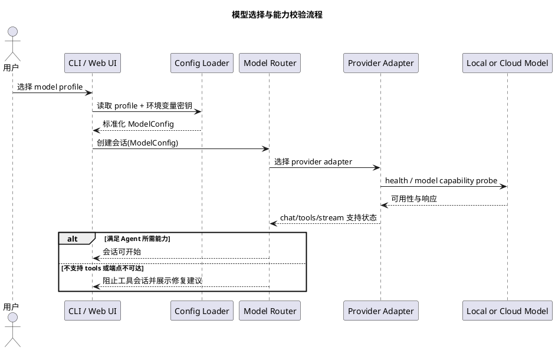
```plantuml
@startuml
title 模型选择与能力校验流程
actor 用户 as User
participant "CLI / Web UI" as UI
participant "Config Loader" as Config
participant "Model Router" as Router
participant "Provider Adapter" as Adapter
participant "Local or Cloud Model" as Model

User -> UI : 选择 model profile
UI -> Config : 读取 profile + 环境变量密钥
Config --> UI : 标准化 ModelConfig
UI -> Router : 创建会话(ModelConfig)
Router -> Adapter : 选择 provider adapter
Adapter -> Model : health / model capability probe
Model --> Adapter : 可用性与响应
Adapter --> Router : chat/tools/stream 支持状态
alt 满足 Agent 所需能力
  Router --> UI : 会话可开始
else 不支持 tools 或端点不可达
  Router --> UI : 阻止工具会话并展示修复建议
end
@enduml
```

---

## 7. Agent Runtime 与工具调用

### 7.1 Runtime 职责

一次会话由 Runtime 管理，至少包含：

- 当前 AgentProfile：角色、system prompt、默认模型、默认 Skill/MCP/工具、记忆策略和审批策略。
- 当前 Session：绑定某个 AgentProfile，持有独立消息历史、TaskStore、Run 历史和临时授权。
- 当前模型 profile 和能力。
- 当前 GoalSpec：目标、验收标准、约束、预算、验证计划、停止条件和工作区隔离策略。
- 消息历史与被注入的 Skill 上下文。
- 上下文预算、压缩摘要、最近消息窗口和可回溯内容引用。
- 当前启用的内置工具与 MCP 工具快照。
- 长期记忆检索结果和本轮产生的候选记忆。
- Planner 生成的任务计划、Executor 当前任务和 Replanner 的调整记录。
- LoopRunner 的循环状态、Verifier 的验证证据、Learner 的经验沉淀候选。
- TaskStore 中每个任务的状态、依赖、证据、失败原因和用户可见摘要。
- 审批策略、最大执行步数、取消信号和超时。
- 文本增量、工具开始/完成、审批请求、错误、token 用量等事件。

Runtime 采用 `GoalSpec + LoopRunner + Planner + Executor + Verifier + Replanner + Learner + TaskStore` 的任务拆解与循环工程结构：

| 模块 | 职责 | 输出 |
|---|---|---|
| GoalSpec | 固化用户目标、成功标准、约束、预算、停止条件和验证计划 | Goal definition、acceptance criteria |
| LoopRunner | 在预算和权限内驱动执行、验证、诊断、修复、学习的循环 | LoopRun、Iteration、status |
| Planner | 判断任务复杂度，复杂任务拆成可执行子任务，声明依赖、风险和预期证据 | 初始 TaskPlan |
| Executor | 选择下一个可执行任务，调用模型、工具、MCP 或电脑控制完成该任务 | Tool calls、observations、task evidence |
| Verifier | 用测试命令、文件断言、浏览器检查、API 检查或人工确认验证目标是否达成 | VerificationResult、evidence refs |
| Replanner | 根据执行结果、错误、用户拒绝、环境变化调整任务、追加任务或标记阻塞 | Plan patch |
| Learner | 从成功与失败循环中提取项目规则、Skill 改进建议和长期记忆候选 | Memory candidates、skill patches |
| TaskStore | 持久化任务状态，供 CLI/Web 展示，也供 Runtime 恢复和审计 | Task snapshot、history |

### 7.2 多 Agent、Session 与长期记忆

AgentLab 是 Agent 开发环境，不是单一固定助手。一个 Agent 由 `AgentProfile` 定义，一个会话由 `Session` 承载。用户可以创建多个 Agent，并通过 `/session` 在不同 Agent 的会话之间切换。

#### 7.2.1 核心概念

| 概念 | 定义 | 典型字段 |
|---|---|---|
| AgentProfile | 一个可复用的 Agent 定义，描述角色、能力和默认策略 | `agent_id`、`name`、`description`、`system_prompt`、`model_profile`、`skills`、`mcp_servers`、`tools`、`memory_policy`、`approval_policy` |
| Session | 一段与某个 AgentProfile 绑定的对话和执行上下文 | `session_id`、`agent_id`、`title`、`messages`、`task_store`、`active_run`、`temporary_grants` |
| Run | Session 中一次用户请求的执行实例 | `run_id`、`status`、`events`、`tool_executions`、`control_observations`、`token_usage` |
| GoalSpec | Loop Engineering 的目标定义 | `goal_id`、`objective`、`success_criteria`、`constraints`、`budgets`、`verification_plan`、`stop_conditions`、`workspace_mode` |
| LoopRun | 围绕某个 GoalSpec 的循环执行记录 | `loop_id`、`goal_id`、`session_id`、`status`、`iteration`、`budget_used`、`worktree_id` |
| VerificationResult | 验证器给出的目标达成证据 | `verification_id`、`loop_id`、`iteration`、`status`、`checks`、`evidence_refs`、`failure_category` |
| Memory | 可跨 session 复用的长期信息 | `memory_id`、`scope`、`agent_id`、`workspace`、`content`、`source`、`confidence`、`created_at`、`last_used_at` |
| ContextSummary | 对单个 session 中旧消息和已完成 run 的压缩摘要 | `summary_id`、`session_id`、`source_message_range`、`summary_ref`、`token_count_before`、`token_count_after`、`created_at` |

AgentProfile 和 Session 的关系：

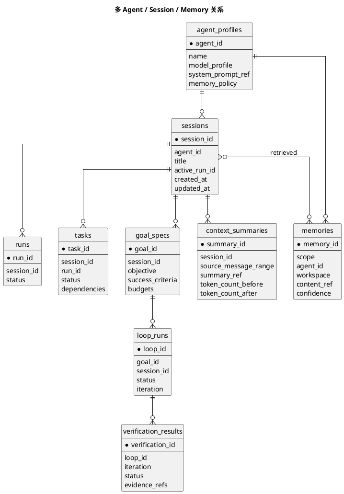
```plantuml
@startuml
title 多 Agent / Session / Memory 关系
skinparam linetype ortho
skinparam shadowing false
hide circle

entity "agent_profiles" as agents {
  * agent_id
  --
  name
  model_profile
  system_prompt_ref
  memory_policy
}

entity "sessions" as sessions {
  * session_id
  --
  agent_id
  title
  active_run_id
  created_at
  updated_at
}

entity "runs" as runs {
  * run_id
  --
  session_id
  status
}

entity "tasks" as tasks {
  * task_id
  --
  session_id
  run_id
  status
  dependencies
}

entity "goal_specs" as goals {
  * goal_id
  --
  session_id
  objective
  success_criteria
  budgets
}

entity "loop_runs" as loops {
  * loop_id
  --
  goal_id
  session_id
  status
  iteration
}

entity "verification_results" as verifications {
  * verification_id
  --
  loop_id
  iteration
  status
  evidence_refs
}

entity "memories" as memories {
  * memory_id
  --
  scope
  agent_id
  workspace
  content_ref
  confidence
}

entity "context_summaries" as summaries {
  * summary_id
  --
  session_id
  source_message_range
  summary_ref
  token_count_before
  token_count_after
}

agents ||--o{ sessions
sessions ||--o{ runs
sessions ||--o{ tasks
sessions ||--o{ goals
goals ||--o{ loops
loops ||--o{ verifications
agents ||--o{ memories
sessions }o--o{ memories : retrieved
sessions ||--o{ summaries
@enduml
```

#### 7.2.2 `/session` 命令

CLI 中的 `/session` 是多 Agent 的主入口。命令目标是“切换或管理当前会话”，而不是直接修改模型配置。

```text
/session                         # 显示当前 session、agent、模型、任务摘要和记忆状态
/session list                    # 列出所有 session，展示 agent、title、updated_at、状态
/session new <agent_id> [title]  # 基于指定 agent 创建新 session 并切换过去
/session switch <session_id>     # 切换到已有 session，恢复消息历史和 TaskStore
/session rename <title>          # 重命名当前 session
/session archive <session_id>    # 归档 session，不删除审计记录
/session agents                  # 列出可用 AgentProfile
```

Web UI 中应提供等价能力：Agent 列表、Session 列表、新建 Session、切换 Session、归档 Session。

#### 7.2.3 AgentProfile 配置

```yaml
# config/agents.yaml
agents:
  coding:
    name: Coding Agent
    description: 代码理解、修改、测试和代码审查
    model_profile: local_qwen
    system_prompt: prompts/coding.md
    skills: [code-review]
    tools: [read_file, write_file, list_dir, code_search, shell, todo_write]
    mcp_servers: [git, github, ide_lsp]
    memory_policy:
      read_scopes: [user, agent, workspace]
      write_scopes: [agent, workspace]
      require_confirmation_for_sensitive_memory: true

  browser:
    name: Browser Agent
    description: 网页浏览、表单填写和网页自动化
    model_profile: cloud_claude
    system_prompt: prompts/browser.md
    tools: [todo_write]
    mcp_servers: [playwright]
    memory_policy:
      read_scopes: [user, agent]
      write_scopes: [agent]
```

AgentProfile 只声明默认能力，不自动越过安全策略。即使某个 Agent 默认启用浏览器或远程主机，具体动作仍需走风险评估和审批。

#### 7.2.4 长期记忆作用域

长期记忆必须有明确作用域，避免不同 Agent、不同项目、不同隐私边界互相污染：

| scope | 用途 | 示例 |
|---|---|---|
| `user` | 用户长期偏好，所有 Agent 可按策略读取 | “用户偏好中文回复，代码解释要简洁” |
| `agent` | 某个 Agent 的经验和工作习惯 | “Coding Agent 修改 Python 前先跑 unit tests” |
| `workspace` | 某个项目的事实和约定 | “本项目使用 FastAPI，测试命令是 pytest tests/unit” |
| `session` | 仅当前 session 的摘要和临时事实 | “这轮正在排查 MCP timeout” |

记忆写入流程：

1. Runtime 从对话、工具结果、用户显式说明中产生 memory candidate。
2. MemoryPolicy 判断作用域、敏感性、置信度和是否需要用户确认。
3. 通过审批后写入 MemoryStore；敏感内容写入前必须脱敏或拒绝。
4. 后续构建上下文时，按 AgentProfile 的 `read_scopes` 检索相关记忆。

记忆读取要求：

- 记忆注入上下文前必须标注来源和作用域。
- 用户可查看、删除、禁用某条记忆。
- 云端模型会接收记忆内容时，应按数据边界策略提示。
- 密钥、token、私钥、cookie、验证码、支付信息不能作为长期记忆保存。

#### 7.2.5 多 Agent 切换流程

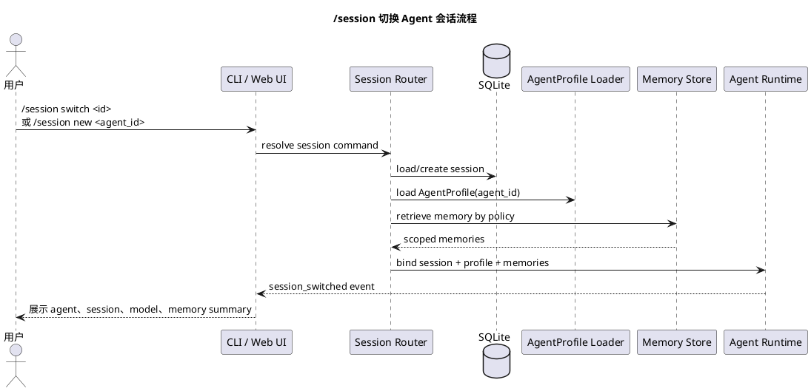
```plantuml
@startuml
title /session 切换 Agent 会话流程
actor 用户 as User
participant "CLI / Web UI" as UI
participant "Session Router" as Router
database "SQLite" as DB
participant "AgentProfile Loader" as Profiles
participant "Memory Store" as Memory
participant "Agent Runtime" as Runtime

User -> UI : /session switch <id>\n或 /session new <agent_id>
UI -> Router : resolve session command
Router -> DB : load/create session
Router -> Profiles : load AgentProfile(agent_id)
Router -> Memory : retrieve memory by policy
Memory --> Router : scoped memories
Router -> Runtime : bind session + profile + memories
Runtime --> UI : session_switched event
UI --> User : 展示 agent、session、model、memory summary
@enduml
```

### 7.3 上下文构建与压缩

上下文压缩是 Runtime 的核心能力之一。它的目标不是把所有历史都变成长期记忆，而是在单个 session 内控制模型输入长度，让长对话和复杂任务可以持续推进。

#### 7.3.1 上下文组成

每次模型调用前，Context Builder 按稳定顺序组装上下文：

| 部分 | 来源 | 说明 |
|---|---|---|
| System Prompt | AgentProfile + Runtime 默认规则 | 角色、行为边界、安全规则 |
| Active Task | TaskStore | 当前任务、依赖、完成标准、风险提示 |
| Skill Context | Skill Loader | 当前任务匹配到的 Skill 说明和必要参考 |
| Tool Snapshot | ToolRegistry + MCP Manager | 当前可用工具 schema、风险和能力边界 |
| Memory Context | MemoryStore | 按 memory_policy 检索出的长期记忆，必须标注 scope/source |
| Context Summary | ContextCompressor | 本 session 中旧消息和已完成 run 的压缩摘要 |
| Recent Messages | Message Store | 最近的用户消息、assistant 回复、未完成工具调用和必要工具结果 |
| Evidence References | Storage/Blob Store | 大文本、截图、下载文件、长工具输出的引用和摘要 |

上下文压缩只替换“模型输入中的旧历史片段”，不删除原始消息、工具审计或控制观察记录。原始内容的保留与删除由数据保留策略决定，不能由压缩流程隐式删除。

#### 7.3.2 上下文预算

Runtime 必须根据当前模型 profile 的上下文窗口计算 `ContextBudget`：

| 预算项 | 策略 |
|---|---|
| `model_context_limit` | 来自模型 profile 或 provider 能力探测 |
| `reserved_output_tokens` | 为最终回答、工具参数和重规划预留输出空间 |
| `system_and_tools_budget` | system prompt、Skill、tool schema 的固定预算 |
| `memory_budget` | 长期记忆注入上限，超过则按相关性和 scope 裁剪 |
| `summary_budget` | 压缩摘要上限，优先保留最近一次有效摘要 |
| `recent_messages_budget` | 最近消息窗口，必须保留最后用户请求和当前未完成 run |
| `evidence_budget` | 工具结果和观察摘要预算，大内容只放引用 |

推荐触发阈值：

| 触发点 | 动作 |
|---|---|
| 预计输入超过上下文窗口的 70% | 发出 `context_budget_warning`，下一次稳定点准备压缩 |
| 预计输入超过上下文窗口的 85% | 在下一次模型调用前强制压缩旧历史 |
| 切换到上下文更小的模型 profile | 重新计算预算并压缩到新模型可接受范围 |
| 一个复杂 run 完成后历史明显增长 | 后台生成 session summary，降低下一轮延迟 |
| session 恢复或 `/session switch` | 加载最近 summary + recent messages，而不是全量历史 |
| 用户手动执行 `/context compact` | 立即压缩当前 session 的可压缩历史 |

#### 7.3.3 压缩摘要结构

ContextCompressor 输出结构化摘要，而不是自由散文。摘要至少包含：

```yaml
summary:
  user_goal: 当前用户目标和成功标准
  active_constraints: 用户明确约束、禁止事项、偏好
  decisions: 已确认的设计决定和原因
  current_state: 代码/网页/远程设备/任务状态
  open_tasks: 未完成任务、阻塞原因、下一步建议
  tool_evidence:
    - source: tool_execution_id 或 observation_id
      finding: 可复用结论
  files_and_artifacts: 涉及的文件、截图、下载文件、外部页面引用
  failed_attempts: 已尝试但失败的方案，避免重复
  approvals_and_risks: 本 session 已授权范围、被拒绝动作和高风险提示
  memory_candidates: 可能写入长期记忆的候选，不自动落库
  handoff_note: 给后续模型调用的简短交接说明
```

压缩摘要必须带 `source_message_range`、`source_run_ids`、`token_count_before`、`token_count_after`、`compression_model_profile` 和 `created_at`。如果摘要中引用了工具结果、截图或文件内容，应引用 evidence id 或 content ref，避免把大内容重复塞回模型上下文。

#### 7.3.4 压缩流程

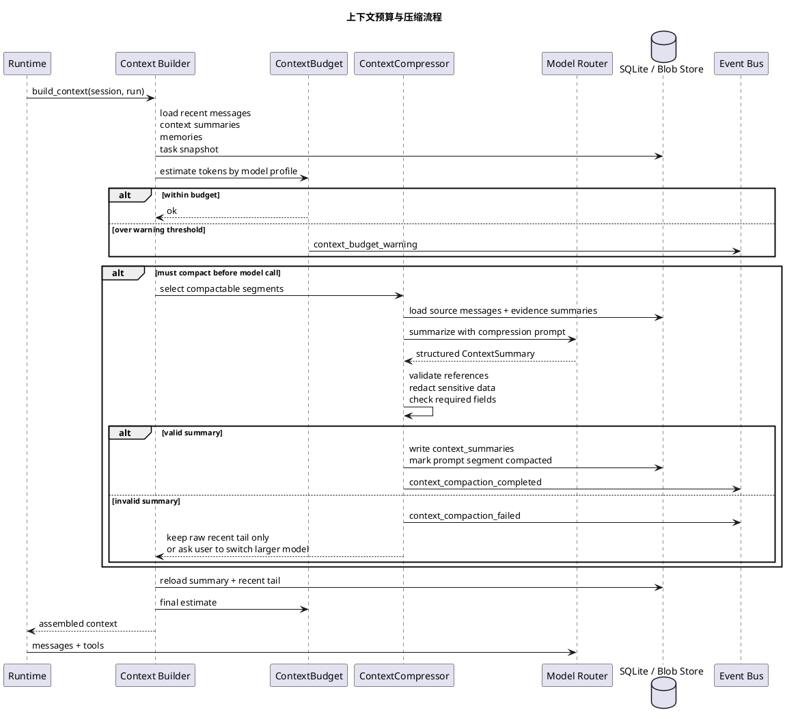
```plantuml
@startuml
title 上下文预算与压缩流程
skinparam linetype ortho
skinparam shadowing false

participant "Runtime" as Runtime
participant "Context Builder" as Builder
participant "ContextBudget" as Budget
participant "ContextCompressor" as Compressor
participant "Model Router" as Model
database "SQLite / Blob Store" as Store
participant "Event Bus" as Events

Runtime -> Builder : build_context(session, run)
Builder -> Store : load recent messages\ncontext summaries\nmemories\ntask snapshot
Builder -> Budget : estimate tokens by model profile

alt within budget
  Budget --> Builder : ok
else over warning threshold
  Budget -> Events : context_budget_warning
end

alt must compact before model call
  Builder -> Compressor : select compactable segments
  Compressor -> Store : load source messages + evidence summaries
  Compressor -> Model : summarize with compression prompt
  Model --> Compressor : structured ContextSummary
  Compressor -> Compressor : validate references\nredact sensitive data\ncheck required fields
  alt valid summary
    Compressor -> Store : write context_summaries\nmark prompt segment compacted
    Compressor -> Events : context_compaction_completed
  else invalid summary
    Compressor -> Events : context_compaction_failed
    Compressor --> Builder : keep raw recent tail only\nor ask user to switch larger model
  end
end

Builder -> Store : reload summary + recent tail
Builder -> Budget : final estimate
Builder --> Runtime : assembled context
Runtime -> Model : messages + tools
@enduml
```

#### 7.3.5 压缩边界与安全规则

- 当前未完成 run、最后一条用户请求、pending approval、未闭合的 tool call/tool result 对不能被压缩掉。
- 压缩不能改变审计事实：审批记录、工具参数摘要、工具结果摘要、控制动作和错误必须保留结构化记录。
- 压缩摘要进入云端模型前，必须经过与普通上下文相同的数据边界提示和脱敏策略。
- 如果当前 session 包含敏感本地数据，CompressionPolicy 可以要求使用本地小模型做摘要，或要求用户确认后才允许云端模型参与压缩。
- 压缩摘要不能自动写入长期记忆。只有 MemoryPolicy 明确允许并通过确认的 `memory_candidate` 才能进入 MemoryStore。
- 摘要需要保留“不确定性”：无法确认的事实必须标记为 unknown 或 unresolved，不能为了缩短上下文而编造结论。
- 用户应能查看当前压缩摘要，并能请求重新压缩或禁用本 session 的自动压缩。

#### 7.3.6 与长期记忆的区别

| 能力 | 作用域 | 是否跨 session | 主要用途 |
|---|---|---|---|
| Context Summary | 单个 session | 默认不跨 session | 让长对话在有限上下文窗口内继续 |
| Session Summary Memory | `session` memory | 可用于恢复当前 session | 会话摘要和交接信息 |
| Long-term Memory | user/agent/workspace | 可跨 session | 用户偏好、项目事实、Agent 经验 |
| Evidence Reference | run/tool/control | 按审计策略保留 | 回看工具结果、截图、下载文件和操作证据 |

### 7.4 Runtime 内部详细图

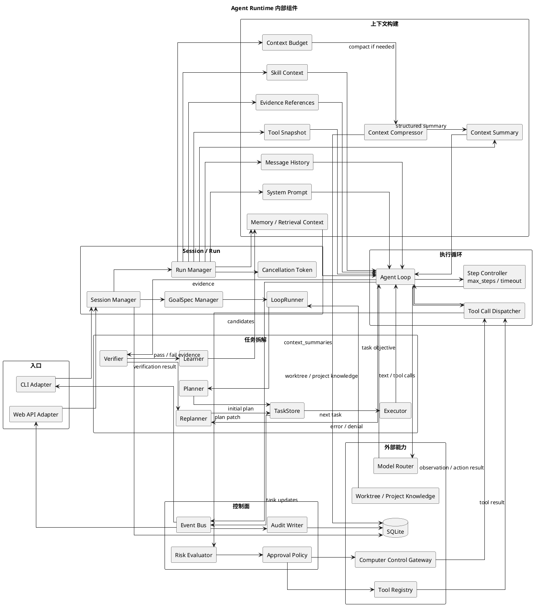
```plantuml
@startuml
title Agent Runtime 内部组件
skinparam componentStyle rectangle
skinparam linetype ortho
skinparam shadowing false
left to right direction

rectangle "入口" as Entry {
  [CLI Adapter] as Cli
  [Web API Adapter] as Web
}

rectangle "Session / Run" as SessionBox {
  [Session Manager] as Session
  [Run Manager] as Run
  [GoalSpec Manager] as Goal
  [LoopRunner] as LoopRunner
  [Cancellation Token] as Cancel
}

rectangle "任务拆解" as PlanningBox {
  [Planner] as Planner
  [TaskStore] as TaskStore
  [Executor] as Executor
  [Verifier] as Verifier
  [Replanner] as Replanner
  [Learner] as Learner
}

rectangle "上下文构建" as ContextBox {
  [Message History] as History
  [System Prompt] as Prompt
  [Skill Context] as Skill
  [Memory / Retrieval Context] as Memory
  [Context Budget] as ContextBudget
  [Context Compressor] as Compressor
  [Context Summary] as Summary
  [Evidence References] as Evidence
  [Tool Snapshot] as ToolSnapshot
}

rectangle "执行循环" as LoopBox {
  [Agent Loop] as Loop
  [Step Controller\nmax_steps / timeout] as Step
  [Tool Call Dispatcher] as Dispatcher
}

rectangle "控制面" as ControlBox {
  [Approval Policy] as Approval
  [Risk Evaluator] as Risk
  [Event Bus] as Events
  [Audit Writer] as Audit
}

rectangle "外部能力" as External {
  [Model Router] as Model
  [Tool Registry] as Tools
  [Computer Control Gateway] as Control
  [Worktree / Project Knowledge] as Workspace
  database "SQLite" as DB
}

Cli --> Session
Web --> Session
Session --> Run
Session --> Goal
Goal --> LoopRunner
Run --> Cancel
LoopRunner --> Planner
Planner --> TaskStore : initial plan
TaskStore --> Executor : next task
Executor --> Loop : task objective
Loop --> Verifier : evidence
Verifier --> Replanner : verification result
Loop --> Replanner : error / denial
Replanner --> TaskStore : plan patch
Verifier --> Learner : pass / fail evidence
Learner --> Memory : candidates
Run --> History
Run --> Prompt
Run --> Skill
Run --> Memory
Run --> ContextBudget
Run --> Summary
Run --> Evidence
Run --> ToolSnapshot
History --> Loop
Prompt --> Loop
Skill --> Loop
Memory --> Loop
ContextBudget --> Compressor : compact if needed
Compressor --> Summary : structured summary
Compressor --> DB : context_summaries
Summary --> Loop
Evidence --> Loop
ToolSnapshot --> Loop
Loop --> Step
Step --> Model
Model --> Loop : text / tool calls
Loop --> Dispatcher
Dispatcher --> Risk
Risk --> Approval
Approval --> Tools
Approval --> Control
Tools --> Dispatcher : tool result
Control --> Dispatcher : observation / action result
Workspace --> LoopRunner : worktree / project knowledge
Dispatcher --> Loop
Loop --> Events
TaskStore --> Events : task updates
Events --> Cli
Events --> Web
Events --> Audit
Audit --> DB
Session --> DB
@enduml
```

Runtime 的原则是：模型只能提出计划建议、任务调整和 tool call；任务状态由 TaskStore 维护，是否执行工具、如何执行、是否需要观察或审批，都由 Runtime 的风险评估、审批策略和调度器决定。

### 7.5 任务拆解、验证与重规划流程

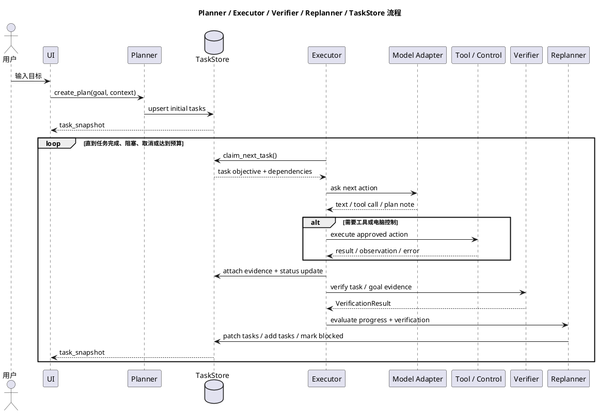
```plantuml
@startuml
title Planner / Executor / Verifier / Replanner / TaskStore 流程
skinparam linetype ortho
skinparam shadowing false

actor 用户 as User
participant "UI" as UI
participant "Planner" as Planner
database "TaskStore" as Store
participant "Executor" as Executor
participant "Model Adapter" as Model
participant "Tool / Control" as Tool
participant "Verifier" as Verifier
participant "Replanner" as Replanner

User -> UI : 输入目标
UI -> Planner : create_plan(goal, context)
Planner -> Store : upsert initial tasks
Store --> UI : task_snapshot

loop 直到任务完成、阻塞、取消或达到预算
  Executor -> Store : claim_next_task()
  Store --> Executor : task objective + dependencies
  Executor -> Model : ask next action
  Model --> Executor : text / tool call / plan note
  alt 需要工具或电脑控制
    Executor -> Tool : execute approved action
    Tool --> Executor : result / observation / error
  end
  Executor -> Store : attach evidence + status update
  Executor -> Verifier : verify task / goal evidence
  Verifier --> Executor : VerificationResult
  Executor -> Replanner : evaluate progress + verification
  Replanner -> Store : patch tasks / add tasks / mark blocked
  Store --> UI : task_snapshot
end
@enduml
```

任务拆解不是一次性计划。每个工具结果、验证结果、错误、审批拒绝或用户新输入都可能触发 Replanner 调整任务清单；TaskStore 是唯一可信任务状态来源。Loop 模式下，Verifier 的结论是 Replanner 是否继续修复的主要依据。

### 7.6 Loop Engineering 模式

Loop Engineering 是 AgentLab 的高级运行模式。它把一次性 prompt 改造成“目标驱动的循环工程”：用户先定义目标、成功标准、约束和预算，Agent 在本地 Runtime 的权限控制下持续执行、验证、诊断、修复和学习，直到目标达成、被阻塞、预算耗尽或用户停止。

#### 7.6.1 Prompt 模式与 Loop 模式的区别

| 模式 | 用户输入 | Agent 行为 | 结束条件 |
|---|---|---|---|
| Prompt 模式 | 一段请求 | 模型回答或执行一次有限工具循环 | 模型给出最终回答或达到 max_steps |
| Task 模式 | 一个复杂任务 | Planner 拆任务，Executor 执行，Replanner 修正 | TaskStore 全部完成、阻塞或失败 |
| Loop 模式 | GoalSpec + 验收标准 + 预算 | 执行、验证、诊断、修复、再验证，并沉淀经验 | 验证通过、预算耗尽、用户停止、策略阻止 |

Loop 模式不能被理解为“无人值守自动乱跑”。它必须有明确 GoalSpec、可执行验证计划、预算上限、权限边界和停止条件。

#### 7.6.2 GoalSpec

GoalSpec 是 Loop Engineering 的入口。用户可以通过 `/goal` 逐步定义，也可以通过 `/loop` 一次性启动时由 Runtime 引导补齐。

```yaml
goal:
  objective: "修复登录页在 Safari 下按钮错位的问题"
  success_criteria:
    - "本地单元测试通过"
    - "浏览器检查 login 页面按钮不遮挡输入框"
    - "只修改 web/login 相关文件"
  constraints:
    allowed_paths: ["app/web/", "tests/"]
    forbidden_actions: ["delete_database", "publish_release"]
    model_profile: "local_qwen"
  verification_plan:
    checks:
      - type: command
        command: "python -m pytest tests/unit/test_login.py -q"
      - type: browser
        url: "http://127.0.0.1:8000/login"
        assertion: "login button visible and not overlapping inputs"
      - type: file_diff
        allowed_paths: ["app/web/", "tests/"]
  budgets:
    max_iterations: 6
    max_runtime_minutes: 30
    max_tool_calls: 80
    max_cost_usd: 2.00
  stop_conditions:
    - "verification_passed"
    - "approval_denied"
    - "budget_exhausted"
    - "destructive_action_requested"
  workspace_mode: "git_worktree"
  learning_policy:
    write_memory_candidates: true
    propose_skill_updates: true
```

GoalSpec 字段要求：

| 字段 | 要求 |
|---|---|
| `objective` | 必填，用自然语言描述目标 |
| `success_criteria` | 必填，至少一条可验证标准；不能只写“效果变好” |
| `constraints` | 路径、工具、模型、网络、远程目标和安全边界 |
| `verification_plan` | 至少一个 verifier；没有 verifier 时必须要求人工确认 |
| `budgets` | iteration、时间、工具调用、token/cost 上限 |
| `stop_conditions` | 达成、阻塞、用户停止、预算耗尽、高风险请求等 |
| `workspace_mode` | `direct`、`git_worktree`、`remote_workspace` 三选一 |
| `learning_policy` | 是否写记忆候选、是否建议修改 Skill 或项目知识 |

#### 7.6.3 LoopRunner 状态机

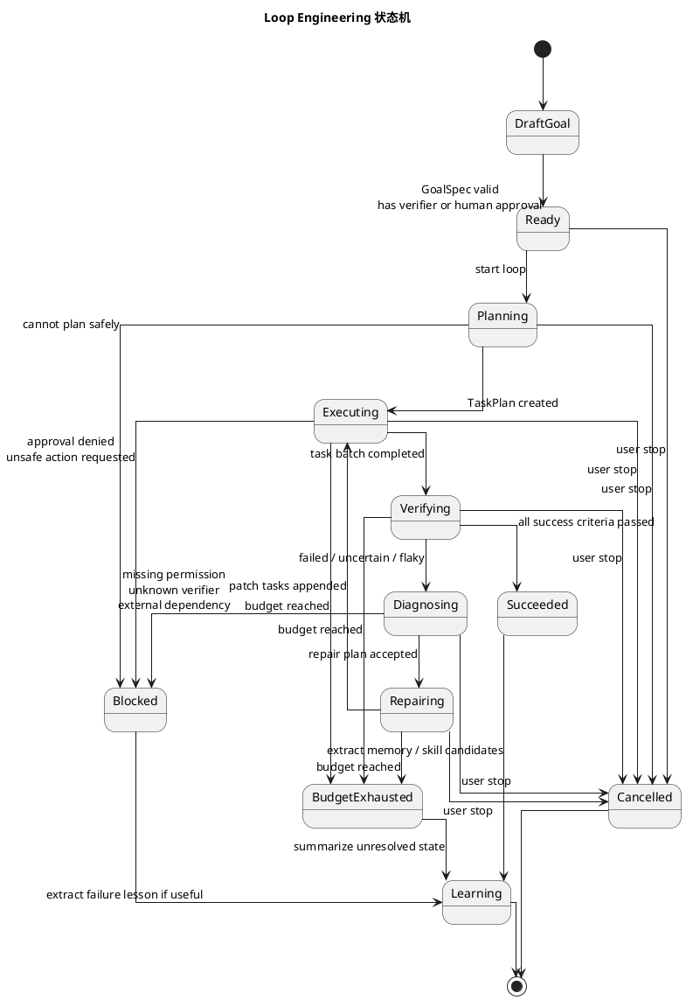
```plantuml
@startuml
title Loop Engineering 状态机
skinparam linetype ortho
skinparam shadowing false

[*] --> DraftGoal
DraftGoal --> Ready : GoalSpec valid\nhas verifier or human approval
Ready --> Planning : start loop
Planning --> Executing : TaskPlan created
Executing --> Verifying : task batch completed
Verifying --> Succeeded : all success criteria passed
Verifying --> Diagnosing : failed / uncertain / flaky
Diagnosing --> Repairing : repair plan accepted
Repairing --> Executing : patch tasks appended
Diagnosing --> Blocked : missing permission\nunknown verifier\nexternal dependency
Executing --> Blocked : approval denied\nunsafe action requested
Planning --> Blocked : cannot plan safely
Repairing --> BudgetExhausted : budget reached
Executing --> BudgetExhausted : budget reached
Verifying --> BudgetExhausted : budget reached
Succeeded --> Learning : extract memory / skill candidates
Blocked --> Learning : extract failure lesson if useful
BudgetExhausted --> Learning : summarize unresolved state
Learning --> [*]

Ready --> Cancelled : user stop
Planning --> Cancelled : user stop
Executing --> Cancelled : user stop
Verifying --> Cancelled : user stop
Diagnosing --> Cancelled : user stop
Repairing --> Cancelled : user stop
Cancelled --> [*]
@enduml
```

LoopRunner 每一轮称为一个 iteration。iteration 必须记录：

- 本轮目标和待执行任务。
- 实际执行的工具、MCP、电脑控制动作和审批结果。
- Verifier 的检查项、输出摘要、证据引用和结论。
- 失败分类：测试失败、验证环境失败、权限不足、目标不明确、外部依赖失败、模型输出不可靠、预算不足。
- Replanner 的修复计划和是否修改 GoalSpec。GoalSpec 的成功标准不能由模型静默降低，必须由用户确认。

#### 7.6.4 Loop 执行流程

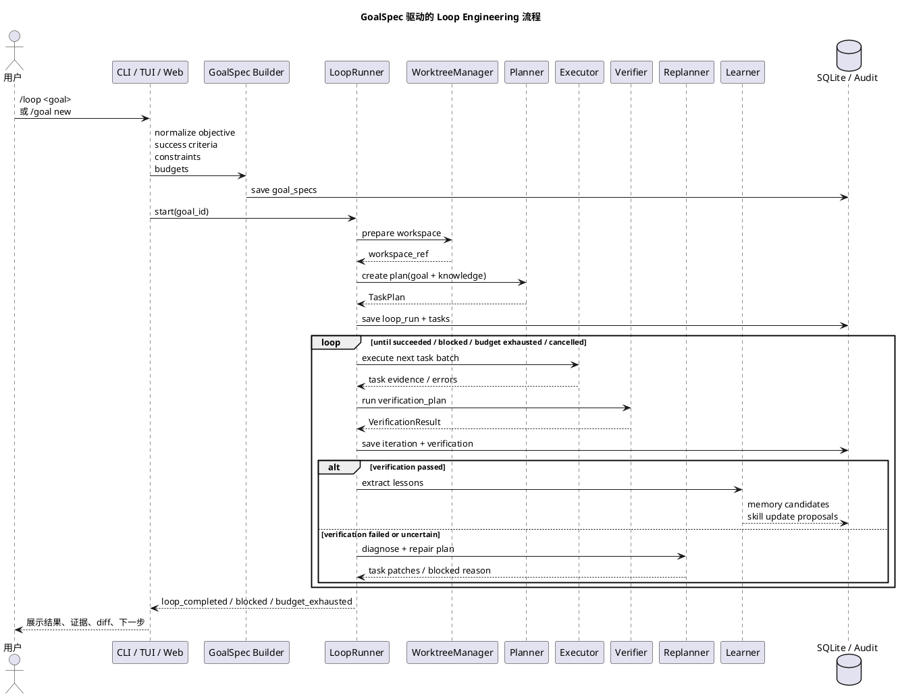
```plantuml
@startuml
title GoalSpec 驱动的 Loop Engineering 流程
skinparam linetype ortho
skinparam shadowing false

actor 用户 as User
participant "CLI / TUI / Web" as UI
participant "GoalSpec Builder" as Goal
participant "LoopRunner" as Loop
participant "WorktreeManager" as Worktree
participant "Planner" as Planner
participant "Executor" as Executor
participant "Verifier" as Verifier
participant "Replanner" as Replanner
participant "Learner" as Learner
database "SQLite / Audit" as Store

User -> UI : /loop <goal>\n或 /goal new
UI -> Goal : normalize objective\nsuccess criteria\nconstraints\nbudgets
Goal -> Store : save goal_specs
UI -> Loop : start(goal_id)
Loop -> Worktree : prepare workspace
Worktree --> Loop : workspace_ref
Loop -> Planner : create plan(goal + knowledge)
Planner --> Loop : TaskPlan
Loop -> Store : save loop_run + tasks

loop until succeeded / blocked / budget exhausted / cancelled
  Loop -> Executor : execute next task batch
  Executor --> Loop : task evidence / errors
  Loop -> Verifier : run verification_plan
  Verifier --> Loop : VerificationResult
  Loop -> Store : save iteration + verification
  alt verification passed
    Loop -> Learner : extract lessons
    Learner --> Store : memory candidates\nskill update proposals
  else verification failed or uncertain
    Loop -> Replanner : diagnose + repair plan
    Replanner --> Loop : task patches / blocked reason
  end
end

Loop --> UI : loop_completed / blocked / budget_exhausted
UI --> User : 展示结果、证据、diff、下一步
@enduml
```

#### 7.6.5 Verifier 设计

Verifier 是 Loop 模式的核心。没有 Verifier，Agent 只能“声称完成”；有 Verifier，Agent 才能用证据判断是否达到目标。

| Verifier 类型 | 用途 | 通过标准 |
|---|---|---|
| `command` | 单元测试、lint、typecheck、构建命令 | exit code、stdout/stderr 摘要、超时和重试策略 |
| `file_assertion` | 检查文件存在、内容包含/不包含、diff 范围 | 结构化断言全部通过 |
| `browser` | 打开页面、DOM snapshot、截图、点击后状态 | 页面观察结果满足断言，截图/DOM 有 evidence ref |
| `api` | 调本地或远程 HTTP API 验证行为 | status、JSON schema、关键字段断言 |
| `database_readonly` | 只读查询验证迁移或数据状态 | 查询结果满足断言，默认禁止写 SQL |
| `remote` | 在已配置远程 host/workspace 上验证 | host/workspace 匹配配置，命令结果通过 |
| `human` | 需要用户主观判断或外部系统权限 | 用户明确确认 |
| `llm_judge` | 评估文本质量、总结质量等软指标 | 只能作为辅助信号，不能单独通过高风险目标 |

Verifier 输出统一为：

```yaml
verification_result:
  status: pass | fail | blocked | uncertain
  checks:
    - name: "unit tests"
      status: pass
      evidence_ref: "tool_execution:abc123"
      summary: "42 tests passed"
  failure_category: null
  confidence: 0.94
  next_hint: "若失败，优先查看 tests/unit/test_login.py"
```

验证规则：

- 高风险或可确定任务不能只用 `llm_judge` 作为唯一验证器。
- flaky 检查最多按配置重试，重试仍失败则状态为 `uncertain` 或 `fail`，不能静默忽略。
- 验证失败后，Replanner 必须基于 VerificationResult 诊断，不允许凭空重写目标。
- Verifier 运行的命令、URL、host、数据库连接和浏览器 origin 都必须来自 GoalSpec 或配置，不允许模型临时扩大范围。

#### 7.6.6 Worktree 与工作区隔离

Loop 模式的代码修改默认使用隔离工作区：

| 模式 | 用途 | 默认策略 |
|---|---|---|
| `direct` | 小型只读或用户明确允许的直接修改 | 写操作仍需审批 |
| `git_worktree` | 代码修复、重构、测试循环 | 默认推荐；在独立 worktree 修改和验证 |
| `remote_workspace` | 远程设备或专用测试环境 | 仅允许预配置 host/workspace |

WorktreeManager 职责：

1. 从当前仓库创建隔离 worktree，命名包含 `goal_id` 或 `loop_id`。
2. 记录 base branch、base commit、worktree path 和 dirty state。
3. 所有写文件、shell、测试、浏览器构建命令默认在 worktree 内执行。
4. loop 成功后生成 diff summary、测试证据和合并建议。
5. 合并、删除 worktree、覆盖主分支等动作必须由用户确认。
6. 如果原工作区已有用户未提交改动，不得自动覆盖或移动。

#### 7.6.7 Project Knowledge

Loop 模式需要稳定的项目知识，避免每次从零探索。Project Knowledge 不是长期记忆的替代，而是 workspace 范围内的结构化上下文。

来源包括：

- README、开发文档、架构文档、测试说明。
- `AGENTS.md`、`CLAUDE.md`、`SKILL.md` 或项目自定义 agent 指南。
- `config/agents.yaml`、Skill metadata、MCP 配置说明。
- 历史成功 loop 的验证命令、失败原因和修复经验。
- 代码搜索或 IDE/LSP MCP 提供的 symbols、diagnostics 和 references。

Project Knowledge 要求：

- 每条知识必须标注来源文件、版本标识或生成来源。
- 模型不能把 Project Knowledge 当作绝对事实；与实际代码冲突时，以实际代码和验证结果为准。
- 可从 loop 成功经验生成 memory candidate 或 Skill update proposal，但写入前必须经过 MemoryPolicy 和用户确认策略。

#### 7.6.8 子 Agent 协作

Loop 模式可以把不同职责拆给子 Agent，但父 LoopRunner 仍是唯一调度者。

| 子 Agent | 职责 | 权限原则 |
|---|---|---|
| Executor Agent | 执行实现、改代码、调用工具 | 只能在分配的 workspace 和工具范围内行动 |
| Verifier Agent | 独立验证、复跑测试、检查浏览器/接口 | 默认只读或 observe，不能修改代码 |
| Reviewer Agent | 代码审查、安全审查、风险提示 | 只读，输出 findings 和建议 |
| Research Agent | 查项目文档、外部文档、MCP 知识源 | network/MCP 权限按配置审批 |

子 Agent 隔离规则：

- 每个子 Agent 拥有独立 session、上下文窗口、TaskStore snapshot 和临时授权。
- 子 Agent 不能直接降低 GoalSpec 的成功标准，不能扩大权限范围。
- 子 Agent 输出必须回到父 LoopRunner，由父级统一写审计、更新 TaskStore 和决定下一轮。
- 执行 Agent 与验证 Agent 分离时，验证 Agent 不应复用执行 Agent 的私有推理上下文，只读取代码、证据和 GoalSpec，降低自我确认偏差。

#### 7.6.9 Learner 与沉淀

Learner 只在稳定点运行：loop 成功、阻塞、预算耗尽或用户停止时。它负责生成候选，而不是自动修改长期知识。

Learner 输出：

| 输出 | 说明 |
|---|---|
| `memory_candidate` | 用户偏好、项目事实、有效测试命令、常见失败原因 |
| `skill_update_proposal` | 建议新增或修改某个 Skill 的工作流、检查清单或参考资料 |
| `project_knowledge_update` | 建议更新项目知识索引，例如测试命令、服务启动方式 |
| `anti_pattern` | 记录无效尝试，避免后续 loop 重复走错路 |

学习规则：

- 密钥、cookie、私钥、验证码、内部隐私数据不能写入长期记忆。
- 自动学习默认只生成候选；是否写入由 MemoryPolicy、SkillPolicy 和用户设置决定。
- 从失败 loop 中学习时必须保留失败上下文和不确定性，不能把未验证猜测写成项目事实。

#### 7.6.10 定时与后台 Loop

Loop 可以由三类入口触发：

| 入口 | 用途 | 安全要求 |
|---|---|---|
| 手动 `/loop` | 用户在当前会话启动 | 默认入口 |
| 本地 scheduler / cron | 定期跑固定检查，例如依赖更新、测试巡检 | 必须使用预配置 GoalSpec 和预算 |
| GitHub Actions / CI | PR 检查、自动修复建议 | 默认只评论建议，不自动 push，除非用户配置 |

后台 loop 默认不允许执行高风险动作。任何发布、删除、支付、上传、部署、远程写操作都必须转为人工审批。

### 7.7 工具循环

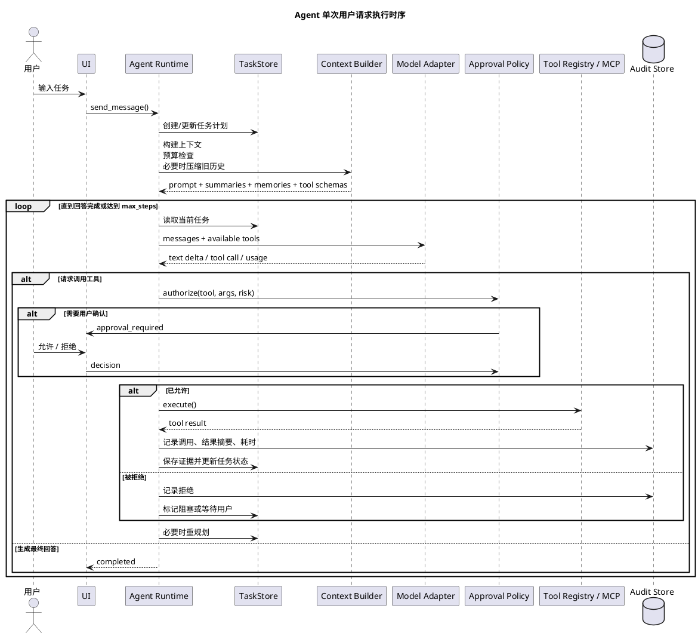
```plantuml
@startuml
title Agent 单次用户请求执行时序
actor 用户 as User
participant "UI" as UI
participant "Agent Runtime" as Agent
participant "TaskStore" as Store
participant "Context Builder" as Context
participant "Model Adapter" as LLM
participant "Approval Policy" as Policy
participant "Tool Registry / MCP" as Tool
database "Audit Store" as Audit

User -> UI : 输入任务
UI -> Agent : send_message()
Agent -> Store : 创建/更新任务计划
Agent -> Context : 构建上下文\n预算检查\n必要时压缩旧历史
Context --> Agent : prompt + summaries + memories + tool schemas
loop 直到回答完成或达到 max_steps
  Agent -> Store : 读取当前任务
  Agent -> LLM : messages + available tools
  LLM --> Agent : text delta / tool call / usage
  alt 请求调用工具
    Agent -> Policy : authorize(tool, args, risk)
    alt 需要用户确认
      Policy -> UI : approval_required
      User -> UI : 允许 / 拒绝
      UI -> Policy : decision
    end
    alt 已允许
      Agent -> Tool : execute()
      Tool --> Agent : tool result
      Agent -> Audit : 记录调用、结果摘要、耗时
      Agent -> Store : 保存证据并更新任务状态
    else 被拒绝
      Agent -> Audit : 记录拒绝
      Agent -> Store : 标记阻塞或等待用户
    end
    Agent -> Store : 必要时重规划
  else 生成最终回答
    Agent --> UI : completed
  end
end
@enduml
```

### 7.8 工具风险分类

| 等级 | 示例 | 默认策略 |
|---|---|---|
| `read` | 读取当前 workspace 文件、列目录、搜索代码 | 可自动允许，并记录日志 |
| `observe` | 截图、读取网页标题/DOM、获取远程主机基本信息 | 首次按目标确认；云端模型会接收截图/页面内容时必须提示 |
| `network` | HTTP 请求、远程 MCP 查询 | 首次按 server/域名确认 |
| `write` | 写文件、修改配置、创建目录 | 每次确认或用户授予会话级权限 |
| `browser_control` | 点击网页、输入文本、下载/上传文件、提交表单 | 按 origin + 动作确认；登录、支付、发布、删除前二次确认 |
| `desktop_control` | 截屏后坐标点击、键盘输入、启动/切换应用 | 默认禁用；启用后每次确认，并提供紧急停止 |
| `remote_execute` | SSH 到其他设备执行命令、传输文件、启动远程浏览器 | 按 host + workspace + 命令确认，禁止未知 host |
| `execute` | 运行命令、Python 代码、启动进程 | 每次确认，限制工作目录与超时 |
| `destructive` | 删除、覆盖大量文件、修改系统设置 | 默认阻止，明确二次确认后才执行 |

工具 registry 需要为内置工具和 MCP 工具使用同一套风险元数据。模型不能自行提升权限。
workspace 是默认工作范围与信任边界，而不是绝对沙箱：workspace 内只读动作可
自动允许；目标路径越界时必须切换为独立审批动作，批准后才执行。越界审批与
普通工具审批使用不同 action，且不得提供会话级“总是允许”，避免普通授权被
扩展成任意文件系统访问。

### 7.9 能力层与电脑控制详细图

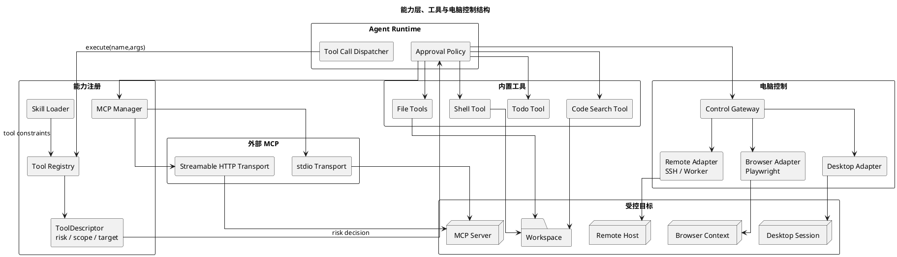
```plantuml
@startuml
title 能力层、工具与电脑控制结构
skinparam componentStyle rectangle
skinparam linetype ortho
skinparam shadowing false
top to bottom direction

rectangle "Agent Runtime" as Runtime {
  [Tool Call Dispatcher] as Dispatcher
  [Approval Policy] as Approval
}

rectangle "能力注册" as RegistryBox {
  [Tool Registry] as Registry
  [ToolDescriptor\nrisk / scope / target] as Descriptor
  [Skill Loader] as Skill
  [MCP Manager] as McpManager
}

rectangle "内置工具" as Builtin {
  [File Tools] as FileTools
  [Code Search Tool] as CodeSearch
  [Shell Tool] as ShellTool
  [Todo Tool] as TodoTool
}

rectangle "电脑控制" as ControlBox {
  [Control Gateway] as Gateway
  [Browser Adapter\nPlaywright] as Browser
  [Desktop Adapter] as Desktop
  [Remote Adapter\nSSH / Worker] as Remote
}

rectangle "外部 MCP" as McpBox {
  [stdio Transport] as Stdio
  [Streamable HTTP Transport] as Http
}

rectangle "受控目标" as Targets {
  folder "Workspace" as Workspace
  node "Browser Context" as BrowserTarget
  node "Desktop Session" as DesktopTarget
  node "Remote Host" as RemoteTarget
  node "MCP Server" as McpServer
}

Dispatcher --> Registry : execute(name,args)
Registry --> Descriptor
Descriptor --> Approval : risk decision
Approval --> FileTools
Approval --> CodeSearch
Approval --> ShellTool
Approval --> TodoTool
Approval --> Gateway
Approval --> McpManager
Skill --> Registry : tool constraints
McpManager --> Stdio
McpManager --> Http
Gateway --> Browser
Gateway --> Desktop
Gateway --> Remote
FileTools --> Workspace
CodeSearch --> Workspace
ShellTool --> Workspace
Browser --> BrowserTarget
Desktop --> DesktopTarget
Remote --> RemoteTarget
Stdio --> McpServer
Http --> McpServer
@enduml
```

能力层的核心是 `ToolDescriptor`：它把所有内置工具、MCP 工具、浏览器动作、桌面动作和远程命令统一成“带风险和目标范围的能力”，再交给审批策略。

### 7.10 代码搜索工具设计

代码搜索是 Agent 的高频只读能力，定位上介于 `list_dir` / `read_file` 和 `shell` 之间：它应提供稳定、结构化、受限且低成本的代码定位能力，避免模型频繁调用高风险 shell 去拼 `grep` / `find` 命令。

#### 7.10.1 工具边界

| 工具 | 职责 | 不负责 |
|---|---|---|
| `list_dir` | 看目录结构 | 不做全文搜索 |
| `read_file` | 读取已知文件内容 | 不遍历 workspace |
| `code_search` | 搜索文本、正则、symbol、文件名，返回位置和上下文 | 不修改文件，不执行命令 |
| `shell` | 执行任意命令 | 不作为默认搜索入口 |

`code_search` 必须是只读工具，风险等级为 `read`。workspace 内搜索可自动
允许；搜索根目录越界时必须触发 `code_search_outside_workspace` 独立审批。
无论目标范围如何，都必须遵守 ignore 规则、结果条数、输出大小和超时限制。

#### 7.10.2 推荐工具接口

```python
ToolDescriptor(
    name="code_search",
    risk="read",
    target_type="filesystem",
    description="搜索代码文本、正则、文件名或 symbol；workspace 外搜索需要逐次审批。",
    input_schema={
        "type": "object",
        "properties": {
            "query": {
                "type": "string",
                "description": "搜索关键词、正则或 symbol 名称"
            },
            "mode": {
                "type": "string",
                "enum": ["text", "regex", "file", "symbol"],
                "default": "text"
            },
            "path": {
                "type": "string",
                "description": "可选搜索目录；workspace 外目录需要逐次审批",
                "default": "."
            },
            "glob": {
                "type": "string",
                "description": "可选文件 glob，例如 '*.py'、'app/**/*.ts'"
            },
            "case_sensitive": {
                "type": "boolean",
                "default": False
            },
            "context_lines": {
                "type": "integer",
                "default": 2
            },
            "max_results": {
                "type": "integer",
                "default": 50
            }
        },
        "required": ["query"]
    }
)
```

#### 7.10.3 搜索模式

| mode | 语义 | 实现策略 |
|---|---|---|
| `text` | 普通文本搜索，适合函数名、错误信息、配置 key | 优先 `ripgrep` fixed-string；无 `rg` 时退化为 Python 扫描 |
| `regex` | 正则搜索，适合复杂模式 | 优先 `ripgrep` regex；限制超时与结果数 |
| `file` | 文件名/路径搜索，适合找配置或组件文件 | 优先 `rg --files` 或 Python walk，匹配路径片段/glob |
| `symbol` | 符号搜索，适合函数/类/变量定义 | 先用启发式正则；后续可接 tree-sitter/LSP 索引 |

搜索默认遵守 `.gitignore`，并额外跳过常见大目录：`.git/`、`node_modules/`、`.venv/`、`__pycache__/`、`dist/`、`build/`、`.agentlab/`、`data/`。用户需要搜索被忽略文件时必须显式开启对应配置。

#### 7.10.4 结果格式

工具输出应稳定、短小、可被模型继续用 `read_file` 精读：

```json
{
  "query": "ToolDescriptor",
  "mode": "text",
  "root": "/workspace/project",
  "truncated": false,
  "matches": [
    {
      "path": "app/tools/registry.py",
      "line": 19,
      "column": 7,
      "kind": "text",
      "preview": "class ToolDescriptor:",
      "context": [
        "17:",
        "18:@dataclass",
        "19:class ToolDescriptor:",
        "20:    name: str"
      ]
    }
  ]
}
```

约束：

- workspace 内命中使用相对 workspace 的 POSIX 风格路径；外部命中返回绝对路径。
- `line` / `column` 从 1 开始，便于 UI 跳转。
- `context` 行数受 `context_lines` 限制。
- 结果超过 `max_results` 或输出大小上限时设置 `truncated=true`。
- 对二进制文件、超大文件和解码失败文件默认跳过，并在 summary 中统计。

#### 7.10.5 实现与索引策略

默认采用无索引搜索：

1. 优先调用 `ripgrep`，因为它快、遵守 ignore 规则、跨平台可安装。
2. `rg` 不存在时，使用 Python fallback 扫描文本文件。
3. 所有路径通过 workspace resolver 校验；越界时由 Runtime 请求独立审批，
   ToolRegistry 仅在获批调用的执行上下文中临时放行。
4. 搜索进程设置 timeout，输出流式读取或硬截断，避免卡住 Runtime。

后续可选增量索引：

- 使用 SQLite FTS5 保存轻量全文索引。
- 对大型代码库接入 tree-sitter/LSP，增强 `symbol` 搜索。
- 索引仅缓存可搜索文本和路径摘要，不缓存密钥文件内容。

#### 7.10.6 安全与测试

安全要求：

- workspace 内只读搜索不需要逐次审批。
- workspace 外搜索必须逐次审批，不能加入会话级永久授权。
- 审批结果由 Runtime 传给 ToolRegistry 的受控执行上下文，模型参数不能伪造。
- 默认不返回隐藏密钥文件内容；匹配到 `.env`、私钥、token 文件时只返回路径和命中行号，内容脱敏或要求额外确认。
- 当模型为云端 provider 时，搜索结果会进入上下文，应对疑似密钥进行脱敏。

测试要求：

- text/regex/file/symbol 四种模式。
- 未审批的 workspace 越界请求必须拒绝；用户拒绝后不执行，用户批准后允许搜索。
- `.gitignore` 和默认忽略目录生效。
- `rg` 可用与不可用 fallback 路径。
- max_results、context_lines、timeout、二进制文件跳过。
- 疑似密钥内容脱敏。

### 7.11 电脑控制与远程执行

电脑控制不能由通用 shell 直接承担。shell 只有文本输入输出，缺少页面状态、截图、焦点、远程目标身份、用户接管和动作级权限。因此需要把电脑控制作为独立能力层设计。

#### 7.11.1 控制目标模型

所有可被操作的环境统一抽象为 `ControlTarget`：

| Target 类型 | 典型实现 | 定位 |
|---|---|---|
| `browser` | Playwright Python，隔离 Chromium profile | 网页打开、点击、输入、截图、读取 DOM |
| `desktop` | PyAutoGUI 或 OS UI Automation | 用于非网页应用，默认禁用 |
| `remote_host` | SSH Runner，可扩展远程 Agent Worker | 在远程 workspace 内执行命令和传输文件 |
| `remote_browser` | 远程 Agent Worker 或远程 MCP Server 暴露浏览器工具 | 在远程设备上打开网页并回传观察结果 |

每个控制目标都必须有会话状态：

```python
@dataclass
class ControlSession:
    id: str
    target_type: str              # browser / desktop / remote_host / remote_browser
    target_name: str              # local_browser / win_gpu / macbook 等
    workspace: str | None
    capabilities: list[str]       # observe / click / type / shell / upload / download
    risk: str
    created_at: datetime
    expires_at: datetime | None
```

#### 7.11.2 浏览器控制

浏览器控制优先使用 Playwright，而不是通过 shell 打开系统浏览器后模拟鼠标。原因是 Playwright 能提供稳定的页面结构、选择器、事件等待、截图和多浏览器支持。

浏览器控制工具：

| 工具 | 功能 | 风险 |
|---|---|---|
| `browser_open` | 在受控浏览器会话打开 URL | `network` |
| `browser_snapshot` | 返回标题、URL、可交互元素摘要和可选截图 | `observe` |
| `browser_click` | 点击 selector 或已编号元素 | `browser_control` |
| `browser_type` | 在输入框输入文本，默认不回车提交 | `browser_control` |
| `browser_press` | 按 Enter/Escape/Tab 等键 | `browser_control` |
| `browser_wait` | 等待元素、URL 或网络空闲 | `read` |
| `browser_download` | 下载文件到 workspace 的 downloads 目录 | `write` |

默认策略：

1. 默认启动隔离浏览器 profile，避免直接读取用户主浏览器 cookie、历史记录和插件状态。
2. 需要使用用户真实登录态时，必须显式创建 named browser profile，并在 UI 中标明“将使用该 profile 的登录态”。
3. 任何登录、支付、发布、发送消息、删除、购买、转账、授权 OAuth、上传文件动作都必须二次确认。
4. 如果当前模型是云端模型，截图、DOM 文本、表单内容可能被发送到云端；UI/CLI 必须在首次观察该页面前提示。
5. 对同一 origin 可支持会话级授权，例如“本会话允许在 `https://localhost:3000` 点击和输入”，但不覆盖支付/删除等高风险动作。

#### 7.11.3 桌面控制

桌面控制用于浏览器自动化无法覆盖的场景，例如操作原生应用、系统设置窗口、远程桌面客户端或安装程序。它比浏览器控制风险更高，也更不稳定，因此不应作为首选路径。

设计约束：

- 默认关闭，需要在配置中显式启用 `desktop_control.enabled=true`。
- 每次动作前提供最近截图和动作描述，例如“将在坐标 (x, y) 单击”。
- macOS 启用前检查 Accessibility 与 Screen Recording 权限；Windows 启用前检查 UI 自动化/屏幕捕获能力。
- 不允许模型直接连续执行长动作序列。应采用“观察 -> 计划下一步 -> 审批 -> 单步动作 -> 再观察”的闭环。
- 必须支持紧急停止：CLI 中 Ctrl-C/Web UI 中 Stop 按钮应取消 pending action，并尽量释放键盘/鼠标状态。

#### 7.11.4 远程设备控制

远程控制分两层：

1. `remote_shell`：通过 SSH 在已配置设备的指定 workspace 内执行命令，适合查状态、跑脚本、部署、启动服务。
2. `remote_worker`：在远程设备启动一个 AgentLab Worker 或 MCP Server，由它暴露文件、shell、浏览器等结构化工具，适合复杂远程网页和 GUI 操作。

不建议让模型临时决定 SSH 目标、用户名或密钥路径。远程设备必须在配置文件中预先登记：

```yaml
# config/control.yaml
browser:
  enabled: true
  engine: chromium
  mode: headed                 # headed 便于用户看见；CI 可用 headless
  profile: isolated            # isolated / named
  downloads_dir: .agentlab/downloads

desktop_control:
  enabled: false
  require_screenshot_before_action: true

remote_hosts:
  win_gpu:
    transport: ssh
    host: 192.168.1.20
    port: 22
    username_env: WIN_GPU_USER
    key_path_env: WIN_GPU_SSH_KEY
    workspace: C:/Users/me/work
    enabled: false
    risk: remote_execute
```

远程控制默认策略：

- 真实密码、token、私钥内容不进入 YAML；只保存环境变量名或系统 Keyring 引用。
- SSH 必须启用 host key 校验，首次连接指纹需用户确认并记录。
- 远程命令必须在配置的 remote workspace 内执行，并有 timeout、输出截断和审计。
- 不允许默认 agent forwarding；需要访问私有仓库时优先使用远程设备自己的凭据。
- 远程文件传输只允许 workspace 与本地 workspace 之间，越界需要额外确认。

#### 7.11.5 电脑控制执行流程

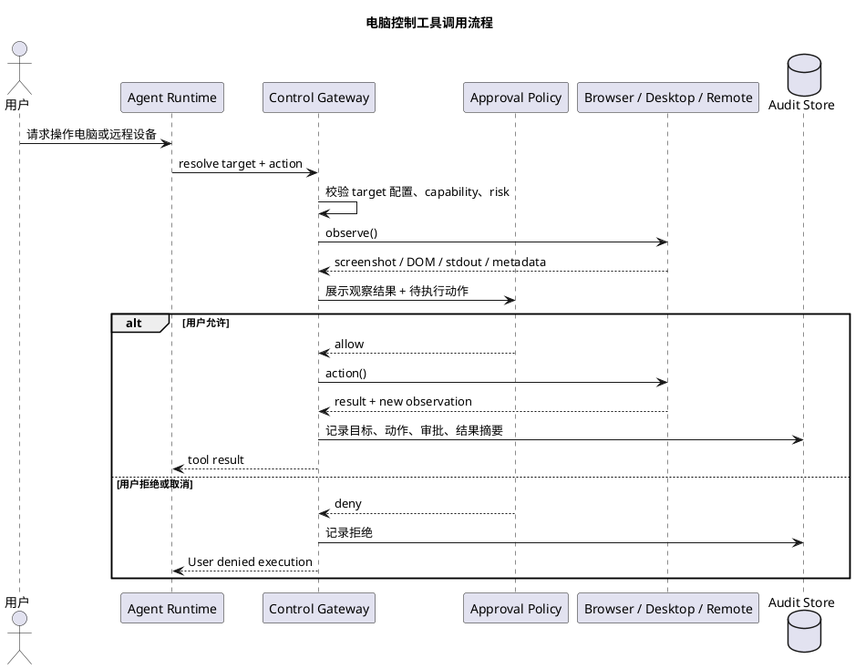
```plantuml
@startuml
title 电脑控制工具调用流程
actor 用户 as User
participant "Agent Runtime" as Runtime
participant "Control Gateway" as Control
participant "Approval Policy" as Approval
participant "Browser / Desktop / Remote" as Target
database "Audit Store" as Audit

User -> Runtime : 请求操作电脑或远程设备
Runtime -> Control : resolve target + action
Control -> Control : 校验 target 配置、capability、risk
Control -> Target : observe()
Target --> Control : screenshot / DOM / stdout / metadata
Control -> Approval : 展示观察结果 + 待执行动作
alt 用户允许
  Approval --> Control : allow
  Control -> Target : action()
  Target --> Control : result + new observation
  Control -> Audit : 记录目标、动作、审批、结果摘要
  Control --> Runtime : tool result
else 用户拒绝或取消
  Approval --> Control : deny
  Control -> Audit : 记录拒绝
  Control --> Runtime : User denied execution
end
@enduml
```

这个流程要求所有电脑控制动作都先经过 `Control Gateway`，而不是由模型直接调用低层库。`Control Gateway` 负责把“模型想做什么”转换成“对哪个已授权目标执行哪个受限动作”。

---

## 8. Skill 设计

### 8.1 定义

Skill 是本地可配置的“任务指导包”，用于告诉 Agent 某类任务应遵循的步骤、允许使用的工具、参考材料和输出约束。Skill 本身不是任意代码执行入口；需要执行动作时，仍必须通过注册过的工具或 MCP，并接受权限策略。

Skill、Tool 和 MCP 的区别：

| 概念 | 解决的问题 | 例子 |
|---|---|---|
| Skill | 如何完成一种任务 | “代码审查时先跑测试再输出分级 findings” |
| 内置 Tool | 应用进程内的原子能力 | 读文件、写文件 |
| MCP Server | 外部进程/服务暴露的工具或资源 | GitHub、数据库、浏览器、本地 IDE 服务 |

### 8.2 Skill 目录格式

```text
skills/
  code-review/
    SKILL.md
    references/
      checklist.md
    scripts/                         # 可选；只能经被批准的执行工具调用
```

建议的 `SKILL.md`：

```markdown
---
name: code-review
description: Review source changes for correctness and test gaps.
allowed_tools: [read_file, list_dir]
optional_mcp_servers: [git]
---

# Workflow

1. Read changed files and related tests.
2. Report correctness and security issues before summaries.
```

### 8.3 加载规则

1. 启动时扫描启用目录，校验 metadata，生成 Skill Catalog。
2. 用户可显式启用 Skill；后续可增加基于描述的自动推荐。
3. Runtime 只将当前任务需要的 Skill 内容加入上下文，避免提示过长。
4. Skill 声明的工具是需求或上限，不代表自动授权。
5. 来自未知来源的 Skill 默认禁用，启用前展示其所需工具和引用文件。

---

## 9. MCP 集成设计

### 9.1 接入方式

AgentLab 充当 MCP Client，连接用户配置的 MCP Server。目标支持两种 transport：

| Transport | 适用场景 | 示例 |
|---|---|---|
| `stdio` | 与 Agent 同机运行的受信本地 server | 文件增强、git、开发工具 |
| `streamable_http` | 远程或长期运行的 server | 内网服务、远程工具服务 |

### 9.2 MCP 配置

```yaml
# config/mcp_servers.yaml
servers:
  local_git:
    transport: stdio
    command: python
    args: ["-m", "my_git_mcp_server"]
    cwd: "."
    env_allowlist: ["PATH"]
    enabled: false
    risk: read

  internal_docs:
    transport: streamable_http
    url: http://127.0.0.1:9010/mcp
    token_env: INTERNAL_DOCS_MCP_TOKEN
    enabled: false
    risk: network
```

配置要求：

- 配置文件只保存环境变量名称，不保存真实 token。
- stdio 命令以数组方式保存并直接启动，禁止默认通过 shell 执行字符串。
- `cwd` 相对路径以 AgentLab 项目根目录为基准，避免启动终端目录改变
  Playwright profile、下载目录或本地 MCP Server 的工作目录。
- Windows 自动解析 npm shim（例如 `npx` → `npx.cmd`），并向子进程提供
  `SYSTEMROOT`、`COMSPEC`、`PATHEXT`、`TEMP`、`USERPROFILE`、`APPDATA`
  等运行必需的非敏感变量；其它变量仍必须进入 `env_allowlist`。
- 任一新 MCP Server 第一次启用前，UI/CLI 展示 server 名称、transport 和可能暴露的数据。
- 从 MCP 发现的每一个工具都映射到统一 `ToolDescriptor`，并继承或提高 server 风险等级。

### 9.3 MCP 数据流和信任边界

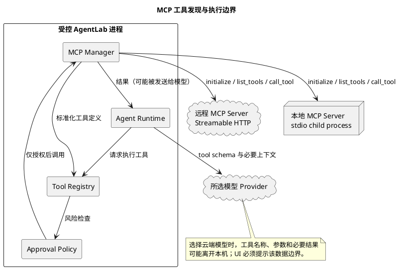
```plantuml
@startuml
title MCP 工具发现与执行边界
skinparam componentStyle rectangle

rectangle "受控 AgentLab 进程" {
  [MCP Manager] as Manager
  [Tool Registry] as Registry
  [Approval Policy] as Approval
  [Agent Runtime] as Runtime
}

node "本地 MCP Server\nstdio child process" as Local
cloud "远程 MCP Server\nStreamable HTTP" as Remote
cloud "所选模型 Provider" as Model

Manager --> Local : initialize / list_tools / call_tool
Manager --> Remote : initialize / list_tools / call_tool
Manager --> Registry : 标准化工具定义
Runtime --> Registry : 请求执行工具
Registry --> Approval : 风险检查
Approval --> Manager : 仅授权后调用
Runtime --> Model : tool schema 与必要上下文
Manager --> Runtime : 结果（可能被发送给模型）

note bottom of Model
选择云端模型时，工具名称、参数和必要结果
可能离开本机；UI 必须提示该数据边界。
end note
@enduml
```

---

## 10. 配置、密钥与数据存储

### 10.1 配置优先级

配置来源优先级：

```text
命令行参数 / UI 当前会话选择        最高优先级
环境变量与 .env                    密钥及开发覆盖
用户配置目录的 app.yaml            用户持久配置
项目 config/*.yaml                 项目模板与默认 profile
应用内安全默认值                    最低优先级
```

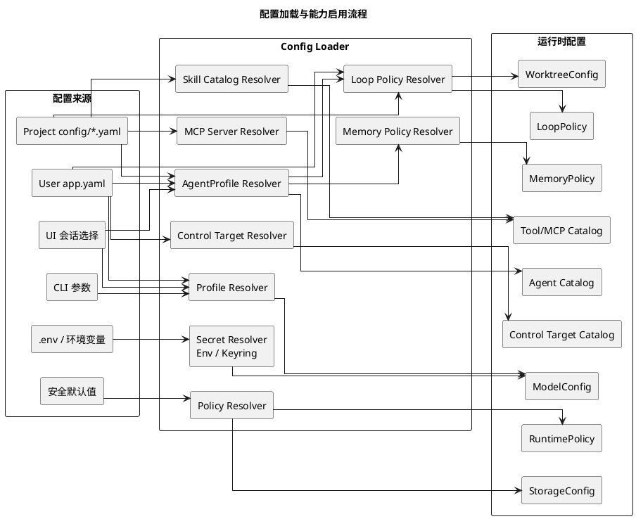
```plantuml
@startuml
title 配置加载与能力启用流程
skinparam componentStyle rectangle
skinparam linetype ortho
skinparam shadowing false
left to right direction

rectangle "配置来源" as Sources {
  [CLI 参数] as CliArgs
  [UI 会话选择] as UiChoice
  [.env / 环境变量] as Env
  [User app.yaml] as UserYaml
  [Project config/*.yaml] as ProjectYaml
  [安全默认值] as Defaults
}

rectangle "Config Loader" as Loader {
  [AgentProfile Resolver] as AgentResolver
  [Profile Resolver] as Profile
  [Secret Resolver\nEnv / Keyring] as Secrets
  [Control Target Resolver] as ControlTargets
  [MCP Server Resolver] as McpResolver
  [Skill Catalog Resolver] as SkillResolver
  [Memory Policy Resolver] as MemoryResolver
  [Loop Policy Resolver] as LoopResolver
  [Policy Resolver] as PolicyResolver
}

rectangle "运行时配置" as RuntimeConfig {
  [Agent Catalog] as AgentCfg
  [ModelConfig] as ModelCfg
  [MemoryPolicy] as MemoryCfg
  [LoopPolicy] as LoopCfg
  [RuntimePolicy] as PolicyCfg
  [Tool/MCP Catalog] as ToolCfg
  [Control Target Catalog] as ControlCfg
  [StorageConfig] as StorageCfg
  [WorktreeConfig] as WorktreeCfg
}

CliArgs --> Profile
UiChoice --> Profile
UiChoice --> AgentResolver
Env --> Secrets
UserYaml --> AgentResolver
UserYaml --> Profile
UserYaml --> ControlTargets
UserYaml --> LoopResolver
ProjectYaml --> McpResolver
ProjectYaml --> SkillResolver
ProjectYaml --> AgentResolver
ProjectYaml --> LoopResolver
Defaults --> PolicyResolver
AgentResolver --> AgentCfg
AgentResolver --> MemoryResolver
AgentResolver --> LoopResolver
Profile --> ModelCfg
Secrets --> ModelCfg
ControlTargets --> ControlCfg
McpResolver --> ToolCfg
SkillResolver --> ToolCfg
MemoryResolver --> MemoryCfg
LoopResolver --> LoopCfg
LoopResolver --> WorktreeCfg
PolicyResolver --> PolicyCfg
PolicyResolver --> StorageCfg
@enduml
```

配置加载必须区分“非密钥配置”和“密钥解析”。YAML 可以引用环境变量名或 Keyring 条目名，但不能保存真实 API Key、SSH 私钥内容或远程密码。

Loop 配置示例：

```yaml
# config/loop.yaml
defaults:
  workspace_mode: git_worktree
  max_iterations: 6
  max_runtime_minutes: 30
  max_tool_calls: 80
  require_verifier: true
  allow_background_loop: false
  verifier_retry_limit: 1

worktree:
  root: data/worktrees
  auto_cleanup: false
  require_clean_base: false

scheduler:
  enabled: false
  allowed_goals: []
```

### 10.2 密钥管理

| 阶段 | 做法 |
|---|---|
| 开发期 | `.env`，加入 `.gitignore`，仅提供 `.env.example` |
| 可分发版本 | 使用系统 Keyring 保存 API Key；YAML 仅引用 key 名 |
| 日志与 UI | 端点可展示，密钥一律脱敏；异常中不得输出请求 header |

### 10.3 数据存储

建议的 SQLite 实体：

| 表 | 用途 |
|---|---|
| `agent_profiles` | Agent 定义：名称、角色、默认模型、Skill/MCP/工具和记忆策略 |
| `sessions` | 会话名称、绑定的 agent_id、模型 profile、创建/修改时间 |
| `messages` | 用户与 assistant 消息、必要的结构化 content |
| `context_summaries` | 上下文压缩摘要：来源消息范围、摘要引用、压缩前后 token、压缩模型 |
| `runs` | 每次请求状态、耗时、token 用量、错误 |
| `goal_specs` | Loop 目标定义：目标、验收标准、约束、预算、验证计划、停止条件 |
| `loop_runs` | Loop 执行实例：状态、当前 iteration、预算消耗、workspace/worktree 引用 |
| `loop_iterations` | 每轮循环记录：执行摘要、验证摘要、失败分类、修复计划 |
| `verification_results` | Verifier 结果：检查项、pass/fail/blocked/uncertain、证据引用 |
| `worktrees` | 隔离工作区：path、base branch、base commit、dirty state、清理状态 |
| `subagent_runs` | 子 Agent 运行记录：角色、输入摘要、输出摘要、权限范围 |
| `tasks` | Planner/Executor/Replanner 管理的任务状态、依赖和证据 |
| `memories` | 长期记忆：用户偏好、Agent 经验、项目事实、会话摘要 |
| `tool_executions` | 工具、参数脱敏摘要、审批决定、执行结果摘要 |
| `settings` | 非密钥用户设置与已启用能力 |

隐私规则：

- 默认不长期保存完整工具输出；提供“保存会话”选项后再持久化。
- 含凭据的环境变量、请求 header 和工具输出中的疑似密钥必须在日志中遮蔽。
- 上下文压缩摘要与原始消息一样受数据保留和脱敏策略约束；摘要不能包含被拒绝保存的密钥、cookie、验证码或支付信息。
- Loop 相关记录必须保存验证证据引用和失败分类，但不得长期保存完整敏感页面、数据库结果或密钥类输出。
- Worktree path、base commit、diff summary 可以持久化；合并、删除、覆盖主分支等动作必须另有审批记录。
- 切换到在线模型时，在会话头部明确展示“内容可能发送至云端”。

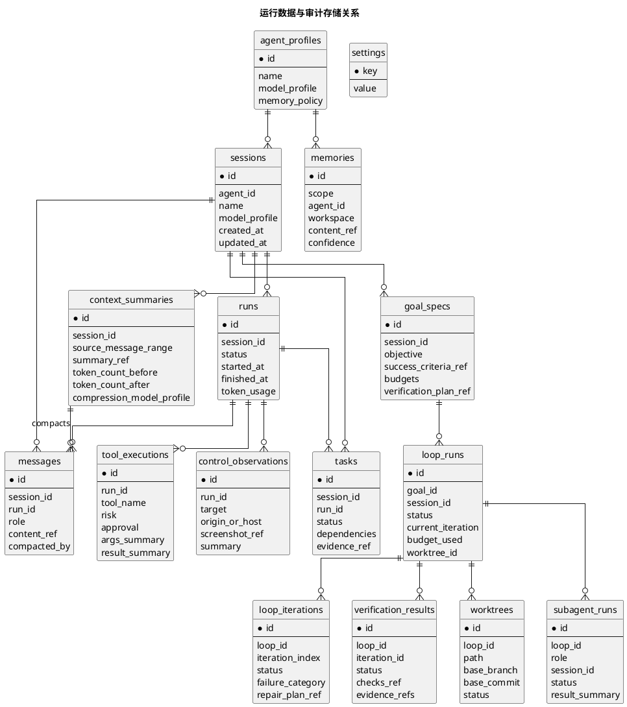
```plantuml
@startuml
title 运行数据与审计存储关系
skinparam linetype ortho
skinparam shadowing false
hide circle

entity "sessions" as sessions {
  * id
  --
  agent_id
  name
  model_profile
  created_at
  updated_at
}

entity "runs" as runs {
  * id
  --
  session_id
  status
  started_at
  finished_at
  token_usage
}

entity "goal_specs" as goals {
  * id
  --
  session_id
  objective
  success_criteria_ref
  budgets
  verification_plan_ref
}

entity "loop_runs" as loop_runs {
  * id
  --
  goal_id
  session_id
  status
  current_iteration
  budget_used
  worktree_id
}

entity "loop_iterations" as iterations {
  * id
  --
  loop_id
  iteration_index
  status
  failure_category
  repair_plan_ref
}

entity "verification_results" as verifications {
  * id
  --
  loop_id
  iteration_id
  status
  checks_ref
  evidence_refs
}

entity "worktrees" as worktrees {
  * id
  --
  loop_id
  path
  base_branch
  base_commit
  status
}

entity "subagent_runs" as subagents {
  * id
  --
  loop_id
  role
  session_id
  status
  result_summary
}

entity "agent_profiles" as agents {
  * id
  --
  name
  model_profile
  memory_policy
}

entity "messages" as messages {
  * id
  --
  session_id
  run_id
  role
  content_ref
  compacted_by
}

entity "context_summaries" as summaries {
  * id
  --
  session_id
  source_message_range
  summary_ref
  token_count_before
  token_count_after
  compression_model_profile
}

entity "tasks" as tasks {
  * id
  --
  session_id
  run_id
  status
  dependencies
  evidence_ref
}

entity "memories" as memories {
  * id
  --
  scope
  agent_id
  workspace
  content_ref
  confidence
}

entity "tool_executions" as tools {
  * id
  --
  run_id
  tool_name
  risk
  approval
  args_summary
  result_summary
}

entity "control_observations" as observations {
  * id
  --
  run_id
  target
  origin_or_host
  screenshot_ref
  summary
}

entity "settings" as settings {
  * key
  --
  value
}

agents ||--o{ sessions
agents ||--o{ memories
sessions ||--o{ runs
sessions ||--o{ messages
sessions ||--o{ summaries
sessions ||--o{ goals
goals ||--o{ loop_runs
loop_runs ||--o{ iterations
loop_runs ||--o{ verifications
loop_runs ||--o{ worktrees
loop_runs ||--o{ subagents
sessions ||--o{ tasks
runs ||--o{ messages
runs ||--o{ tools
runs ||--o{ observations
runs ||--o{ tasks
summaries ||--o{ messages : compacts
@enduml
```

大文本、截图和下载文件应以内容引用保存到本地数据目录，SQLite 保存索引、摘要和审计元数据。

---

## 11. CLI、终端 TUI 与本地 Web UI

### 11.1 交互接口统一

CLI、终端 TUI 和 Web UI 都消费 Runtime 产生的事件：

| 事件 | 展示用途 |
|---|---|
| `message_delta` | 流式模型文本 |
| `session_switched` | 展示当前 Agent、Session、模型、长期记忆摘要和任务状态 |
| `goal_defined` | 展示 GoalSpec 的目标、验收标准、约束和预算 |
| `loop_started` | 展示 LoopRun 开始、workspace/worktree 和预算 |
| `loop_iteration_started` | 展示当前 iteration、任务批次和预算消耗 |
| `verification_started` | 展示正在运行哪些 verifier |
| `verification_completed` | 展示 pass/fail/blocked/uncertain、证据引用和失败分类 |
| `repair_planned` | 展示 Replanner 基于验证结果追加的修复任务 |
| `learner_candidate_created` | 展示 memory/skill/project knowledge 候选，等待确认或忽略 |
| `loop_completed` | 展示目标达成、最终验证证据、diff summary 和学习候选 |
| `loop_blocked` | 展示阻塞原因、需要的权限或用户决策 |
| `loop_budget_exhausted` | 展示预算耗尽和未完成状态 |
| `worktree_prepared` | 展示隔离工作区路径、base branch 和 base commit |
| `subagent_started` | 展示子 Agent 角色、输入摘要和权限范围 |
| `subagent_completed` | 展示子 Agent 输出摘要、发现和证据引用 |
| `memory_retrieved` | 展示本轮注入了哪些作用域的长期记忆 |
| `memory_candidate` | 展示候选长期记忆，等待确认或自动忽略 |
| `context_budget_warning` | 展示当前上下文接近模型窗口上限，可能触发压缩 |
| `context_compaction_started` | 展示正在压缩旧消息和已完成 run |
| `context_compaction_completed` | 展示压缩前后 token、摘要范围和可查看入口 |
| `context_compaction_failed` | 展示压缩失败原因，以及切换更大模型或手动裁剪的入口 |
| `tool_requested` | 显示模型想调用的工具 |
| `approval_required` | 弹出确认或终端询问 |
| `tool_completed` | 展示成功、失败和耗时 |
| `control_observation` | 展示浏览器截图、DOM 摘要、远程 stdout 或桌面截图 |
| `control_action_pending` | 展示即将点击、输入、提交、远程执行等动作，等待确认 |
| `run_completed` | 最终回答及使用统计 |
| `run_failed` | 可理解的错误与重试入口 |

### 11.2 终端 TUI

终端 TUI 是介于行式 CLI 和浏览器 Web UI 之间的全屏终端界面，目标是在不离开终端、不启动浏览器的前提下提供分区布局和更强的可视化。建议使用 Textual / Rich 实现，复用同一 Runtime 与事件协议，不实现任何 Agent 决策逻辑。

TUI 布局自上而下：

| 区域 | 内容 |
|---|---|
| 欢迎栏 | 顶部一个很大的欢迎横幅，用 ASCII art / Rich 大字渲染 **Amaz1ng** 标题，并附当前版本、当前 Agent 和模型 profile |
| 侧边栏 | Agent / Session 列表，支持新建、切换、归档当前会话 |
| Loop 面板 | 当前 GoalSpec、iteration、验证结果、预算消耗、worktree 状态 |
| 任务面板 | TaskStore 快照：任务状态、依赖、证据（`✓/❯/○`） |
| 上下文状态 | 当前 token 预算、recent window、压缩摘要状态和手动 compact 入口 |
| 对话区 | 流式模型文本、工具请求、工具结果和长期记忆注入提示 |
| 审批区 | `approval_required` 与 `control_action_pending` 的内嵌确认对话框 |
| 状态栏 | 当前 provider、数据边界提示（云端模型时高亮）、token / 耗时统计 |

欢迎栏示意：

```text
+---------------------------------------------------------+
|                                                         |
|        ###   #   #   ###   #####    #    #   #   ###    |
|       #   #  ## ##  #   #     #    ##    ##  #  #       |
|       #####  # # #  #####    #      #    # # #  #  ##   |
|       #   #  #   #  #   #   #       #    #  ##  #   #   |
|       #   #  #   #  #   #  #####   ###   #   #   ###    |
|                                                         |
|      本地 Agent 开发环境 · agent=coder · model=cloud_claude     |
+---------------------------------------------------------+
```

设计约束：

1. TUI 只负责输入、渲染事件、展示审批和控制观察，与 CLI / Web UI 共用同一 Runtime service，不复制 Agent 逻辑。
2. 欢迎栏在窄终端下自动降级为单行标题，避免 ASCII art 折行错乱。
3. `/session` 命令族在 TUI 中既可用命令输入，也可用侧边栏交互触发，行为与 CLI 一致。
4. 审批和电脑控制确认必须可用键盘完成；提供明显的 Stop / 取消入口对应紧急停止。
5. 启动入口与 CLI / Web 并列：`python -m app tui`。

### 11.3 Web 服务接口

Web UI 可以由 Python 进程直接提供静态资源与接口：

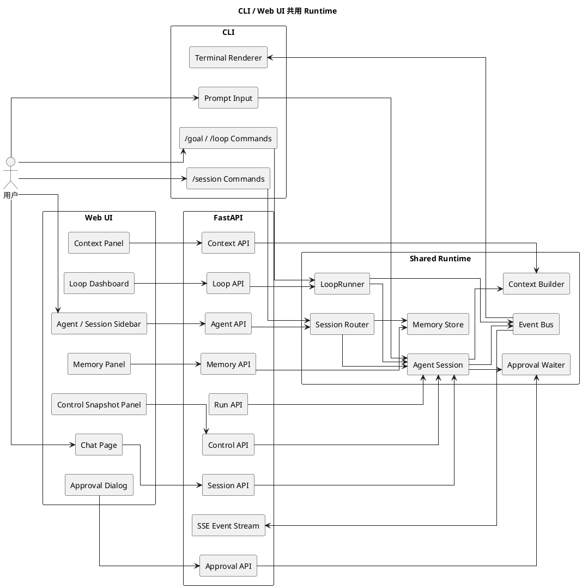
```plantuml
@startuml
title CLI / Web UI 共用 Runtime
skinparam componentStyle rectangle
skinparam linetype ortho
skinparam shadowing false
left to right direction

actor "用户" as User

rectangle "CLI" as Cli {
  [Prompt Input] as Prompt
  [/session Commands] as SessionCmd
  [/goal / /loop Commands] as LoopCmd
  [Terminal Renderer] as Term
}

rectangle "Web UI" as Web {
  [Agent / Session Sidebar] as Sidebar
  [Chat Page] as ChatPage
  [Loop Dashboard] as LoopDashboard
  [Memory Panel] as MemoryPanel
  [Context Panel] as ContextPanel
  [Approval Dialog] as ApprovalDialog
  [Control Snapshot Panel] as SnapshotPanel
}

rectangle "FastAPI" as Api {
  [Agent API] as AgentApi
  [Session API] as SessionApi
  [Run API] as RunApi
  [Loop API] as LoopApi
  [Memory API] as MemoryApi
  [Context API] as ContextApi
  [SSE Event Stream] as Sse
  [Approval API] as ApprovalApi
  [Control API] as ControlApi
}

rectangle "Shared Runtime" as Runtime {
  [Agent Session] as AgentSession
  [Session Router] as SessionRouter
  [LoopRunner] as LoopRunner
  [Context Builder] as ContextBuilder
  [Memory Store] as MemoryStore
  [Event Bus] as EventBus
  [Approval Waiter] as ApprovalWaiter
}

User --> Prompt
User --> SessionCmd
User --> LoopCmd
User --> Sidebar
User --> ChatPage
Prompt --> AgentSession
SessionCmd --> SessionRouter
LoopCmd --> LoopRunner
Term <-- EventBus
Sidebar --> AgentApi
ChatPage --> SessionApi
LoopDashboard --> LoopApi
MemoryPanel --> MemoryApi
ContextPanel --> ContextApi
RunApi --> AgentSession
LoopApi --> LoopRunner
Sse <-- EventBus
ApprovalDialog --> ApprovalApi
SnapshotPanel --> ControlApi
SessionApi --> AgentSession
AgentApi --> SessionRouter
MemoryApi --> MemoryStore
ContextApi --> ContextBuilder
ApprovalApi --> ApprovalWaiter
ControlApi --> AgentSession
SessionRouter --> AgentSession
SessionRouter --> MemoryStore
AgentSession --> EventBus
AgentSession --> ContextBuilder
AgentSession --> ApprovalWaiter
LoopRunner --> AgentSession
LoopRunner --> EventBus
@enduml
```

CLI 和 Web UI 不能各自实现一套 Agent 逻辑。它们只负责输入、渲染事件、展示审批和控制观察结果。

CLI 必须支持 `/session` 命令族，用于多 Agent 会话切换：

```text
/session
/session list
/session agents
/session new <agent_id> [title]
/session switch <session_id>
/session rename <title>
/session archive <session_id>
```

CLI、TUI 和 Web UI 也必须提供上下文压缩的可见入口：

```text
/context                         # 显示当前上下文预算、recent window、summary 状态
/context compact                 # 手动触发当前 session 的上下文压缩
/context summary                 # 查看当前生效的压缩摘要
/context disable-auto-compact    # 禁用当前 session 的自动压缩
```

Loop Engineering 入口：

```text
/goal                            # 显示当前 GoalSpec 或引导创建
/goal new                        # 交互式创建 GoalSpec
/goal edit                       # 修改目标、验收标准、约束或预算；修改成功标准需用户确认
/goal verify                     # 仅运行当前 GoalSpec 的验证计划
/loop start [goal_id]            # 启动或恢复目标循环
/loop status                     # 显示 iteration、验证结果、预算、worktree、阻塞原因
/loop stop                       # 请求协作式停止当前 loop
/loop evidence                   # 查看最近验证证据和工具审计摘要
/loop diff                       # 查看 worktree diff summary
/loop learn                      # 查看本轮学习候选并确认是否写入 memory/skill/project knowledge
```

| 方法与路径 | 用途 |
|---|---|
| `GET /` | 本地聊天页面 |
| `GET /api/agents` | AgentProfile 列表 |
| `POST /api/agents` | 创建或导入 AgentProfile |
| `GET /api/models` | 可选模型与连通状态 |
| `GET /api/skills` | Skill 列表与启用状态 |
| `GET /api/mcp/servers` | MCP Server 状态 |
| `GET /api/control/targets` | 浏览器、桌面、远程设备目标与启用状态 |
| `GET /api/control/sessions/{id}/snapshot` | 查看浏览器/桌面/远程会话的最近观察结果 |
| `POST /api/sessions` | 创建会话 |
| `GET /api/sessions` | 列出会话，支持按 agent_id 过滤 |
| `POST /api/sessions/{id}/switch` | 切换当前会话 |
| `POST /api/sessions/{id}/messages` | 发送用户消息 |
| `GET /api/goals` | 列出 GoalSpec，支持按 session_id 过滤 |
| `POST /api/goals` | 创建 GoalSpec |
| `PATCH /api/goals/{id}` | 修改 GoalSpec；降低成功标准必须要求用户确认 |
| `POST /api/goals/{id}/verify` | 只运行验证计划 |
| `POST /api/loops` | 启动 LoopRun |
| `GET /api/loops/{id}` | 查看 LoopRun 状态、iteration、预算和 worktree |
| `POST /api/loops/{id}/stop` | 停止 LoopRun |
| `GET /api/loops/{id}/evidence` | 查看验证证据、工具审计和失败分类 |
| `GET /api/loops/{id}/diff` | 查看 worktree diff summary |
| `POST /api/loops/{id}/learn` | 确认或拒绝学习候选 |
| `GET /api/sessions/{id}/context` | 查看上下文预算、recent window 和当前摘要 |
| `POST /api/sessions/{id}/context/compact` | 手动触发上下文压缩 |
| `GET /api/context-summaries/{id}` | 查看某条上下文压缩摘要 |
| `GET /api/memories` | 查看长期记忆，支持按 scope/agent/workspace 过滤 |
| `POST /api/memories` | 创建或确认一条长期记忆 |
| `DELETE /api/memories/{id}` | 删除长期记忆 |
| `GET /api/runs/{id}/events` | SSE 事件流 |
| `POST /api/approvals/{id}` | 允许或拒绝工具调用 |

启动体验目标：

```bash
# 首次安装或源码开发
python -m pip install -e /path/to/AgentLab

# 从任意目录启动；workspace 决定文件、搜索和命令工具的边界
agentlab --workspace . --profile local_qwen

# 本地 Web 模式，仅监听本机
agentlab serve --workspace . --host 127.0.0.1 --port 8765
```

`pyproject.toml` 必须注册 `agentlab` console script。`--workspace` 接受绝对或
相对目录，相对路径以调用者当前目录为基准；CLI 参数优先于环境变量和应用配置。
`python -m app` 作为源码开发入口继续保留。

### 11.3 是否做桌面客户端

产品形态上优先采用浏览器 UI + Python 本地服务，满足 macOS 与 Windows 双平台；待 Runtime、权限和更新机制稳定后，再评估 Electron/Tauri 等桌面壳与安装包。

---

## 12. 安全设计

### 12.1 威胁与防护

| 风险 | 防护措施 |
|---|---|
| 模型调用危险工具 | 工具风险等级、明确审批、最大步骤、超时和可取消 |
| Prompt injection 诱导读写敏感文件 | workspace 根目录约束；访问目录外内容额外审批 |
| 网页内容诱导 Agent 越权操作 | 网页文本视为不可信输入；提交、支付、授权、删除等动作二次确认 |
| 浏览器登录态泄露 | 默认隔离 profile；使用真实登录态必须显式启用 named profile 并提示数据边界 |
| 截图/DOM 发送到云端模型 | 首次观察页面或桌面前提示；日志脱敏；允许用户选择本地模型执行敏感任务 |
| 桌面控制误点或键盘失控 | 默认禁用；观察-审批-单步动作闭环；提供 Stop/取消和超时 |
| 远程设备执行错误目标 | 只允许预配置 host；SSH host key 校验；按 host/workspace/命令审批 |
| MCP Server 不可信 | 默认禁用；启用提示；工具统一过审批；限制传递的环境变量 |
| 云端模型泄露本地内容 | 会话明确标记 provider；调用云端前提示数据边界；日志脱敏 |
| 局域网模型服务暴露 | 默认 loopback；不要直接暴露公网；必要时放在受信网络并增加鉴权代理 |
| 密钥泄露 | `.env` 不入库，目标版本用系统 Keyring，日志过滤 |
| 无限工具循环与费用失控 | `max_steps`、请求 timeout、token/费用预算、取消操作 |
| Loop 虚假完成 | 必须有 VerificationResult 和 evidence refs；高风险目标不能只用 LLM 自评 |
| Loop 静默降低目标 | GoalSpec 的 success_criteria、约束和预算只能由用户或显式 API 修改；模型提出降级必须审批 |
| Worktree 污染主工作区 | Loop 默认使用隔离 worktree；合并、删除、覆盖主分支必须另行确认 |
| 后台 loop 失控 | 后台 loop 默认禁用；只能运行预配置 GoalSpec；高风险动作转人工审批 |
| 子 Agent 越权 | 子 Agent 只接收父 LoopRunner 分配的目标、工具和授权；输出回父级统一审计 |
| Verifier 被模型绕过 | Verifier 命令、URL、host 和断言来自 GoalSpec/配置；模型不能临时扩大验证范围 |

### 12.2 默认安全策略

默认值应保守：

- Web 服务监听 `127.0.0.1`。
- workspace 是默认工作范围；越界读取、列目录、搜索、写入和外部 cwd 执行
  必须逐次提示确认，拒绝时不执行。
- 文件写操作每次询问；执行命令与网络 MCP 默认禁用，启用后仍需确认。
- 浏览器控制默认使用隔离 profile；真实登录态、上传、下载、提交表单都需要显式确认。
- 桌面控制和远程设备控制默认禁用；启用后仍不允许模型绕过审批直接连续操作。
- 在线模型 profile 在界面中始终可辨识，不能静默从本地降级至云端。
- 模型连接故障时允许用户手工切换，不自动将敏感请求转发给其他 provider。
- Loop 模式默认要求至少一个非 `llm_judge` verifier；没有验证器时必须改为人工确认。
- Loop 模式默认使用 `git_worktree`；`direct` 写入需要用户显式选择。
- Loop 模式默认禁用后台自动运行、自动 push、自动发布和自动部署。
- 子 Agent 默认不继承父会话授权，只继承 GoalSpec 明确允许的工具和目标。

---

## 13. 可观测性与测试

### 13.1 可观测性

每次 run 记录：

- provider、模型 profile、开始结束时间、最终状态。
- 输入/输出 token（provider 返回时）、耗时和工具步数。
- 工具调用名称、风险等级、审批结果和脱敏后的错误。
- MCP server 连接状态与调用耗时。
- 电脑控制目标、origin/host、动作类型、观察结果摘要、截图引用、审批决定和取消记录。
- GoalSpec 的 objective、success criteria、预算、约束、workspace_mode 和修改历史。
- LoopRun 的 iteration、状态、预算消耗、失败分类、修复计划和最终结论。
- VerificationResult 的每个 check、证据引用、置信度、flaky 重试次数和失败原因。
- Worktree 的 base branch、base commit、diff summary、合并建议和清理状态。
- 子 Agent 的角色、输入摘要、权限范围、输出摘要和 evidence refs。

日志采用结构化 JSON 或标准 logging 字段；默认在本机保留，并允许用户清除。

### 13.2 测试矩阵

| 测试层级 | 覆盖内容 |
|---|---|
| 单元测试 | 配置优先级、profile 解析、审批策略、路径隔离、adapter 响应转换 |
| Agent 离线测试 | fake model 触发工具调用、拒绝、超步数和取消 |
| Loop 状态机测试 | GoalSpec 校验、iteration 推进、成功/阻塞/预算耗尽/取消、学习候选生成 |
| Verifier 测试 | command/file/browser/api/human/llm_judge 的 pass/fail/blocked/uncertain、flaky 重试和证据引用 |
| Worktree 测试 | 创建/清理 worktree、dirty base 检测、diff summary、禁止自动合并 |
| 子 Agent 测试 | 权限隔离、结果汇总、验证 Agent 只读、不能降低 GoalSpec |
| Project Knowledge 测试 | README/AGENTS/SKILL 解析、来源标注、与实际代码冲突时优先实际代码 |
| Learner 测试 | memory candidate、skill update proposal、anti-pattern 生成与敏感信息过滤 |
| 代码搜索测试 | text/regex/file/symbol 搜索、ignore 规则、越界拒绝/批准、fallback、脱敏和截断 |
| MCP 集成测试 | 测试 server 的 `list_tools` / `call_tool`、连接错误、审批；Windows 验证 `npx.cmd` 解析、最小运行环境和进程树清理 |
| 浏览器控制测试 | Playwright 打开本地测试页面、点击、输入、截图、下载路径限制 |
| 远程控制测试 | fake SSH client 覆盖 host key、workspace、timeout、输出截断、审批拒绝 |
| 桌面控制测试 | adapter mock 覆盖截图、坐标动作、取消和权限不足提示 |
| Provider 烟测 | Ollama 本地聊天与 tool call；OpenAI/Anthropic 以显式凭据可选运行 |
| UI 测试 | 创建会话、流式输出、审批交互、provider 显示 |
| 跨平台验收 | macOS 和 Windows 分别完成安装、CLI、Web、本地模型切换 |

不能只以“能聊天”作为本地模型可用标准；Agent 模式必须验证该 profile 的结构化工具调用是否可靠。

## 14. 官方技术参考

以下链接用于约束实现选择；实施时应依据所安装 SDK 版本锁定并编写适配测试。

- [Ollama OpenAI compatibility](https://docs.ollama.com/api/openai-compatibility)：本地端点兼容的 API 与工具调用示例。
- [Ollama tool calling](https://docs.ollama.com/capabilities/tool-calling)：本地模型工具调用和 agent loop 示例。
- [Ollama macOS](https://docs.ollama.com/macos) 与 [Ollama Windows](https://docs.ollama.com/windows)：双平台安装与运行边界。
- [Model Context Protocol Python SDK](https://github.com/modelcontextprotocol/python-sdk)：MCP client/server 与 stdio、Streamable HTTP transport。
- [Playwright Python](https://playwright.dev/python/docs/intro)：跨平台浏览器自动化、页面观察与操作。
- [PyAutoGUI documentation](https://pyautogui.readthedocs.io/en/latest/)：桌面截图、鼠标和键盘控制能力。
- [Paramiko documentation](https://docs.paramiko.org/)：Python SSH 客户端能力，可用于远程命令执行与文件传输。
- [OpenAI Responses API migration guide](https://developers.openai.com/api/docs/guides/migrate-to-responses)：OpenAI 原生 adapter 的推荐 API 方向。
- [Anthropic tool use](https://platform.claude.com/docs/en/agents-and-tools/tool-use/overview)：Claude 工具调用内容块与结果回传约束。
